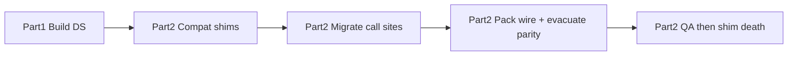
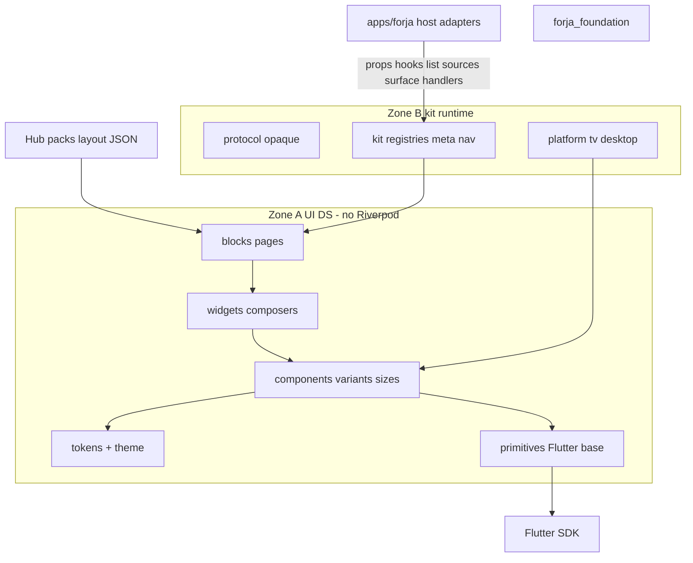

# Forja Foundation — Design System + Zero-regression Upgrade

## Plan structure (locked)

| Part | Name | Gate |
|------|------|------|
| **Part 1** | Prepare the design system (`packages/forja_foundation`) | G0–G13 |
| **Part 2** | Upgrade every consumer without loss / regression | **G14** (mandatory) |

**Ship rule:** Part 1 alone is **not** done. “Foundation redesigned” = Part 1 ✅ **and** Part 2 ✅. No shim death until G14 QA is green.



---

# PART 1 — Prepare the design system

Build [`packages/forja_foundation`](packages/forja_foundation): tokens → theme → primitives → components → widgets → blocks + protocol/kit/platform/utils. Product domain out of the package. Family/variant rules. Kit layout map. Quality bar for the package itself.

## Verdict on today (Part 1 baseline)

[`apps/forja/lib/shared/foundation/`](apps/forja/lib/shared/foundation/) (~225 Dart files) is a strong partial DS: no widgets tier, styled “primitives,” product pollution, dual hero/poster stacks, VerticalMenu buried as `vertical_filters`, settings/player/shell chrome outside foundation.

Part 1 replaces that with a complete package. Part 2 keeps the app/packs working through the cutover.

---

## PART 1 MUST-DO (G0–G13)

### G0 — Package & zones
- [ ] Create [`packages/forja_foundation`](packages/forja_foundation)
- [ ] Path dep from `apps/forja`; update ARCHITECTURE (rust + forja_foundation)
- [ ] Lint zones: (A) UI no Riverpod/features/TmdbApi; (B) kit contracts only
- [ ] Sectioned barrels: `forja_foundation.dart` / `_primitives` / `_kit`
- [ ] *(Shim death / delete `shared/foundation/` is **Part 2 G14** — not a Part 1 exit)*

### G1 — Ten layers
1. tokens  2. theme  3. primitives  4. components  5. widgets  
6. blocks  7. protocol  8. kit  9. platform  10. utils  
- [ ] No product `lib/` dump in package

### G2 — Theme system
- [ ] `ThemeExtension` + `forjaThemeData()`
- [ ] Kill dual `DesignTokens` vs `ForjaShellColors`
- [ ] Player popup tokens absorbed into package theme/player chrome slice

### G3 — Components (families, not explosions)
**Rule:** one public component per family; variants/sizes/slots for looks.

| Family | Variants / slots (not peer components) |
|--------|------------------------------------------|
| `Button` | variant + size (incl. icon); close/back/icon = usages |
| `ButtonGroup` | orientation + `.separator` / `.text` slots |
| `Toggle` / `ToggleGroup` | |
| `Input` / `InputGroup` / `Field` | |
| `VerticalMenu` | `.item` slots |
| `Dialog` / `Sheet` / `Badge` / `Chip` / `Tabs` / `Skeleton` / `Alert` / `Toast` | type/tone/size |

Also: Checkbox, Radio, Switch, Slider, Select, Combobox/Command, Label, Textarea, Item, ListTile, Avatar, Separator, Empty, Progress, Tooltip, Popover, Menu, Tabs/Breadcrumb/Pagination/TopBar/NavItem, PosterFrame, NetworkImage, MoodCircle, FocusableTap, FocusableControl.

Kill: `ForjaGhostButton` / `ForjaPlainIcon` / `ForjaIconButton` as separate APIs (compat aliases live in **Part 2**).

### G4 — Kit layout slot → artifact
| Pack type | Owns |
|-----------|------|
| `kit.stack/menu/tabs/list/row/topBar/categoryBar` | matching Kit* widgets |
| `hero` | CatalogHeroSection + CinematicHero |
| `mood` | MoodSection + MoodCircle |
| `continue` / `because` | ContinueWidget / BecauseSection |
| `vertical_filters` | VerticalMenu + LogoMenuRail |
| `trakt` | remove dead normalize |

### G5 — Widgets / G6 — Blocks / G7 — Convergences / G8 — Pull-in / G9 — VerticalMenu / G10 — protocol-kit-platform / G11 — evacuate into host folders / G12 — package quality / G13 — non-goals

*(Same content as previously locked — still Part 1. G11 means code lives under host paths with working adapters; Part 2 proves no user-visible drop.)*

**G11 evacuate list (Part 1 moves files; Part 2 proves parity):** match_*, sport filter, stremio_*, embed, schedule/**, follow product, pack/**, watch/**, kit_match_details_page, live_surface_open, packs/update/account UI, kit_schedule_*, sport category meta, torrent_*+Simkl, TmdbApi in hero/posters/details, kitLoadTmdbRich, live_match branches, host.trakt.

**G12 package quality:** unit/widget/golden tests, TV focus≠activate, forbidden-import CI, gallery, README — for the **package**. App-wide parity QA is **Part 2**.

**G13 non-goals:** React DS; rust/player engines; pack allowlists; docs/backlog.

---

# PART 2 — Zero-regression upgrade (G14)

**Mandatory.** Every consumer of today’s foundation keeps working. Nothing dropped. No silent behavior loss.

**Verdict after recheck:** Part 2 is the migration guarantee. Gaps below are **locked into G14** (not left for later judgment).

**Scale (baseline):** ~426 Dart files under `apps/forja` reference foundation APIs; `foundation.dart` ~72 exports + `primitives.dart` ~46; packs emitting kit layout include home, anime, asian_drama, live_sports, my_list, kids, cartoon, arabic, aflem, shahid (+ sdk catalog-kit).

## G14 — Consumer upgrade (complete)

### G14-A — Compat layer (ship before breaking call sites)

**Export parity rule:** every **public** symbol today importable via:
- `package:forja/shared/foundation/foundation.dart`
- `package:forja/shared/foundation/primitives/primitives.dart`
- any other `package:forja/shared/foundation/...` path used by app code  

…must remain resolvable until G14-E. Either:
1. re-export from new package under the **same name**, or  
2. deprecated typedef/constructor forwarding to the new family API.

- [ ] Generate export inventory (script/grep) of all public exports → shim map checked into RFC
- [ ] Re-export / shim old paths: `package:forja/shared/foundation/**` → `package:forja_foundation/**`
- [ ] Deprecated constructors: `ForjaGhostButton`, `ForjaPlainIcon`, `ForjaIconButton`, `ForjaCloseButton`, old chips/buttons → `Button` / family
- [ ] Deprecated kit names (`VerticalFiltersRail`, `KitMatchDetailsPage`, torrent-named panels if renamed) → forwarders
- [ ] Tokens: `ShellTokens`, `DetailsTokens`, `ForjaShellColors`, `DesignTokens` keep working (alias or ThemeExtension bridge)
- [ ] Document deprecation; `@Deprecated` where possible
- [ ] **Rule:** no shim removal until G14-E QA ✅ **and** export inventory grep clean **and** import inventory grep clean

### G14-B — Dart call-site inventory & migrate (lose nothing)

**All importers**, not only in-scope product tabs. If a file imports foundation, it is on the migrate list — including archive/out-of-scope features (music, etc.) so the app still analyzes/runs.

| Surface | Paths |
|---------|-------|
| Shell | `apps/forja/lib/shell/**` |
| Features | `apps/forja/lib/features/**` (iptv, settings, media, **and any other feature that imports foundation**) |
| Shared | `shared/player/**`, `shared/navigation/**`, `shared/theme/**`, `shared/host/**`, `shared/engine/**` boot hooks |
| App | `apps/forja/lib/app/**` |
| Tests | `apps/forja/test/**` |

- [ ] **Before migrate batches:** freeze path list from `rg` (~426 files baseline) into RFC acceptance / checklist artifact
- [ ] Replace imports → `package:forja_foundation/...`
- [ ] Replace exploded buttons → `Button(variant/size)`
- [ ] Settings/player/shell presentation → package components (G8)
- [ ] After each batch: `flutter analyze` clean on app + package
- [ ] CI: forbid `package:forja/shared/foundation/` once shim phase ends; forbid resurrected old widget class names in new code
- [ ] **Compile gate:** app must boot/compile after every Part 1 evacuate PR via shims (no “broken until Part 2”)

### G14-C — Pack / plugin wire freeze (no silent pack breakage)

Packs do **not** import Dart. They emit layout JSON.

| Wire | Action |
|------|--------|
| `kit.stack`, `kit.menu`, `kit.tabs`, `kit.list`, `kit.row`, `kit.topBar`, `kit.categoryBar` | Keep forever (aliases OK) |
| `hero`, `mood`, `continue`, `because`, `host.continue`, `host.because` | Keep |
| `vertical_filters`, `host.vertical_filters` | Keep → VerticalMenu/LogoMenuRail |
| `rail`, `ranked`, `stack`, `tabs`, … legacy aliases | Keep via `KitTypes.normalize` |
| New names (`kit.verticalMenu`) | Optional alias only; **not required** for Part 2 exit |

**Packs that must keep working (fixture or live layout parse):**  
`hubs/home`, `hubs/anime`, `hubs/asian_drama`, `hubs/live_sports`, `hubs/my_list`, `hubs/kids`, `hubs/cartoon`, `hubs/arabic`, `hubs/aflem`, `hubs/shahid`, plus `sdk/catalog-kit.js` helpers.

- [ ] Automated test: each hub’s layout JSON (fixture extracted from pack or synthetic) still walks `KitTypes` + shell builder without null fallthrough
- [ ] If pack JSON **must** change: forja-packs PR **before** removing alias
- [ ] Home platforms (`tmdb.js` `vertical_filters`) works without host knowing Netflix names

### G14-D — Evacuate parity (host wiring — no dropped UX)

| Old foundation surface | Must still work via |
|------------------------|---------------------|
| Live match details | Host + `DetailsBlock` |
| Live schedule list/cards | Kit list + host view models |
| Vertical filters / platforms menu | LogoMenuRail + shell `showMenu` |
| Sources / resolve panel | Kit hooks + SourcesPanel |
| Follow / list status | Host data + ListStatus widgets |
| Pack install / update / keychain | Host entry points unchanged |
| TMDB / enrich images | Absolute URLs in props — no blank posters |
| MetaRuntime / plugin_nav / HostListRegistry | Still registered at boot |
| Deeplink `forja://catalog/...` | Still parses |

- [ ] Checklist row per row above: open path + expected UI
- [ ] No “delete first, wire later”
- [ ] Boot hooks re-registered after move (IPTV portals, resolve streams, list sources, surface open handlers)

### G14-E — QA matrix (gate before shim death)

| ID | Scenario |
|----|----------|
| Q1 | Home: platforms menu, top-bar logo, hero, rails |
| Q2 | Anime / Asian Drama / kids / cartoon / arabic / aflem / shahid hubs render |
| Q3 | Live Sports list+cards, details, providers |
| Q4 | Movie/TV details hero + play + sources |
| Q5 | IPTV portals + side panel |
| Q6 | Settings rows |
| Q7 | Player popup + volume slider |
| Q8 | TV focus≠activate; D-pad nav + VerticalMenu |
| Q9 | Search + my list status |
| Q10 | Update / pack install entry |
| Q11 | Archive screens that imported foundation still open (no crash) |
| Q12 | Cold boot: nav from packs, no missing tab/chrome |

- [ ] Q1–Q12 signed off
- [ ] Export inventory + import inventory greps clean
- [ ] Remove shims; delete `apps/forja/lib/shared/foundation/`
- [ ] Final analyze + goldens + forbidden-import CI green

### G14-F — Docs / rules for upgrade
- [ ] Migration guide: old symbol → new family (full table from export inventory)
- [ ] Pack author note: layout types unchanged
- [ ] Update `.cursor/rules/forja-design-system.mdc` + `forja-shared-ui.mdc` to package paths
- [ ] Feature docs / changelog only if user-visible look changes
- [ ] RFC Part 1 + Part 2 acceptance flipped

### G14-G — Hard “no loss” invariants (always true during cutover)
1. App compiles after every merged PR (shims bridge gaps).  
2. No pack JSON required change unless forja-packs PR landed first.  
3. No user-facing entry point removed without replacement path in same PR.  
4. Shim death is a **separate** PR after Q1–Q12.  
5. Part 1 evacuate PRs include host adapter wiring enough to satisfy (1) and (3).
---

## Decision (locked)

| Decision | Choice |
|----------|--------|
| Structure | **Part 1** DS + **Part 2** upgrade — both required |
| Package | [`packages/forja_foundation`](packages/forja_foundation) |
| Zones | (A) UI no Riverpod/features/TmdbApi; (B) kit contracts |
| Layers | 10 layers as Part 1 |
| Component API | One family per concern; variants/slots |
| Packs | Wire freeze; no required JSON churn for exit |
| Done means | **G0–G13 and G14-A…G all ✅** — migration no-loss locked |

---

## Phases (Part 1 then Part 2)

### Part 1 phases
0. RFC with Part 1 + Part 2 acceptance tables  
1. Scaffold + theme + Button + ButtonGroup + VerticalMenu  
2. Rest of component catalog  
3. Kit map + widgets + convergences  
4. Pull-in settings/player/shell chrome + blocks + kit/protocol  
5. Evacuate files to host (adapters stubbed/wired enough to compile)

### Part 2 phases
6. **G14-A** compat shims live; app still runs on old imports  
7. **G14-B** batch migrate all Dart call sites + CI bans  
8. **G14-C** pack wire tests; forja-packs PR only if needed  
9. **G14-D** evacuate parity checklist  
10. **G14-E** QA matrix → shim death → delete `shared/foundation/`  
11. **G14-F** docs freeze  

---

## Success criteria

**Part 1:** Package exists; G0–G13 complete; second app *could* depend on DS APIs.  
**Part 2:** Every former consumer upgraded; packs unchanged or explicitly updated; Q1–Q10 green; shims gone; no regression vs pre-cutover behavior.

**Not success:** Package merged while features still break, platforms menu dead, or packs require unannounced JSON edits.

---

## Explicit non-goals

- React/web DS  
- Moving `packages/rust` or player engines into foundation  
- Pack folder allowlists in Dart  
- Editing `docs/backlog/`  
- Declaring Part 1 “done” without Part 2  

---

# Appendix — Part 1 detail catalogs

*(Existing detailed inventories — tokens, primitives, components, widgets, blocks, VerticalMenu section, protocol/lib/services split, dependency rules — remain below and apply to Part 1. Part 2 owns consumer cutover only.)*

## Decision detail / target tree / layer contracts

*(Continue with prior locked content for package tree, layer contracts, component catalogs, VerticalMenu, evacuate file list, dependency hard rules, quality bar for package.)*



---

## Target tree

```
packages/forja_foundation/
  lib/
    forja_foundation.dart              # sectioned public API
    forja_foundation_primitives.dart   # leaf entry (tests/gallery)
    forja_foundation_kit.dart          # protocol + kit + blocks entry

    tokens/          # spacing colors radius type motion breakpoints semantic
    theme/           # ThemeExtension + ThemeData factory

    primitives/      # Flutter-base (Radix role)
      controls/ forms/ feedback/ overlays/ layout/ media/ focus/ scroll/

    components/      # Forja look — variant/size/defaults → primitive
      button/ switch/ chip/ input/ dialog/ sheet/ … (one folder or file per component)

    widgets/         # multi-component, props+callbacks only
      catalog/ details/ sources/ chrome/ playback/

    blocks/          # page templates
      shell/ details/ search/ play/

    protocol/        # Envelope MetaItem MetaOpen Filter Deeplink Capabilities
    kit/             # KitTypes layout walk HostListRegistry hooks MetaRuntime nav
    platform/
      tv/ desktop/ shell_scope/   # metrics input policy focus graph

    utils/           # cover URL normalize only (no TmdbApi)

  test/              # unit + widget + golden
  gallery/           # optional Widgetbook or design_system route
  README.md
```

App:

```yaml
forja_foundation:
  path: ../../packages/forja_foundation
```

Update [ARCHITECTURE.md](docs/ARCHITECTURE.md): Flutter packages = `rust` + `forja_foundation`.

---

## Exhaustive layers (all of them)

Order = dependency direction (top depends on bottom).

| # | Layer | Folder | Zone | Role (shadcn analogy) |
|--:|-------|--------|------|------------------------|
| 1 | **tokens** | `tokens/` | A | Design values only — spacing, color, type, radius, motion, breakpoint, aspect, elevation, semantic |
| 2 | **theme** | `theme/` | A | `ThemeExtension` + Material `ThemeData` bridge — not scattered static classes |
| 3 | **primitives** | `primitives/` | A | Flutter/Radix bases — hit/focus/semantics; style **values** in; **no** variant enums |
| 4 | **components** | `components/` | A | Forja shadcn `ui/*` — **variant + size + defaults**; each wraps a primitive; includes **groups** (`ButtonGroup`, `ToggleGroup`, `InputGroup`, …) |
| 5 | **widgets** | `widgets/` | A | Composed UI (Hero, PosterRail, SourcesPanel) — several components; props/callbacks only |
| 6 | **blocks** | `blocks/` | A | Page templates (Shell, Details, Search, Settings, Empty) — compose widgets; layout-driven where kit |
| 7 | **protocol** | `protocol/` | B | Opaque wire: Envelope, MetaItem, MetaOpen, Filter, Deeplink, Capabilities |
| 8 | **kit** | `kit/` | B | Layout types, walk/interpret, HostListRegistry, hook **interfaces**, MetaRuntime, plugin nav registry |
| 9 | **platform** | `platform/` | B | ShellScope metrics/profile/input, TV focus graph, desktop window — device chrome, not product |
| 10 | **utils** | `utils/` | A/B | Pure helpers (URL normalize) — no network clients, no product DTOs |

**Outside package (host app):** product adapters (match/schedule/Simkl/torrent resolve), app route back stack, pack install, update dialog, feature Riverpod stores.

**Not a layer:** today’s `lib/` product dump — **deleted** as a concept.

```
blocks → widgets → components → primitives → Flutter
                ↘ tokens/theme
kit/protocol → blocks (layout + opaque meta)
platform → components/widgets (focus, metrics)
host → kit hooks + widget props
```

### Layer contracts

| Layer | Owns | Forbidden |
|-------|------|-----------|
| **tokens / theme** | All design values + ThemeExtension | Widgets, network, Riverpod |
| **primitives** | Flutter wrappers; value-styled | Variant enums, brand recipes, product names |
| **components** | Variant/size/defaults; groups; forms; overlays | Layout JSON, domain DTOs, fetch, Riverpod |
| **widgets** | Multi-component composers | MatchEvent, TmdbApi, Simkl, Riverpod |
| **blocks** | Page templates | Product-named pages (`MatchDetails`) |
| **protocol** | Opaque wire models | Stream unlock / sport logic |
| **kit** | Layout + registries + meta run | Surface-name switches, pack allowlists, live resolve |
| **platform** | TV/desktop/shell metrics | Product chrome |
| **utils** | Pure transforms | HTTP, TmdbApi |

**Composition example:**

```
PrimitiveButton
  ← Button(variant: ghost, size: icon)          // close / back / icon — SAME component
  ← Button(variant: primary, size: md)
  ← ButtonGroup(orientation: horizontal)        // ONE component
       children: Button, ButtonGroup.separator, Button   // slots, not catalog peers
  ← PlayRow widget
  ← DetailsBlock
```

---

## Component API (families + variants — not exploded types)

1. **One public widget per family** (`Button`, `ButtonGroup`, `Input`, `VerticalMenu`, …).
2. Enums: `variant`, `size` (optional `orientation`, `tone`, `type`).
3. Constructor defaults.
4. `Style.resolve(...)` from tokens → primitive.
5. **Slots / nested constructors** for sub-parts: `ButtonGroup.separator`, `ButtonGroup.text`, `VerticalMenu.item`, `InputGroup.prefix` — same library file, **not** separate DS product names in the checklist.
6. Passthrough: callbacks, focus, enabled, loading, child.

**Forbidden catalog shape:**

```
❌ IconButton, CloseButton, BackButton, GhostButton, PlainIcon     → Button(variant/size)
❌ ButtonGroupSeparator, ButtonGroupText as peer components       → ButtonGroup slots
❌ AlertDialog, ConfirmDialog as peer components                  → Dialog(type: …)
❌ VerticalMenuItem as a peer “product”                           → VerticalMenu.item / child
```

Migrate `ForjaGhostButton` / `ForjaPlainIcon` / `ForjaIconButton` → **`Button`**.

Status legend below: **NEW** = does not exist as a real DS API today · **MIGRATE** = exists but wrong shape/name/layer · **HOST** = leave app.

---

## TARGET catalog — tokens & theme (design from scratch)

| Token | Contents | Status |
|-------|----------|--------|
| `Spacing` | 4-pt scale + semantic (page, section, chip, panel, group gap) | MIGRATE expand |
| `Radius` | none, sm, md, lg, xl, pill | MIGRATE expand |
| `Colors` | surfaces, text, border, accent, cinematic + **semantic** success/warning/danger/info/muted | MIGRATE expand |
| `Typography` | display, title, heading, body, label, caption, code — ThemeExtension | NEW system |
| `Motion` | duration + curve tokens | NEW |
| `Breakpoint` | compact, medium, expanded + TV density | MIGRATE expand |
| `Aspect` | poster, backdrop, logo, square, wide | NEW |
| `Elevation` | flat cinematic (RFC-025) | MIGRATE |
| `ZIndex` | toast, dialog, sheet, overlay, nav | NEW |
| `Opacity` / `Blur` | frost panel tokens (panel exception only) | NEW |
| `Theme` | `ForjaThemeExtension` + `forjaThemeData()` — **kill** dual DesignTokens/ShellColors | NEW |

---

## TARGET catalog — primitives (Flutter base)

| Family | Primitives | Status |
|--------|------------|--------|
| Controls | `PrimitiveButton` (one), `PrimitiveSwitch`, `PrimitiveSlider`, `PrimitiveCheckbox`, `PrimitiveRadio`, `PrimitiveToggle` | NEW — no PrimitiveIconButton peer |
| Forms | `PrimitiveTextField`, `PrimitiveTextArea`, `PrimitiveSelect` | NEW |
| Focus | `PrimitiveFocusable`, `PrimitiveInk`, `PrimitiveHover` | MIGRATE |
| Feedback | `PrimitiveProgressLinear`, `PrimitiveProgressCircular`, `PrimitiveSpinner` | NEW/MIGRATE |
| Overlay host | `PrimitiveDialogRoute`, `PrimitiveSheetRoute`, `PrimitiveOverlayBarrier` | NEW |
| Layout | `Gap`, `Inset`, `MaxWidth`, `AspectBox`, `StackSlot` | NEW |
| Scroll | `PrimitiveScrollView`, `PrimitiveScrollArea` | MIGRATE |
| Media | `PrimitiveNetworkImage` | MIGRATE |
| Group shell | `PrimitiveGroup` (role=group, orientation, spacing — used by ButtonGroup/ToggleGroup) | NEW |

---

## TARGET catalog — components (full shadcn-class + media)

This is the **product** of the design system. Designed against shadcn/ui + media apps — **not** a rename of today’s folders. Every row is required for “complete.”

### Actions & groups
| Component | Variants / sizes / slots | Status |
|-----------|--------------------------|--------|
| **`Button`** | variant: primary, secondary, ghost, outline, destructive, link, plainIcon · size: sm, md, lg, icon · loading — close/back/icon are usages of this | MIGRATE unify |
| **`ButtonGroup`** | orientation · slots: child Button, `.separator`, `.text` (same family — not peer components) | **NEW** |
| **`Toggle`** | default, outline | **NEW** |
| **`ToggleGroup`** | single/multiple · nests Toggle | **NEW** |
| **`Link`** | optional — or `Button(variant: link)` only | prefer Button |

### Selection
| Component | Notes | Status |
|-----------|-------|--------|
| `Checkbox` / `CheckboxGroup` | | NEW |
| `Radio` / `RadioGroup` | | NEW |
| `Switch` / `SwitchListTile` | sizes sm/md | MIGRATE |
| `Slider` / `RangeSlider` | default, volume, seek | **NEW** |
| `SegmentedControl` | | NEW |

### Inputs & forms (shadcn Field / Input Group)
| Component | Notes | Status |
|-----------|-------|--------|
| `Label` | | **NEW** |
| `Input` / `TextField` | outline, ghost, search, error | **NEW** |
| `Textarea` | | **NEW** |
| `InputGroup` | prefix/suffix: icon, Button, text | **NEW** |
| `InputOTP` | pin / code | **NEW** (settings/auth) |
| `PasswordField` | | **NEW** |
| `SearchField` | desktop/mobile | **NEW** |
| `TvBrowseTextField` | focus≠activate | MIGRATE |
| `Select` / `NativeSelect` | | **NEW** |
| `Combobox` / `Command` | searchable select / command palette | **NEW** |
| `Field` | label + control + description + error — one form pattern | **NEW** |
| `Form` / `FormRow` | layout helper | **NEW** |
| `Calendar` / `DatePicker` | schedule windows without sport names | **NEW** |

### Data display
| Component | Notes | Status |
|-----------|-------|--------|
| `Text` / `Heading` / `Typography` | token type scale | **NEW** |
| `Badge` / `CountBadge` | default, accent, live, success, danger | MIGRATE/NEW |
| `Tag` / `TagList` | | **NEW** |
| `Avatar` / `AvatarGroup` | | MIGRATE expand |
| `Logo` / `AnimatedLogo` | brand-capable | MIGRATE |
| `Kbd` | keyboard hint | **NEW** |
| `Separator` / `Divider` | h/v | **NEW** |
| `Item` | list/card row primitive (shadcn Item) | **NEW** |
| `ListTile` | dense / default | **NEW** |
| `Table` / `DataTable` | settings / debug | **NEW** |
| `DescriptionList` / `MetaRow` / `Stat` | facts | MIGRATE/NEW |
| `Skeleton` / `SkeletonPoster` / `SkeletonText` / `SkeletonRail` | | MIGRATE expand |
| `Empty` / `EmptyState` | title, description, action slot | **NEW** |
| `ErrorState` / `ErrorRetry` | | MIGRATE |
| `Spinner` / `Progress` / `LoadingDots` | | MIGRATE/NEW |
| `WatchProgress` | bar on posters | MIGRATE |

### Feedback
| Component | Notes | Status |
|-----------|-------|--------|
| `Toast` / `Sonner`-style queue | success/error/warning/info | MIGRATE |
| `Alert` / `InlineAlert` / `Banner` | | **NEW** |
| `Tooltip` | | **NEW** |
| `HoverCard` | | **NEW** |

### Overlays & menus
| Component | Notes | Status |
|-----------|-------|--------|
| `Dialog` / `AlertDialog` / `ConfirmDialog` | | **NEW** |
| `Sheet` / `BottomSheet` / `ActionSheet` / `Drawer` | | **NEW**/MIGRATE panel |
| `Popover` | | **NEW** |
| `DropdownMenu` / `ContextMenu` / `Menubar` | | **NEW** |
| `NavigationMenu` | | **NEW** |
| `FrostedPanel` | panel exception only | MIGRATE |
| `PlayerOverlay` | frozen-frame blur shell | MIGRATE |
| `LoadingOverlay` | **no** product status inside | MIGRATE clean |
| `Sidebar` | optional settings/nav | **NEW** |
| `Resizable` / `ResizablePanel` | sources split | **NEW** |

### Navigation chrome
| Component | Notes | Status |
|-----------|-------|--------|
| `Tabs` / `UnderlineTab` / `StatusTabs` | | MIGRATE |
| `Breadcrumb` | | **NEW** |
| `Pagination` / `PageDots` | | **NEW** |
| `Stepper` | | **NEW** |
| `AppBar` / `TopBar` | slot-based | MIGRATE/NEW |
| `NavItem` / `RailItem` / `BottomNavItem` | host shell consumes | **NEW** |
| `SectionTitle` / `TabHeader` | | MIGRATE |
| `ScrollArea` | | **NEW** |
| `Accordion` / `Collapsible` | settings / FAQ | **NEW** |
| **`VerticalMenu`** | vertical selectable flyout — Home platforms · items via `.item` / children (not a peer VerticalMenuItem product) | **NEW** (extract) |

### VerticalMenu — Home platforms (mandatory)

**Today (wrong):** pack `type: 'vertical_filters'` / `watch_providers` in [`forja-packs/hubs/home/tmdb.js`](forja-packs/hubs/home/tmdb.js). UI jammed in [`vertical_filters.dart`](apps/forja/lib/shared/foundation/components/chrome/vertical_filters.dart) + [`vertical_filters_rail.dart`](apps/forja/lib/shared/foundation/components/chrome/vertical_filters_rail.dart). Opened from [`shell_nav_rail.dart`](apps/forja/lib/shell/nav/shell_nav_rail.dart) / [`shell_bottom_nav.dart`](apps/forja/lib/shell/nav/shell_bottom_nav.dart).

**Target:**

| Piece | Layer | Role |
|-------|-------|------|
| `VerticalMenu` | **component** | Panel + item slot (`.item`: logo/icon + label + selected) |
| `LogoMenuRail` | **widget** | Props-only logo menu (ex-`VerticalFiltersRail`) — no registry/tabId/TMDB |
| `vertical_filters` layout | **kit** | Opaque options from pack → widget props |
| Selection + `showMenu` | kit hook + **host shell** | When to open stays in app shell |
| Netflix/etc list | **pack** | Stays in home hub JS |

Not `ButtonGroup`. Not a one-liner under CategoryBar. Equal weight to Dialog/Sheet.

### Media atoms (still components — single concern)
| Component | Notes | Status |
|-----------|-------|--------|
| `AspectRatio` | token aspects | **NEW** |
| `PosterFrame` | poster/backdrop frame only | MIGRATE |
| `NetworkImage` | fade/settled · absolute URLs | MIGRATE |
| `MoodCircle` | generic circle select | MIGRATE |
| `CardPlayOverlay` | play glyph on hover/focus | MIGRATE |
| `Scrim` | gradient scrim | MIGRATE/NEW |
| `Carousel` / `CarouselDots` | hero rotation chrome | **NEW** |

### Interaction wrappers
`FocusableTap`, `HoverScale`, `Interactive`, `Pressable` — MIGRATE into components over primitives.

### Platform-facing components
`TvSearchBrowseOverlay` — MIGRATE. Desktop window chrome — MIGRATE under platform+thin components. Keychain consent screen — **HOST**.

**First build slice:** **`Button` (all variants/sizes)** + **`ButtonGroup` (with .separator/.text slots)** + **`VerticalMenu`** + `LogoMenuRail`. Then ToggleGroup, Input/Field, Dialog/Sheet.

---

## TARGET catalog — widgets (composers — many NEW)

Compose **components**. Props + callbacks. No Riverpod. No product type ids.

### Catalog / browse
| Widget | Status |
|--------|--------|
| `PosterCard`, `PosterGrid`, `PosterRail`, `RankedPosterRail` | MIGRATE rename off movie_* |
| `SectionHeader`, `ContentRail` (generic continue/because) | MIGRATE |
| `CategoryBar`, `FilterChipBar` | MIGRATE |
| **`LogoMenuRail`** (Home platforms — was `VerticalFiltersRail`) | MIGRATE — `VerticalMenu` + logo items; props only |
| `MenuBar`, `TabBar`, `TopBarActions` | MIGRATE |
| `ListGrid`, `ListDense`, `ListCards` | MIGRATE — style-driven, not product |
| `EventCard`, `DenseTile` | MIGRATE — generic props; host maps match rows |
| `LetterJumpScope` | MIGRATE |
| `ProviderLogosRow` | MIGRATE (URLs only) — top-bar selected mark, not the flyout |
| `CatalogCard`, `FeaturedCard` | **NEW** |
| `MasonryRail` / `PeekRail` | **NEW** |

### Hero / details
| Widget | Status |
|--------|--------|
| `HeroBanner`, `CinematicHero`, `RotatingHeroBackdrop` | MIGRATE — **strip TmdbApi** |
| `HeroTitle`, `HeroMetaLine`, `HeroOverview`, `HeroActions` | MIGRATE — actions use ButtonGroup |
| `DetailsHero`, `PlayRow` (ButtonGroup: Play + MyList + …) | MIGRATE improve |
| `FactsPanel`, `CastRail`, `TrailerRail`, `RecoRail` | MIGRATE |
| `EpisodeTile`, `EpisodeList`, `SeasonPicker` | MIGRATE — absolute still URLs |
| `DetailsScrollScaffold` | MIGRATE |
| `ListStatusControl`, `StatusPin` | MIGRATE — dumb options |

### Sources / panels
| Widget | Status |
|--------|--------|
| `SidePanelOverlay`, `SourcesPanel`, `SourceTile`, `SourceFilters` | MIGRATE — **rename off torrent_*** |
| `PortalListPanel`, `PortalsChip` | MIGRATE |
| `SplitMasterDetail` (list + panel) | **NEW** |

### Search / chrome
| Widget | Status |
|--------|--------|
| `SearchChrome`, `SearchResults`, `RecentQueries` | MIGRATE |
| `FilterSheet`, `OptionSheet` | MIGRATE/NEW |
| `CommandPalette` (uses Command component) | **NEW** |

### Playback chrome (generic)
| Widget | Status |
|--------|--------|
| `StreamLoading`, `ResolveFailure`, `BufferingIndicator` | MIGRATE clean names |

### Settings widgets (for host settings screens)
| Widget | Status |
|--------|--------|
| `SettingsSection`, `SettingsRow`, `SettingsGroup` | **NEW** — use Field/Switch/Select |

**HOST only:** pack install, update dialog, schedule sport sheets, live-TV product browse, Simkl handlers, keychain consent.

---

## TARGET catalog — blocks (pages — more than today’s kit)

| Block | Composes | Status |
|-------|----------|--------|
| `ShellBlock` | TopBar + filters + list/rails from layout JSON | MIGRATE split god file |
| `DetailsBlock` | Hero + PlayRow(ButtonGroup) + sections + optional Sources | MIGRATE — **one** for all catalogs |
| `SearchBlock` | SearchChrome + results | MIGRATE |
| `EntryDetailsBlock` | full-bleed details for `open: details` | MIGRATE |
| `BrowseBlock` | generic catalog browse page template | **NEW** |
| `SettingsBlock` | SettingsSection stack | **NEW** |
| `EmptyBlock` / `ErrorBlock` | full-page empty/error | **NEW** |
| `PlaySessionBlock` | play boundary + hooks | MIGRATE purge stremio names |
| `AuthBlock` / `ConsentBlock` | optional — or HOST | prefer HOST |
| `GalleryBlock` | design-system gallery | **NEW** (dev) |

**Gone:** `KitMatchDetailsPage` as a package type — host fills `DetailsBlock`.  
**Gone from blocks:** stremio helpers, pack-id switches, TmdbApi enrich.

---

## Protocol / kit / lib / services / tv / navigation

### Protocol → package `protocol/`
`protocol.dart`, `filter.dart`, `deeplink.dart`, `pack_capabilities.dart` — strip sport-helper imports; opaque extension maps only.

### Lib → dissolve
| File | Destination |
|------|-------------|
| `cover_urls.dart` | package `utils/` — **no TmdbApi**; absolute/normalize only |
| `pack_assets.dart` | host (or opaque utils if proven pack-agnostic) |
| `forja_host_assets.dart` | host |
| `match_event.dart`, `match_team_parse.dart`, `schedule_sport_filter.dart` | host `shared/host/live_sports/` |
| `stremio_live_meta.dart`, `embed_webview_proxy.dart` | host |

### Services → package `kit/` + `services/meta` vs host

**Package:** `HostListRegistry`, all `kit_*_hooks` **interfaces**, `MetaSurfaceOpen` **registry** (handlers registered by host), `MetaRuntime` + cache + details_fetch + meta_feed (opaque), `plugin_nav` (opaque tab registration), generic panel-host interface.

**Host:** entire `schedule/`, `follow/` product (Simkl), `pack/`, `watch/`, `kit_match_details_page`, `live_surface_open`, IPTV-named hook **implementations**, torrent/Simkl UI.

Rename hooks that encode product (`kit_iptv_play_hooks`) → generic play-hook names; IPTV registers from feature.

### TV → package `platform/tv/`
All current `foundation/tv/*` — generic leanback. Details TV scope tied to generic DetailsBlock.

### Navigation
| Kind | Place |
|------|-------|
| Pack/kit nav + open dispatcher + surface registry | package `kit/` |
| App back stack / trackpad / shell levels (`shared/navigation/*`) | **host**; may use package `Button` / back icon component |

---

## Public API (sectioned barrels)

`forja_foundation.dart` exports **only**:

1. tokens + theme  
2. primitives  
3. components  
4. widgets  
5. blocks (generic names)  
6. protocol  
7. kit contracts (registries/hooks/meta/nav)  
8. platform (shell scope, tv, desktop)

**Never export:** match/sport/schedule/stremio/torrent/packs/update/simkl/follow providers.

Secondary: `forja_foundation_primitives.dart`, `forja_foundation_kit.dart`.

---

## Dependency hard rules

| Dep | Rule |
|-----|------|
| `flutter` / Material | Allowed |
| Fonts | `theme/` only |
| `flutter_riverpod` | **Forbidden** in tokens/primitives/components/widgets/blocks. Kit registry may stay callback-based (no Riverpod inside package). Host wires Riverpod → hooks |
| `go_router` / features / TmdbApi / Simkl / torrent engine / live engine / PluginRegistry pack allowlists | **Forbidden** in package |
| Network HTTP clients | **Forbidden** in UI layers |
| Platform plugins (window_manager, keychain) | `platform/desktop` or **host** only |

CI: custom lint or `import_lint` / dependency_validator — fail PR if UI zones import forbidden libs.

---

## Quality bar (professional package)

| Requirement | Detail |
|-------------|--------|
| **Unit** | Token math, protocol parse, cover URL pure helpers |
| **Widget tests** | Each component: variants × sizes × disabled/loading/focus |
| **Goldens** | Button, Chip, Toast, PosterCard, Empty/Error, SourceTile — cinematic + TV density |
| **TV contract tests** | Browse text field: focus ≠ activate |
| **Forbidden-import CI** | Zones A/B rules |
| **Docs** | Package README (layer diagram, do/don’t), per-component props table, migration guide (torrent→source, evacuate host) |
| **Gallery** | Widgetbook **or** in-app `/design_system` gallery — ship one |
| **Analyze** | Package + app clean after shim removal |

---

## Evacuate list (Part 1 move → Part 2 parity)

Move out of package (from today’s foundation) during Part 1; **Part 2 G14-D** proves each still works:

- `lib/match_*`, `schedule_sport_filter`, `stremio_live_meta`, `embed_webview_proxy`, host assets  
- `services/schedule/**`, `services/follow/**` (keep list-status **widget** only), `services/pack/**`, `services/watch/**`  
- `services/panel/kit_match_details_page.dart`, `services/play/live_surface_open.dart`  
- `components/packs/**`, `components/update/**`, `components/account/**`  
- `components/chrome/kit_schedule_*`, `kit_category_circle_meta` sport taxonomy  
- `components/chrome/vertical_filters*.dart` → VerticalMenu + LogoMenuRail + kit hook; shell `showMenu`  
- `components/cards` match coupling → EventCard props; MatchEvent in host  
- `components/media_details/torrent_*`, tracker/Simkl handlers  
- `components/playback/torrent_*`  
- `components/hero/tmdb_paint_gate`, TmdbApi in hero/posters/details  
- `blocks/**/stremio*`, legacy pack id branches, `kitLoadTmdbRich`  
- `live_match` / `live_schedule` branches inside list/open  

---

## Phases and success

See **PART 1 / PART 2** at top of plan. Bottom-line:

- Part 1 = build DS (G0–G13)  
- Part 2 = upgrade everything (G14-A…G)
- Done = both. Shim death only after Q1–Q12 + export/import greps clean.

## Explicit non-goals

- React/web DS; rust/player engines in foundation; pack allowlists; docs/backlog  
- Calling Part 1 “shipped” without Part 2  
