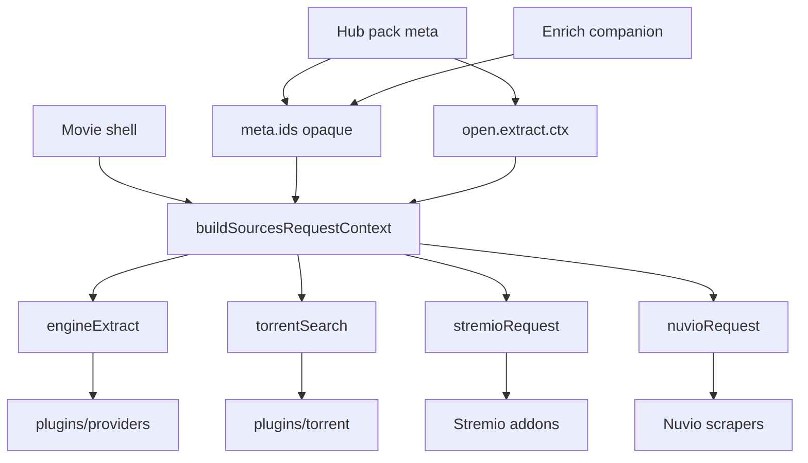

# Sources ID middleware (generic catalog → providers / torrents / Stremio / Nuvio)

## Problem

Catalog packs emit different id bags. Sources kinds each expect different inputs. Today the host improvises per path from `Movie` alone, which breaks hubs:

| Kind | What it needs | What host often passes today | Hub failure mode |
|------|---------------|------------------------------|------------------|
| **Forja (providers)** | Pack `extract.ctx` + optional `tmdbId`/`imdbId`/`anilistId`/`malId` | `movie.id` as `tmdbId` + extract merge | Without enrich, AniList/KissKh id wrongly used as TMDB |
| **Torrents** | `query` (+ `imdbId` for Torrentio) | `movie.title` + `movie.imdbId` | Torrentio empty on anime/drama |
| **Stremio** | Per-addon `idPrefixes` (often `tt`, sometimes `anilist` / `tmdb:` / …) or custom `stremioId` extras | Always `movie.imdbId` | Addon that needs non-IMDb id never gets it; tab dead without IMDb |
| **Nuvio** | Host-fixed TMDB (`getStreams(tmdbId,…)`) — **not** declared per scraper in Nuvio manifest | `movie.id.toString()` always | Wrong title / empty when id is AniList/KissKh/synthetic |

There is no single place that says: *given this catalog title, what can each Sources kind actually run?*

## Goal

One **middleware** — input-driven, not hub-driven:

```text
CatalogMetaItem.ids
+ CatalogOpen.extract.ctx (+ extras)
+ Movie (title, imdb fallback)
+ season / episode / episodeVideoId
        │
        ▼
  buildSourcesRequestContext(...)
        │
        ├──► engineExtract   (providers / web)
        ├──► torrentSearch   (indexers)
        ├──► stremioRequest  (addons)
        └──► nuvioRequest    (scrapers)
```

Host never switches on pack ids (`anilist`, `kisskh`, …) or `open.surface`. It only:

1. Merges **opaque** id maps under **known scheme names** (`tmdb`, `imdb`, `anilist`, `mal`, …).
2. Projects into **fixed kind schemas** each consumer already understands.
3. Exposes **capability flags** so UI can skip/disable kinds that lack required inputs.

Packs remain responsible for emitting `extract` + enriching `ids`. Middleware does not invent IMDb/TMDB via host `TmdbApi`.



---

## Contract — `SourcesRequestContext`

New module: [apps/forja/lib/shared/catalog/kit/sources/sources_request_context.dart](apps/forja/lib/shared/catalog/kit/sources/sources_request_context.dart) (preferred — kit boundary; not playback pack branches).

```dart
class SourcesRequestContext {
  // Opaque bag after merge (string values only)
  final Map<String, String> ids;

  // Shared display / text search
  final String title;
  final String? year;
  final int? season;
  final int? episode;
  final String? episodeVideoId;

  // Shared projections (nullable = kind cannot run at all)
  final EngineExtractSlice? engine;
  final TorrentSearchSlice? torrent;
  final NuvioRequestSlice? nuvio;
  // Stremio: bag + custom open extras only here — per-addon id pick is separate
  final StremioBagSlice? stremioBag; // ids bag view + optional custom stremioId/baseUrl

  // Capability flags for UI (no pack names)
  bool get hasTmdb => /* numeric ids['tmdb'] */;
  bool get hasImdb => /* normalized tt… */;
  bool get hasTitle => title.trim().isNotEmpty;
}
```

**Layering (important):**

| Layer | Responsibility |
|-------|----------------|
| `buildSourcesRequestContext` | Merge opaque **id bag** + engine/torrent/nuvio projections. **Does not** read Stremio addon manifests. |
| `resolveStremioStreamId(bag, addonManifest)` | **Addon-aware:** read `idPrefixes` for resource `stream`, map prefix → bag scheme, return stream id or null (skip addon). |
| Nuvio | No per-scraper id declaration — always require `ids.tmdb`. |

### Merge rules (order)

1. Start from `catalogMeta?.ids` (stringify, drop empty).
2. Overlay `open.effectiveExtract.ctx` keys that look like ids (`*Id` / known schemes) without deleting pack-specific keys needed by `ctxConfigMap`.
3. Fallbacks from `Movie` only when key still missing:
   - `imdb` ← `movie.imdbId` (normalize `tt…`)
   - **do not** invent `tmdb` from `movie.id` unless `ids.tmdb` or extract `tmdbId` already exists (avoids treating AniList/KissKh/synthetic as TMDB)
4. Episode: merge `episode` / `episodeVideoId` / `videoId` the same way `engineExtractContext` does today.

### Scheme → engine field map (names only, not packs)

| Scheme in `ids` / extract | Engine first-class / ctx key |
|---------------------------|------------------------------|
| `tmdb` / `tmdbId` | `tmdbId` |
| `imdb` / `imdbId` | `imdbId` |
| `anilist` / `anilistId` | `anilistId` |
| `mal` / `malId` | `malId` |
| (anything else) | stay in opaque ctx for `ctxConfigMap` (`kisskhId`→`dramaId`, `videoId`, …) |

Host still uses existing [injectExtractCtxIntoConfig](apps/forja/lib/shared/engine/models.dart) — middleware feeds the merged ctx; it does not hardcode KissKh.

---

## Per-kind projections

### Engine (Forja / web providers)

| Field | Rule |
|-------|------|
| `resolveType` / `panelCategory` | From `open.effectiveExtract` (unchanged) |
| `ctx` | Merged extract + episode + scheme overlays from `ids` via `putIfAbsent` |
| `tmdbId` param to `runPlugin` | Only if numeric `ids.tmdb` or extract `tmdbId` > 0; else omit / empty string — **never** raw hub `open.id` |

Wire: [service.dart](apps/forja/lib/shared/engine/service.dart) `runPluginIsolated` / Sources panel engine path should take slices from middleware instead of `movie.id.toString()` blindly.

### Torrent

| Field | Rule |
|-------|------|
| `query` | Title (+ year); TV/hub episode shaping stays in existing helpers (`torrentEp` extras → `Title 05` vs `SxxExx`) |
| `imdbId` | `normalizeTorrentImdbId(ids['imdb'])` |
| `ids` | Full opaque map on JS `ctx` for future indexers |
| `season` / `episode` | Passthrough |

Torrentio keeps reading `ctx.imdbId`. Other indexers keep `ctx.query`.

### Stremio (dynamic per addon)

Bag middleware only exposes the **id bag** + optional custom open extras (`stremioAddonBaseUrl`, `stremioId`). It does **not** pick a single global Stremio id.

**Projector** (call site / small helper next to Sources, reusing `_getIdPrefixes` logic already in [stremio_service.dart](packages/rust/lib/src/catalog/stremio_service.dart) for meta):

```text
for each installed stream addon:
  prefixes = idPrefixes(manifest, resource: "stream")  // else manifest-level
  if custom open extras for this title → use that id (existing path)
  else pick first prefix that matches a value in the bag:
    "tt" / empty-as-imdb → ids.imdb (normalize tt…; series → tt:S:E)
    "tmdb" / "tmdb:" → ids.tmdb (prefix as addon expects)
    "anilist" → ids.anilist
    other prefix P → ids[P] or ids[P without trailing :] if present
  if no match → skip addon (do not call getStreams with wrong id)
```

Wire in [player_sources_panel.dart](apps/forja/lib/shared/player/controls/player_sources_panel.dart) `_fetchStremioStreams`: stop hard-requiring `movie.imdbId` for every addon; resolve id **per** selected addon from bag + `idPrefixes`.

Known prefix→scheme map starts small (`tt`→`imdb`, `tmdb`→`tmdb`, `anilist`→`anilist`, `mal`→`mal`, `kitsu`→`kitsu`, `anidb`→`anidb`); unknown prefixes still work if the bag key equals the prefix string.

### Nuvio (host-fixed — not in scraper manifest)

Nuvio addon manifests list scrapers (`id`, `filename`, `supportedTypes`, …) but **do not** declare id schemes. Runtime is always `getStreams(tmdbId, movie|tv, …)` in [nuvio_runtime.dart](apps/forja/lib/shared/nuvio/nuvio_runtime.dart).

| Field | Rule |
|-------|------|
| `tmdbId` | **Only** numeric `ids.tmdb` (or extract `tmdbId`) > 0 |
| `type` | `movie` \| `tv` from extract / `tmdbMediaType` / movie mediaType |
| No TMDB | `nuvio == null` → do not call scrapers with AniList/KissKh/synthetic ids |

No need to inspect each Nuvio scraper manifest for id type.

---

## Call sites to rewire

| Call site | Today | After |
|-----------|-------|-------|
| [player_sources_panel.dart](apps/forja/lib/shared/player/controls/player_sources_panel.dart) torrent / stremio / nuvio / engine | `movie.*` ad hoc | One `SourcesRequestContext` per panel open / episode change |
| [hub_catalog_sources.dart](apps/forja/lib/shared/widgets/hub_details/hub_catalog_sources.dart) / [hub_details_play.dart](apps/forja/lib/shared/catalog/kit/details/hub_details_play.dart) | Passes `Movie` + `CatalogOpen` | Also pass `CatalogMetaItem` |
| [engine_auto_play.dart](apps/forja/lib/shared/playback/engine_auto_play.dart) | Separate id guesses | Prefer same middleware for engine + stremio id |
| [torrent_js_search.dart](apps/forja/lib/shared/playback/torrent_js_search.dart) + [runtime.dart](apps/forja/lib/shared/engine/runtime.dart) | `query`/`imdbId` only | Accept `ids` map on torrent search ctx |
| TMDB-only details (no meta) | N/A | Middleware with `catalogMeta: null` still works from `Movie` + optional open fallback |

Pass `catalogMeta` into `PlayerSourcesPanel.show`; player fallback: `catalogMetaItemForMovie(movie)` when registered.

---

## Pack side (fills the bag — not host)

Middleware cannot invent missing schemes. Packs / enrich must populate:

| Scheme | Who should set it |
|--------|-------------------|
| `ids.tmdb` | Home native; anime/drama enrich (`hubApplyTmdbHit`) |
| `ids.imdb` | Home details (`external_ids`); **enrich kits should also set** (today often missing after TMDB match) |
| `anilist` / `mal` / `kisskh` / scraper ids | Hub `extract.ctx` + optionally mirror into `meta.ids` for a uniform bag |

**Follow-up PR:** anime + asian_drama `_kit.js` — when applying TMDB hit, fetch `external_ids` and set `meta.ids.imdb` (same as [tmdb.js details](plugins/hubs/home/tmdb.js)). Optional: mirror `anilistId` into `meta.ids.anilist` for symmetry.

Manifest documentation (optional v1):

- Providers: existing `"ids": [...]` remains declarative.
- Torrents: optional `"searchInputs": ["query"]` | `["imdbId"]`.
- Future: host can use declared inputs + capability flags to grey out chips (defer if noisy).

---

## RFC / docs

- Prefer a new small RFC **or** append a slice to an existing Sources/catalog RFC (not only RFC-054 torrent): e.g. `SourcesRequestContext` components + acceptance for all four kinds.
- RFC-054: add row that torrent path consumes the shared middleware (not a torrent-only mapper).
- Feature docs: [torrent.md](docs/features/scrapers/torrent.md), Sources / hub-details notes — when Torrents/Stremio/Nuvio need enrich IDs.
- Changelog **Sources**: catalog titles map ids once for Forja / Torrents / Stremio / Nuvio; Nuvio skipped without TMDB match.

---

## Tests (synthetic only — host suite)

No shipped pack ids as contracts:

- Meta with `ids: {tmdb, imdb}` → all four slices non-null (stremio/torrent imdb, nuvio tmdb).
- Meta with only `anilist` in extract, no `ids.tmdb` → engine has anilist; torrent query OK; stremio/nuvio null.
- Meta with `ids.tmdb` but no imdb → nuvio OK; stremio/torrentio imdb null.
- `Movie` only (legacy TMDB details) with `imdbId` + positive `id` and no meta — document expected fallbacks carefully (tmdb only if we treat legacy path as “id is tmdb”; do **not** apply that when `catalogOpen`/`catalogMeta` present without `ids.tmdb`).

---

## Out of scope

- Host `TmdbApi` IMDb/TMDB lookup when enrich skipped.
- Per-hub title rewriting for Nyaa / scene naming (`ids.searchTitle` later from packs).
- Changing Nuvio scrapers to accept AniList (would be a Nuvio contract change, not this middleware).
- Rewriting provider JS; they keep reading the same ctx keys.

---

## Verification

1. Home TMDB title — all kinds behave as today (parity).
2. Anime + enrich with `ids.tmdb` + pack `ids.imdb` — Nuvio + Torrentio + Stremio work; Forja still uses anilist extract.
3. Anime without enrich — Forja + title torrents work; Nuvio/Stremio/Torrentio do not run on wrong ids.
4. Asian Drama same as (2)/(3).
5. Custom Stremio open extras still bypass IMDb requirement.
