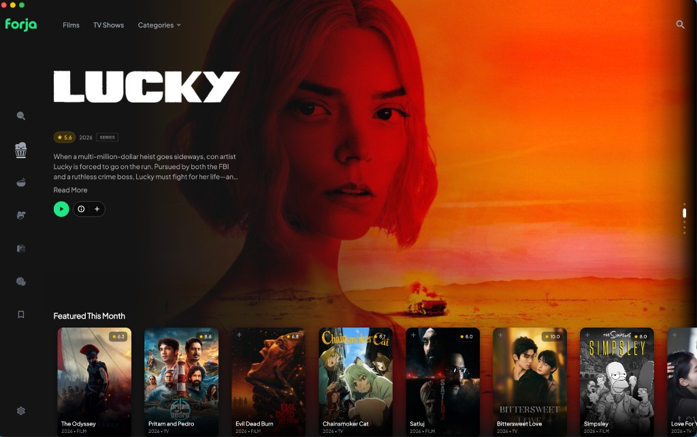
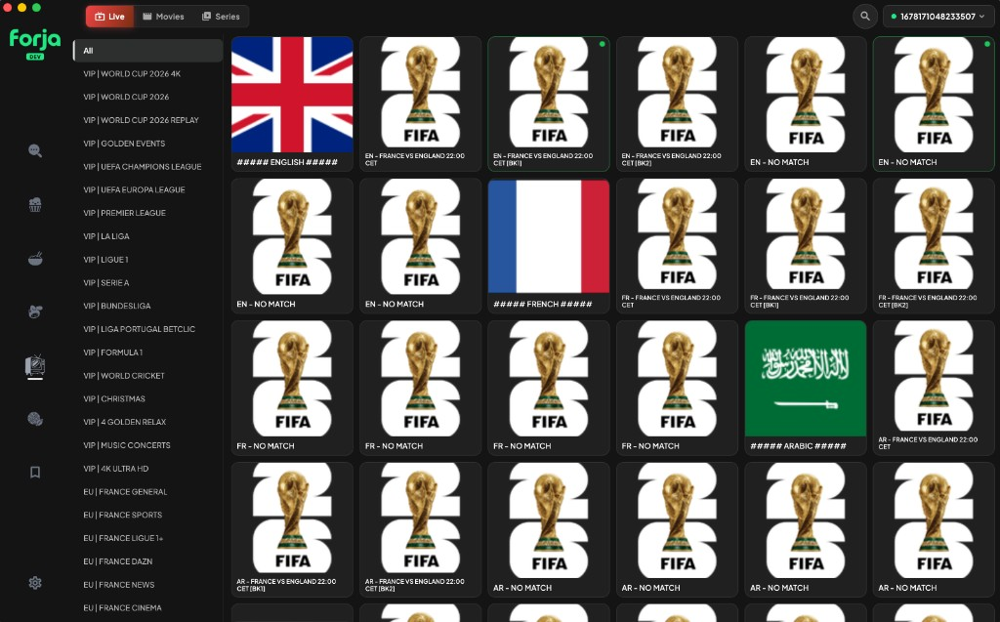
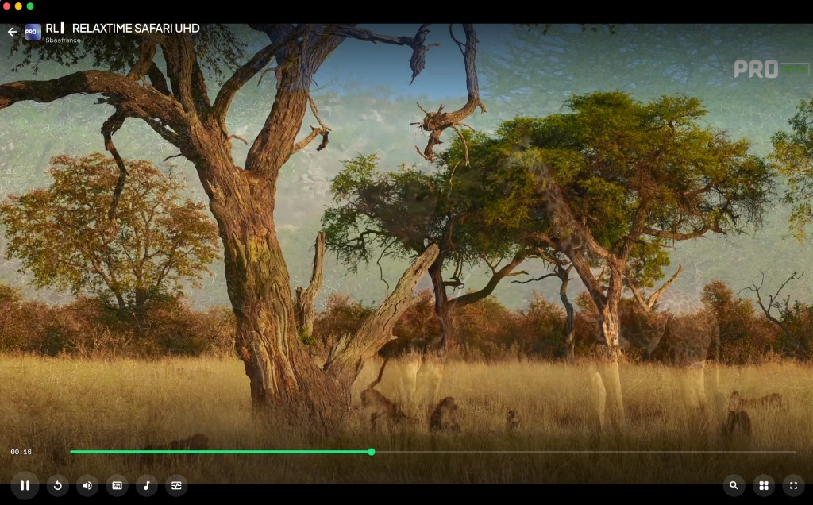

  

  <strong>A player built to stream.</strong> 
  Playback. Guides. Live lists. Sources you connect. 
  <em>One app. Your screens.</em>

  
  &nbsp;
  
  &nbsp;
  

  
  
  
  
  
  

---

  

<em>Sit down. Something’s waiting.</em>

---

## What you can watch

| | |
|:--|:--|
| **Movies** | Pick a film. Watch it full screen. |
| **Series** | Start a show. Keep the episodes rolling. |
| **Live sport** | Pick a match. Watch it as it happens. |
| **Live TV** | Add your list. Tune in to any channel. |

Free to use. Bring your own sources, addons, and servers — no app subscription required.

---

## Home that feels like cinema

A full-bleed hero that pulls you in. Shelves that feel personal. New titles next to old favorites.

- Rich metadata from TMDB — posters, cast, trailers, similar picks
- Watch history with auto-resume — pick up exactly where you left off
- My List, Discover, and search that actually finds what you mean
- Trakt, Simkl, and MDBList when you want your lists everywhere

---

## One player. Every night.

Unified playback across desktop, phone, and TV — built for the couch and the desk.

| Experience | What you get |
|:--|:--|
| **Picture-in-picture** | Keep watching while you browse |
| **Subtitles & audio** | Pick tracks, load more scrapers, own the night |
| **Skip intro / next episode** | Series that keep rolling |
| **Playback speed** | Your pace |
| **External players** | VLC, mpv, MX Player where the platform allows |
| **Torrent + debrid** | Direct torrent, Real-Debrid, TorBox |
| **Stream providers** | Webstreaming, Stremio addons, Nuvio scrapers |

---

## Live when the world watches together

  

| Hub | |
|:--|:--|
| **Live Matches** | Kickoff. Overtime. Sports and events from multiple stream sources. |
| **IPTV** | Xtream Codes, M3U, and Stalker portals — live channels and VOD. |

  

---

## Worlds inside one app

Dedicated hubs when you want something specific — same shell, same player, different night.

| Hub | |
|:--|:--|
| **Anime** | Catalog, seasons, episode flow |
| **Asian Drama** | KissKh-powered drama hub |
| **Arabic · Anime Arabic** | Regional cinema and anime |
| **Music** | Search, stream, lyrics, playlists, offline downloads |
| **Manga · Comics · Books** | Read in-app with chapter tracking |
| **Audiobooks** | Chapters, speed control, generate from text |
| **Jellyfin** | Your home server, your library |
| **Downloader · Magnet** | Keep offline, or paste a magnet and play |

---

## UX built for every screen

Desk. Living room. Same Forja.

| Surface | Focus |
|:--|:--|
| **Desktop** | Keyboard shortcuts, custom window chrome, side panels, arrow-key focus |
| **Phone** | Immersive nav, PiP, thumb-friendly shell |
| **Android TV** | Leanback launcher, D-pad focus, remote-first player — browse without accidental keyboards |

Flat cinematic shell. Dark theme. No clutter fighting the picture. Hero, shelves, and details share one visual language so the night never feels like a settings panel.

Customize the nav bar — show only the tabs you use.

---

## Sources you connect

Forja doesn’t lock you into one catalog. You wire what you own.

- **Torrents** — Knaben, TPB, Uindex, Jackett, Prowlarr
- **Debrid** — Real-Debrid, TorBox
- **Stremio addons** — catalog + streams
- **WebStreamr / stream providers** — direct links without torrent
- **LAN** — pair desktop ↔ phone/TV for torrent relay
- **Cloud sync** — Forja account across devices
- **Backup & restore** — move settings between machines

---

## Download

Get the latest build from **[forjahq.xyz/download](https://www.forjahq.xyz/download)** or [GitHub Releases](https://github.com/forjahq/forja/releases).

| Platform | Format |
|:--|:--|
| **Windows** | Installer |
| **macOS** | DMG (Apple Silicon + Intel) |
| **Linux** | AppImage |
| **Android / Android TV** | APK |
| **iOS** | App Store / sideload |

---

## Learn more

| | |
|:--|:--|
| **User guide** | [docs/features](docs/features/README.md) — every feature, how to use it |
| **Website** | [forjahq.xyz](https://www.forjahq.xyz) |
| **Developers** | [docs/DEVELOPMENT.md](docs/DEVELOPMENT.md) · Flutter app in `apps/forja` · Rust engine in `crates/` |
| **Portal** | Marketing + accounts — `apps/web` (`pnpm install && pnpm dev`) |

---

## License

GPL-2.0

   
  <strong>Don’t wait for the night.</strong> 
  Download Forja. Press play. It’s already free.

