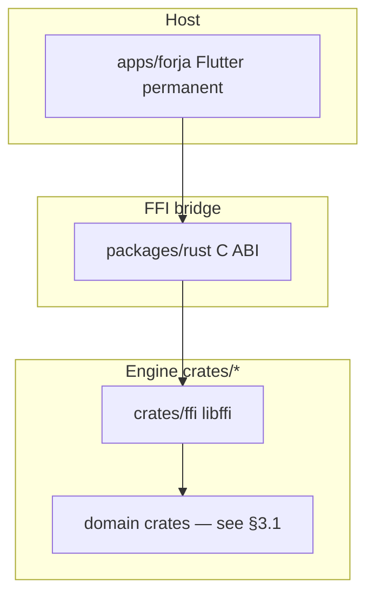
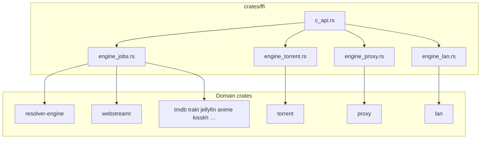
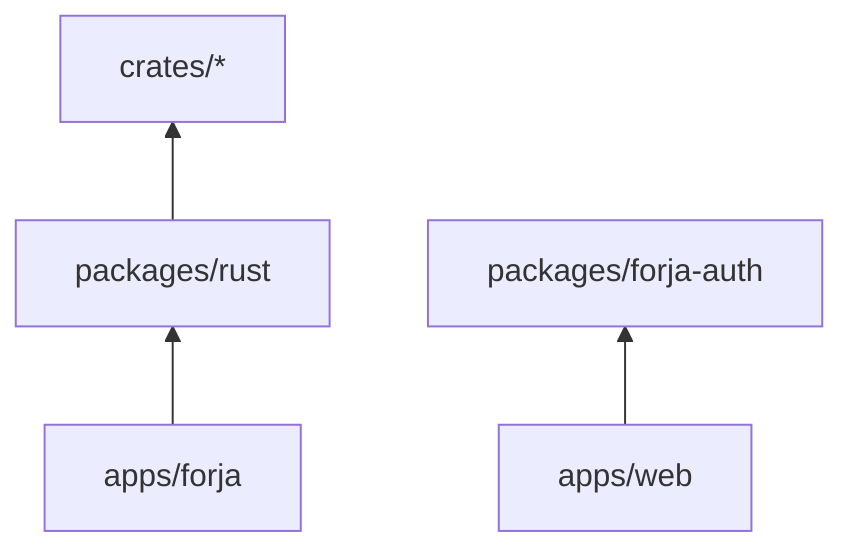

# Forja — architecture

Technical architecture reference for the Forja engine and monorepo.

**Status:** App line **1.4.x** (`kReleaseCodename` = Atarin). **Phases 1–3 engine migration complete** — [migration index](migration/README.md).  
**Last reviewed:** 2026-08-25 (vs repo HEAD).

**Companion docs:** [DEVELOPMENT.md](DEVELOPMENT.md) (build/run) · [features/README.md](features/README.md) (user guide) · [INVENTORY.md](INVENTORY.md) (as-built facts) · [ENGINE_BOUNDARY.md](ENGINE_BOUNDARY.md) (boundary decisions) · [architecture/README.md](architecture/README.md) (UI feature map) · [migration/README.md](migration/README.md) · [RFC-009](rfc/fixed/009-[fixed]-rust-ffi.md) (FFI spec)

---

## 1. System overview

Forja is a **GPL-2.0 melos + Cargo monorepo**: one cross-platform Flutter product (`apps/forja`) backed by a Rust engine (`crates/*`) exposed through FFI. A separate web portal (`apps/web`) and admin (`apps/admin`) share auth helpers via `packages/forja-auth` (TypeScript). The Flutter app is a fat-client media hub — movies/TV, IPTV, live matches, anime, Asian drama, torrents, Stremio addons, and more.

**Core principle** ([ENGINE_BOUNDARY.md](ENGINE_BOUNDARY.md)):

> **Engine in `crates/*`. Flutter host shows pixels and platform capabilities.**

| Concern | Owner |
|---------|-------|
| Engine (resolve, catalog APIs, storage, proxy, scrape, LAN server) | `crates/*` |
| C3–C5 hosts (WebView, Nuvio/`flutter_js`, WASM) | `apps/forja` (permanent) |
| Widgets, navigation, theme, OAuth UX, **Riverpod host state** ([RFC-047](rfc/047-[open]-riverpod-state-migration.md)) | Host (`apps/forja`) |
| Dart FFI bridge + thin catalog/playback glue | `packages/rust` (permanent) |
| Web portal auth (TS) | `packages/forja-auth` + `apps/web` |

### Target end-state (Flutter product)



Normalized Flutter engine path: **`packages/rust` + `crates/*`**. Web/admin are separate surfaces.

### Layer cake (Flutter)

```
┌──────────────────────────────────────────┐
│  apps/forja — widgets, shell, player     │
│  C3–C5 hosts, OAuth UX, Riverpod         │
├──────────────────────────────────────────┤
│  packages/rust — FFI + thin glue         │
├──────────────────────────────────────────┤
│  libffi — c_api + jobs + stateful engines│
├──────────────────────────────────────────┤
│  domain crates — resolve, catalog,       │
│  torrent, proxy, LAN, scrapers, …        │
└──────────────────────────────────────────┘
```

---

## 2. Monorepo topology

```
Forja/
├── apps/
│   ├── forja/           Flutter product (permanent host)
│   ├── web/             Portal (Supabase) — download, account, …
│   └── admin/           Admin tooling
├── packages/
│   ├── rust/            Dart FFI bridge + thin glue (permanent)
│   └── forja-auth/      Shared TS auth helpers for web
├── crates/              Rust engine workspace → libffi
├── docs/                Architecture, migration, RFCs, features
└── scripts/             build_rust.sh, build_rust_mobile.sh, …
```

| Path | Role | Fate |
|------|------|------|
| `apps/forja` | Flutter UI + platform host | **Permanent** |
| `apps/web` / `apps/admin` | Web portal / admin | **Permanent** (separate from Flutter engine) |
| `packages/rust` | Dart FFI bridge + parity tests + thin services | **Permanent** |
| `packages/forja-auth` | TS auth for web | **Permanent** (web stack) |
| ~~`packages/api`~~ / ~~`packages/{core,storage,streaming}`~~ | Legacy Dart engines | **Deleted** (waves 1–2) |
| `crates/*` | Rust engine | **Permanent** |

### Dependency rules (Flutter)

```
apps/forja → packages/rust only (engine)
packages/rust → never import apps/forja
```

Cross-feature navigation uses `shell/app_router.dart` and `shell/shell_bus.dart` — features must not import other features' screens directly. See [architecture/README.md](architecture/README.md).

---

## 3. Rust engine

There is no separate `engine` crate. The engine is the aggregate of domain crates wired through `crates/ffi`, built as **`libffi`** (`cdylib` + `staticlib`).

Default features on `ffi`: `torrent-engine`, `local-proxy`, `lan-server`.

### 3.1 Crate map

Workspace members (`crates/Cargo.toml`):

| Crate | Responsibility |
|-------|----------------|
| **`ffi`** | C ABI (`c_api.rs`), job runtime (`engine_jobs`), torrent / proxy / LAN / mega / seek111477 engines |
| **`utils`** | Episode matcher, torrent filter, JS unpacker, HLS parse, kisskh subtitle, cancel tokens, provider runtime |
| **`stream`** | Playable normalize / select / source order helpers |
| **`iptv`** | M3U / Xtream / Stalker / Reddit catalog / portal extract / stream probe |
| **`iptv-worker`** | Standalone IPTV worker binary |
| **`stremio`** | Manifest/catalog/meta/streams parse + HTTP |
| **`webstreamr`** | Source/extractor pipeline + `get_streams_json` (HTTP in Rust) |
| **`scrapers`** | Knaben / TPB / Uindex torrent search |
| **`torrent`** | librqbit session + localhost axum stream server |
| **`proxy`** | axum localhost relay (generic, HLS, token, mega, jellyfin, comic, …) |
| **`lan`** | LAN server, pairing, mDNS browse, torrent history |
| **`storage`** | JSON file-backed KV |
| **`tmdb`** / **`trakt`** / **`jellyfin`** / **`anilist`** | Catalog HTTP clients |
| **`manga`** / **`books`** / **`catalog`** | Vertical scrape/catalog (manga, LibGen, BestSimilar, …) |
| **`anime`** | Anime extractors, resolve, subtitles, mdblist, introdb, lyrics |
| **`kisskh`** | Asian Drama catalog + kkey helpers |
| **`live-matches`** | Live sports catalog / fetch pipelines |
| **`indexer`** | Jackett / Prowlarr HTTP |
| **`debrid`** | Real-Debrid, AllDebrid, Premiumize, TorBox, Debrid-Link |
| **`music`** | Deezer / YouTube music HTTP |
| **`resolver-engine`** | Provider race, scoring, cache, plugin registry ([ENGINE_BOUNDARY](ENGINE_BOUNDARY.md) D2) |
| **`engine-js`** | QuickJS-backed extract / StreamCrypto-style jobs |

Vendored patch: `crates/third_party/librqbit-dualstack-sockets` — iOS socket binding fix for librqbit.

### 3.2 Crate layering inside `ffi`



Entry modules (abbreviated — see `crates/ffi/src/lib.rs`):

```
mod engine_jobs;
mod c_api;
mod engine_torrent;   // feature torrent-engine
mod engine_proxy;     // feature local-proxy
mod engine_lan;       // feature lan-server
mod engine_seek111477;
mod engine_mega;
```

Pattern: domain crates own logic; `ffi` is glue + job orchestration. Complex calls often go through **`engine_jobs`** (cancelable) rather than raw blocking FFI on the UI isolate.

### 3.3 FFI boundary — dual surface, one binary

| Path | Contract | Consumer | Status |
|------|----------|----------|--------|
| **C ABI** | `crates/ffi/src/c_api.rs` — `#[no_mangle] extern "C" ffi_*` | `packages/rust` (`Engine`) | **Active** |
| **UniFFI** | `crates/ffi/src/forja.udl` + scaffolding | — | **Scaffold only** — Dart does **not** bind UniFFI |

Dart uses the C ABI exclusively. UDL may still be generated at build time; keep C ABI as the source of truth for new exports.

#### Marshaling contract

| Type | Convention |
|------|------------|
| Primitives | Direct (`i64`, `bool`, `i32`) |
| Complex data | **JSON strings** both ways |
| String memory | `CString::into_raw` out; `ffi_free_string` to release |
| Errors | Embedded in JSON `{"error":"..."}` or sentinels |
| Async Rust | Global `LazyLock<Runtime>` + job workers; long work off UI via `EngineWorkerPool` / `Isolate.run` |

#### Dart call chain

```
App → Engine.init() → DynamicLibrary.open("libffi…")
  → lookup("ffi_*") → call → _readString() → ffi_free_string()
```

Load paths (`packages/rust/lib/src/library_path.dart`):

- Android: `libffi.so` (jniLibs)
- iOS/macOS: `libffi.dylib` (app bundle Frameworks)
- Desktop dev: `crates/target/release/libffi.{dylib,so,dll}`
- Override: `RUST_LIB` env

### 3.4 Stateful subsystems

Long-lived localhost axum servers run **inside** the `libffi` process — not separate OS processes.

| Subsystem | Rust module | Lifecycle FFI |
|-----------|-------------|-----------------|
| Torrent engine | `engine_torrent.rs` → `torrent` | `torrent_engine_start` / `stop` |
| Local proxy | `engine_proxy.rs` → `proxy` | `proxy_start` / `stop` / `register_route` |
| LAN server | `engine_lan.rs` → `lan` | `lan_server_start` / `stop`, pairing, browse |

#### Proxy route map (core)

| Route | Purpose |
|-------|---------|
| `/health` | Liveness |
| `/proxy?url=&headers=` | Generic upstream fetch — CORS bypass, Range, headers |
| `/hls-proxy` | HLS playlist rewrite + PNG-wrapper TS strip |
| `/proxy/{token}` | Pre-registered upstream by token |

Additional proxy modules (mega, jellyfin, comic, seek111477, …) live under `crates/proxy`.

---

## 4. Data flows

### 4.1 Torrent playback

1. `TorrentStreamService` starts the engine on a free port.
2. `torrentStreamJson` adds the magnet; `utils::episode_matcher` picks the file for S/E.
3. Returns a localhost URL; the player never talks to librqbit directly.

### 4.2 Web stream resolution

**Main path (WebStreamr):** `WebStreamrService` → one FFI call `webstreamrGetStreamsJson`. Rust (`crates/webstreamr`) fetches + parses. Dart post-processes URLs when needed (e.g. re-proxy).

**Resolver engine:** `crates/resolver-engine` owns provider race / scoring / cache for the unified resolve path; host owns progress/cancel UX and C3–C5 adapters ([ENGINE_BOUNDARY](ENGINE_BOUNDARY.md) D2).

**Legacy / granular FFI:** Pattern A HTML-in parsers still exist for some call sites; prefer Pattern B (fetch+parse in Rust) for new work.

**Embed providers:** Mix of Rust jobs and host WebView/WASM where required — see [INVENTORY.md](INVENTORY.md) and [architecture/services-map.md](architecture/services-map.md).

### 4.3 Provider registry

Registry: [`packages/rust/lib/src/playback/providers/registry/provider_registry.dart`](../packages/rust/lib/src/playback/providers/registry/provider_registry.dart).

`getActiveProviders()` respects user order. Resolve tries providers per scoring/order rules; Stremio addon streams remain a related but separate path.

### 4.4 Storage / prefs

```
Engine.init(storagePath)
  → storage_open(path)           # crates/storage JSON KV
  → kv.dart prefers Rust KV when engine ready
```

Host prefs / settings facades live in **`packages/rust/lib/src/`** (`SettingsService`, `kv.dart`, watch history, …). Secrets / OAuth stay on the host ([ENGINE_BOUNDARY](ENGINE_BOUNDARY.md) D5).

---

## 5. Packages (normalized)

| Package | Role |
|---------|------|
| `packages/rust` | Dart FFI bridge, thin catalog/playback services, parity tests |
| `packages/forja-auth` | Shared TypeScript auth for `apps/web` |

Deleted engine packages: `api`, `scrapers`, `webstreamr`, `streaming`, `storage`, `core`, legacy `forja_*`.



---

## 6. Flutter UI

| Layer | Path | Role |
|-------|------|------|
| Bootstrap | `apps/forja/lib/app/bootstrap.dart` | Platform init, `Engine.init()`, `ProviderScope`, splash |
| Shell | `apps/forja/lib/shell/` | `MainScreen`, `AppRouter`, `ShellBus`, `nav_config`, adaptive profiles |
| Features | `apps/forja/lib/features/` | One folder per vertical (+ `media/` routes) |
| Shared | `apps/forja/lib/shared/` | Player, design tokens, extractors, Nuvio, telemetry |

**State:** Migrating to **Riverpod** ([RFC-047](rfc/047-[open]-riverpod-state-migration.md)) — `ProviderScope` at bootstrap; many screens still `StatefulWidget` + singleton services (`SettingsService`, …).

**Routing:** Splash → shell tabs via `MainScreen` / `nav_config`. Secondary nav via `Navigator` + `AppRouter` (`openMovie`, `openPlayer`, …). No go_router.

**Player (host):** `shared/player/` — **media_kit** (desktop + default Android) and **ExoPlayer/Media3** (Android built-in option). TV menus keep both engines available. Defers to `Engine` for torrent / proxy / resolve jobs.

**Nav destinations** (`nav_config.dart`): Home · Discover · Similar · Search · My List · Downloader · Magnet · Live Matches · IPTV · Audiobooks · Books · Music · Comics · Manga · Jellyfin · Anime · Anime Arabic · Asian Drama · Arabic · Settings. Product polish scope for TV/active work is a subset — see [forja-feature-scope](../.cursor/rules/forja-feature-scope.mdc) / [forja-tv-scope](../.cursor/rules/forja-tv-scope.mdc).

---

## 7. Build, artifacts, CI

| Script | Output |
|--------|--------|
| `./scripts/build_rust.sh` | `crates/target/release/libffi.{dylib,so,dll}` |
| `./scripts/build_rust_mobile.sh ios` | `apps/forja/ios/Runner/Frameworks/libffi.dylib` |
| `./scripts/build_rust_mobile.sh android` | `jniLibs/{arm64-v8a,armeabi-v7a}/libffi.so` |

| Melos command | What |
|---------------|------|
| `melos run rust:build` | Desktop Rust engine |
| `melos run rust:build:mobile` | iOS + Android FFI |
| `melos run rust:test` | `cargo test` + Dart parity |
| `melos run rust:integration` | App engine smoke (desktop) |

### Artifact locations

| Platform | Path |
|----------|------|
| Desktop dev | `crates/target/release/libffi.*` |
| macOS bundle | `apps/forja/macos/Runner/Frameworks/libffi.dylib` |
| Android | `jniLibs/arm64-v8a` + `armeabi-v7a` |
| iOS | `ios/Runner/Frameworks/libffi.dylib` |

### CI workflows

| Workflow | Trigger |
|----------|---------|
| `.github/workflows/rust.yml` | PR touching `crates/**` or `packages/rust/**` |
| `.github/workflows/release.yml` | Tagged / release builds |
| `.github/workflows/build.yml` | Manual multi-platform build |

### Tests

| Layer | Location | Command |
|-------|----------|---------|
| Rust unit + golden | `crates/*/src`, `crates/*/tests/` | `cargo test --workspace` |
| Dart ↔ Rust parity | `packages/rust/test/parity/` | `cd packages/rust && flutter test` |
| App smoke | `apps/forja/test/engine_smoke_test.dart` | `melos run rust:integration` |

---

## 8. Migration delta (engine lens)

Phases 1–3 are **`fixed`** — see [migration/README.md](migration/README.md).

| Wave | Outcome |
|------|---------|
| Wave 1 — playback | scrapers, webstreamr, torrent, proxy, Stremio/IPTV HTTP in Rust; `streaming`/`storage`/`core` deleted |
| Wave 2 — catalog | TMDB/Trakt/Jellyfin/AniList/anime/kisskh/live-matches/… in `crates/*`; `packages/api` deleted |

**Still host:** C3–C5 (WebView / Nuvio / WASM), player decode, OAuth/secrets, provider-race UX chrome. Some out-of-scope vertical scrape remains Dart until explicitly ported — [services-map.md](architecture/services-map.md).

---

## 9. Design decisions and constraints

| Decision | Rationale |
|----------|-----------|
| **Two layers: engine vs host** | Non-platform logic in `crates/*`; Flutter for UI + platform |
| **JSON as FFI IPC** | Simplicity over zero-copy |
| **C ABI via `packages/rust`** | Permanent Dart FFI bridge |
| **FFI Pattern B default** | fetch+parse in Rust; Pattern A legacy only |
| **No sync FFI on UI thread** | Long resolve → jobs + `Isolate.run` / `EngineWorkerPool` |
| **Resolver-engine owns race** | Host owns progress/cancel + C3–C5 adapters (D2) |
| **WebView / Nuvio / player host-only** | Platform capabilities — never Rust |
| **Network is not the boundary** | HTTP location is an engine implementation detail |
| **Long-lived localhost axum** | Torrent + proxy (+ LAN) inside `libffi` |
| **Thin FFI, fat domain** | Logic in pure crates |

### Anti-patterns

- Dart wrapper calling Rust instead of deleting Dart engine logic
- Sync FFI on UI thread for resolve/search
- New Pattern A FFI for engine work
- New engine logic in Dart
- Hiding a player engine / setting as a “fix” ([no-hide-as-fix](../.cursor/rules/no-hide-as-fix.mdc))

### Allowed

- Host provider race + loading/cancel UX
- C3–C5 vertical hosts in `apps/forja`
- `EngineWorkerPool` / `isolate_runner` for long FFI calls

---

## 10. Cross-references

| Doc | Purpose |
|-----|---------|
| [INVENTORY.md](INVENTORY.md) | As-built codebase inventory |
| [ENGINE_BOUNDARY.md](ENGINE_BOUNDARY.md) | Host vs engine boundary (locked) |
| [architecture/README.md](architecture/README.md) | UI architecture index |
| [architecture/services-map.md](architecture/services-map.md) | Service placement + port status |
| [architecture/feature-file-map.md](architecture/feature-file-map.md) | Feature god-file inventory |
| [DEVELOPMENT.md](DEVELOPMENT.md) | Build, run, melos scripts |
| [crates/README.md](../crates/README.md) | Rust build, NDK, iOS patch |
| [migration/README.md](migration/README.md) | Migration phases 1–3 (`fixed/`) |
| [rfc/fixed/001-[fixed]-monorepo.md](rfc/fixed/001-[fixed]-monorepo.md) | Monorepo layout |
| [rfc/004-[partial]-provider-registry.md](rfc/004-[partial]-provider-registry.md) | Stream provider registry |
| [rfc/fixed/009-[fixed]-rust-ffi.md](rfc/fixed/009-[fixed]-rust-ffi.md) | Rust FFI spec |
| [rfc/047-[open]-riverpod-state-migration.md](rfc/047-[open]-riverpod-state-migration.md) | Riverpod migration |
