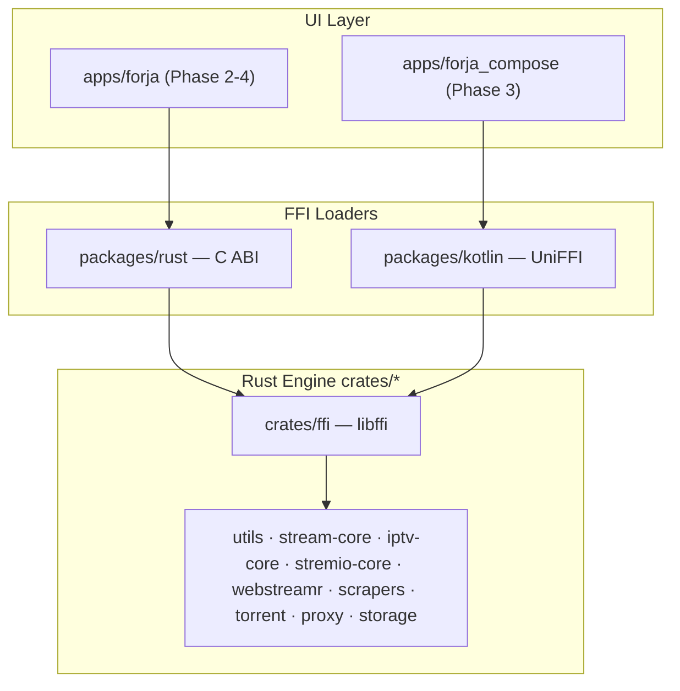
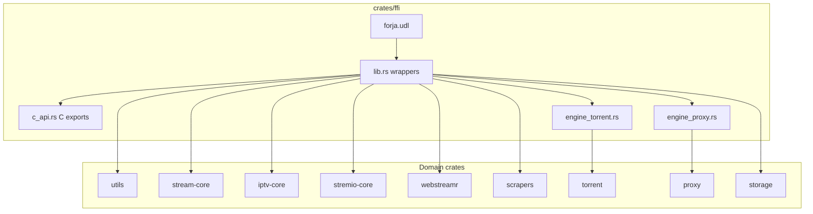
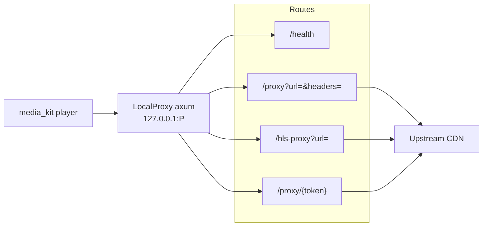
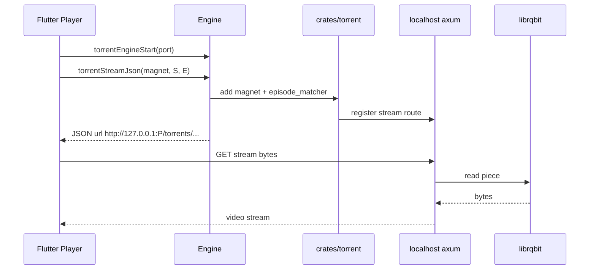
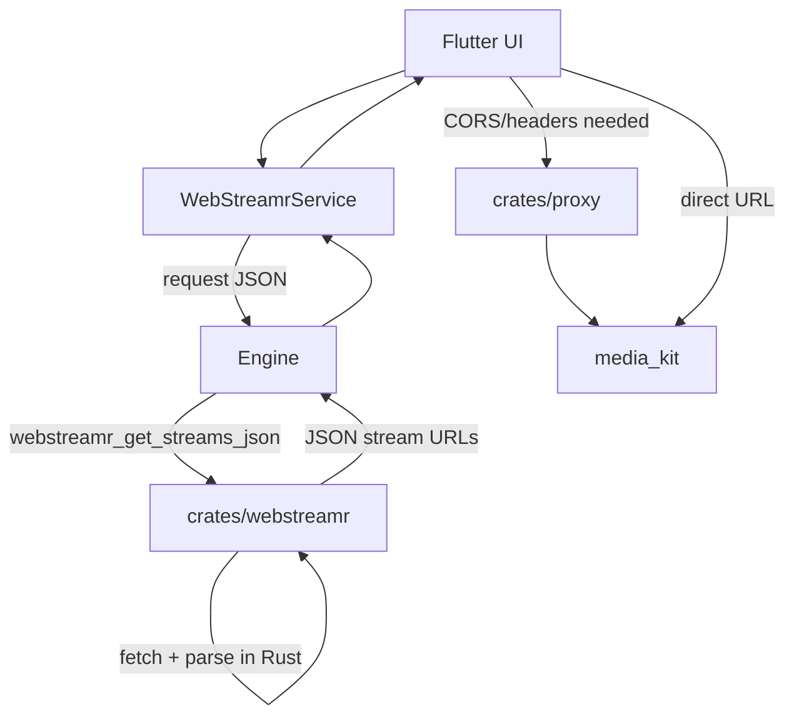
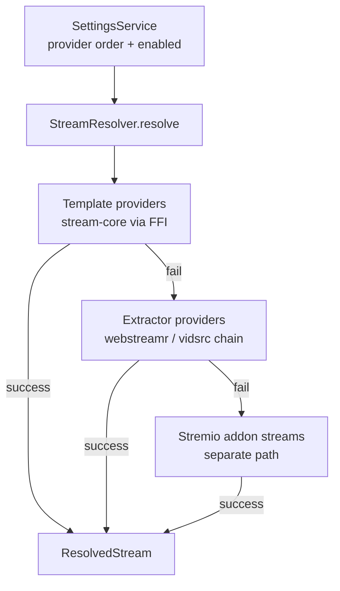
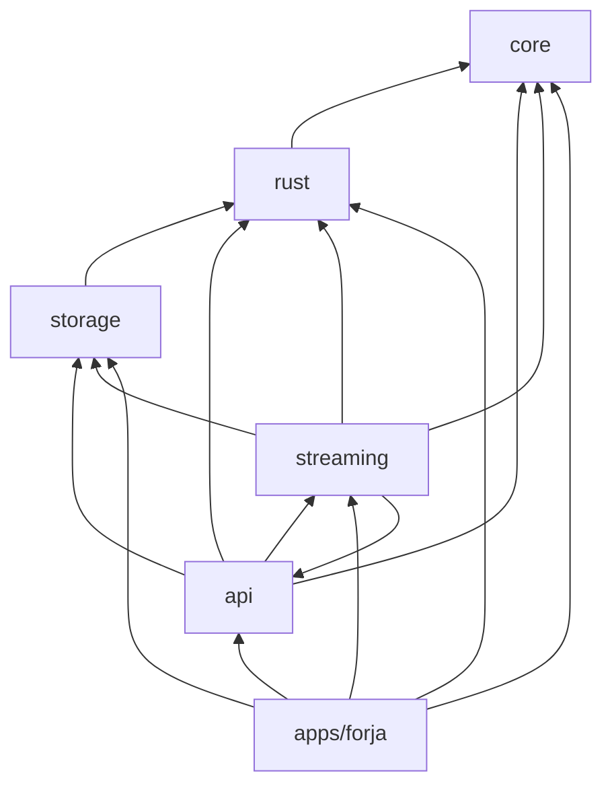

# Forja — architecture

Technical architecture reference for the Forja engine and monorepo.

**Status:** v1.0 shipped on macOS. Active work: [Phase 2 — Rust engine complete](migration/02-rust-engine-complete.md) (78% — Dart engine packages still transitional).

**Companion docs:** [DEVELOPMENT.md](DEVELOPMENT.md) (build/run) · [INVENTORY.md](INVENTORY.md) (as-built facts) · [ENGINE_BOUNDARY.md](ENGINE_BOUNDARY.md) (boundary decisions) · [migration/README.md](migration/README.md) (phases) · [RFC-009](rfc/009-rust-ffi.md) (FFI spec)

---

## 1. System overview

Forja is a **GPL-2.0 melos monorepo**: one cross-platform Flutter product (`apps/forja`) backed by a Rust engine (`crates/*`) exposed through FFI. It is a fat-client media hub — movies/TV, IPTV, music, manga, comics, audiobooks, torrents, Stremio addons, Jellyfin, and more.

**Core principle** (locked in [migration/README.md](migration/README.md)):

> **Engine works in Rust. UI shows pixels.**

| Concern | Owner |
|---------|-------|
| HTTP, APIs, parse, crypto, extract, models | `crates/*` |
| Torrent (librqbit), local proxy (axum) | `crates/*` |
| Storage, prefs, watch history | `crates/storage` (port in progress) |
| Widgets, navigation, player chrome | `apps/forja` |
| WebView host for JS-heavy extractors | UI layer only |

### Target end-state



Phase 3 swaps Flutter for Kotlin Compose. Phase 4 deletes `apps/forja` and `packages/rust`. `packages/kotlin` + `crates/*` are permanent.

### Layer cake (current)

```
┌─────────────────────────────────────┐
│  apps/forja — widgets, nav, player  │
├─────────────────────────────────────┤
│  packages/{api,storage,streaming}   │  ← transitional (Phase 2 delete)
├─────────────────────────────────────┤
│  packages/rust — Engine FFI    │
├─────────────────────────────────────┤
│  libffi — c_api + stateful engines  │
├─────────────────────────────────────┤
│  domain crates — parsers, torrent,  │
│  proxy, storage, webstreamr, …      │
└─────────────────────────────────────┘
```

---

## 2. Monorepo topology

```
Forja/
├── apps/forja/          Flutter product (transitional UI)
├── packages/
│   ├── rust/            Dart FFI loader (deleted Phase 4)
│   ├── kotlin/          UniFFI bindings (permanent)
│   ├── core/            Models, utilities (deleted Phase 2)
│   ├── storage/         Settings, repos (deleted Phase 2)
│   ├── api/             HTTP clients, services (deleted Phase 2)
│   └── streaming/       Torrent session, providers, proxy glue (deleted Phase 2)
├── crates/              Rust engine workspace
├── docs/                Architecture, migration, RFCs
└── scripts/             build_rust.sh, build_rust_mobile.sh, …
```

| Path | Role | Fate |
|------|------|------|
| `apps/forja` | Flutter UI shell | Deleted Phase 4 |
| `packages/rust` | Dart FFI loader + parity tests | Deleted Phase 4 |
| `packages/kotlin` | UniFFI-generated Kotlin bindings | **Permanent** |
| `packages/{core,storage,api,streaming}` | Transitional Dart orchestration | Deleted Phase 2 |
| `crates/*` | Rust engine | **Permanent** |

### Dependency rules

From [RFC-001](rfc/001-monorepo.md):

```
apps/forja → packages/* only
packages/* → never import apps/forja
api → storage → core
streaming → api, core, rust
```

Cross-feature navigation uses `shell/app_router.dart` and `shell/shell_bus.dart` — features must not import other features' screens directly.

---

## 3. Rust engine

There is no separate `engine` crate. The engine is the aggregate of domain crates wired through `crates/ffi`, built as **`libffi`** (`cdylib` + `staticlib`).

Default features on `ffi`: `torrent-engine`, `local-proxy`.

### 3.1 Crate map

Workspace members (`crates/Cargo.toml`):

| Crate | Modules / responsibility | Sync vs async | FFI exposure |
|-------|-------------------------|---------------|--------------|
| **`ffi`** | UDL + `c_api.rs` + `engine_proxy` + `engine_torrent` | mixed | all public API |
| **`utils`** | `episode_matcher`, `torrent_filter`, `js_unpacker`, `hls_parser`, `kisskh_subtitle`, `openssl_crypt` | sync | `*_json`, primitives |
| **`stream-core`** | Provider URL templates (VidLink, VixSrc, Vidnest, …) | sync | template builders |
| **`iptv-core`** | M3U parse, Xtream JSON, paste.sh decrypt | sync | parse fns |
| **`stremio-core`** | Manifest/catalog/meta/streams parse + HTTP GET | blocking reqwest | `stremio_*_json` |
| **`webstreamr`** | 23 extractors + 21 sources | sync parsers | granular + `get_streams_json` |
| **`scrapers`** | Knaben / TPB / Uindex HTML → torrent results | async `search_all` | `search_torrents_json` |
| **`torrent`** | librqbit session + localhost axum stream server | tokio | `torrent_*` |
| **`proxy`** | axum localhost relay (generic, HLS rewrite, token routes) | tokio | `proxy_*` |
| **`storage`** | JSON file-backed KV | sync | `storage_*_json` |

Vendored patch: `crates/third_party/librqbit-dualstack-sockets` — iOS socket binding fix for librqbit.

### 3.2 Crate layering inside `ffi`



Entry point:

```1:27:crates/ffi/src/lib.rs
mod c_api;
#[cfg(feature = "torrent-engine")]
mod engine_torrent;
#[cfg(feature = "local-proxy")]
mod engine_proxy;

use iptv_core::m3u;
use iptv_core::pastesh;
use scrapers::{dedup_by_infohash, parse_knaben_html, parse_tpb_html, parse_uindex_html, search_all};
use stream_core::list_providers;
use stremio_core::{
    build_resource_url, fetch_get, parse_catalog, parse_manifest, parse_meta, parse_streams,
    parse_subtitles,
};
use utils::{
    episode_matcher, hls_parser, js_unpacker, kisskh_subtitle, torrent_filter,
};
use std::sync::LazyLock;
use tokio::runtime::Runtime;

uniffi::include_scaffolding!("forja");

const VERSION: &str = env!("CARGO_PKG_VERSION");

#[allow(dead_code)]
static RUNTIME: LazyLock<Runtime> =
    LazyLock::new(|| Runtime::new().expect("ffi tokio runtime"));
```

Pattern: `fn foo(...) -> String { domain_crate::foo(...) }` with JSON serialization at the FFI edge. Business logic stays in pure domain crates; `ffi` is glue.

### 3.3 FFI boundary — dual surface, one binary

Two FFI paths load the same `libffi` artifact:

| Path | Contract | Consumer | Status |
|------|----------|----------|--------|
| **C ABI** | `crates/ffi/src/c_api.rs` — `#[no_mangle] extern "C" ffi_*` | `packages/rust` (`RustLib` + `Engine`) | **Active** |
| **UniFFI** | `crates/ffi/src/forja.udl` — 65 flat functions, namespace `forja` | `packages/kotlin/generated/` | Phase 3 |

Dart does **not** use UniFFI. The C ABI and UDL must be kept in sync manually.

#### Marshaling contract

| Type | Convention |
|------|------------|
| Primitives | Direct (`i64`, `bool`, `i32`) |
| Complex data | **JSON strings** both ways |
| String memory | `CString::into_raw` out; `ffi_free_string` to release |
| Errors | Embedded in JSON `{"error":"..."}` or sentinels (`"null"`, `-1`) |
| Async Rust | Global `LazyLock<Runtime>` in `ffi`; `block_on` from FFI threads |

#### Dart call chain

```
App → Engine.init() → RustLib.init()
  → DynamicLibrary.open("libffi...")
  → lookup("ffi_*") → call → _readString() → ffi_free_string()
```

Load paths (`packages/rust/lib/src/library_path.dart`):

- Android: `libffi.so` (jniLibs)
- iOS/macOS: `libffi.dylib` (app bundle Frameworks)
- Desktop dev: `crates/target/release/libffi.{dylib,so,dll}`
- Override: `RUST_LIB` env

### 3.4 Stateful subsystems

Long-lived localhost axum servers run **inside** the `libffi` process — not separate OS processes.

| Subsystem | Rust module | Localhost routes | Lifecycle FFI |
|-----------|-------------|------------------|---------------|
| Torrent engine | `engine_torrent.rs` → `torrent` | `GET /torrents/{id}/stream/{file_id}/{*filename}` | `torrent_engine_start` / `stop` |
| Local proxy | `engine_proxy.rs` → `proxy` | `/health`, `/proxy`, `/hls-proxy`, `/proxy/{token}` | `proxy_start` / `stop` / `register_route` |

Both subsystems use internal tokio runtimes. The torrent crate runs its own runtime separate from `ffi`'s `RUNTIME`.

#### Proxy route map



| Route | Purpose |
|-------|---------|
| `/health` | Liveness check |
| `/proxy?url=&headers=` | Generic upstream fetch — CORS bypass, Range, custom headers |
| `/hls-proxy` | HLS playlist rewrite + PNG-wrapper TS strip |
| `/proxy/{token}` | Pre-registered upstream URL by token (`proxy_register_route`) |

Dart registers token routes, then points the player at `http://127.0.0.1:{port}/proxy/{token}`.

---

## 4. Data flows

### 4.1 Torrent playback



1. `TorrentStreamService` starts the engine on a free port.
2. `torrentStreamJson` adds the magnet, `utils::episode_matcher` picks the file for S/E.
3. Returns a localhost URL; media_kit never talks to librqbit directly.

### 4.2 Web stream resolution

**Main path (WebStreamr):** `WebStreamrService` builds a JSON request from settings, then one FFI call — `webstreamrGetStreamsJson`. Rust (`crates/webstreamr`) fetches pages via `fetcher.rs` and runs the full source/extractor pipeline. Dart only post-processes URLs (e.g. 1shows.app HLS re-proxy).



**Legacy / granular FFI:** `extract_embed_html_json`, `parse_webstreamr_source_html_json`, etc. accept pre-fetched HTML (Pattern A in [INVENTORY.md](INVENTORY.md)). The app’s primary WebStreamr path does not use these for full resolve.

**Embed providers (videasy, vidsrc, template):** Mix of Rust (`resolveVidsrcEmbedJson`, template URLs) and host-side WebView/WASM where required — see [INVENTORY.md](INVENTORY.md) §5.

### 4.3 Provider registry resolve

From [RFC-004](rfc/004-provider-registry.md). Registry: `packages/streaming/lib/src/provider_registry.dart`.



`getActiveProviders()` respects user order. `resolve(movie, season, episode)` tries providers sequentially; first success wins. Stremio addon streams are separate from the built-in provider grid.

### 4.4 Storage / prefs

```
Engine.init(storagePath)
  → storage_open(path)           # crates/storage JSON KV
  → kv.dart prefers Rust KV when engine ready
  → one-time SharedPreferences migration in facade.dart
```

`packages/storage` repos are thin wrappers during Phase 2; target is typed Rust APIs with Dart package deleted.

---

## 5. Dart transitional layer

These packages still contain engine logic. **Move = port to `crates/*`, expose FFI, delete the Dart package.**

| Package | Still in Dart | Rust port status |
|---------|---------------|------------------|
| `packages/streaming` | Nuvio JS runtime (`flutter_js`), site111477 seekable proxy, shelf routes in `local_server_service` | P2-83 partial |
| `packages/storage` | `kv.dart` glue, `app_theme.dart`, thin repos | P2-88 partial |
| `packages/api` | TMDB, Trakt, debrid, Jackett, Jellyfin, vertical scrapers, subtitles | P2-89 todo |
| `packages/core` | Dart models (`Movie`, `StreamSource`, …) | P2-90 todo |

Deleted Dart packages (logic now in Rust): `packages/scrapers`, `packages/webstreamr`, legacy `packages/forja_*`.

### Package dependency graph



**Narrow cycle:** `api ↔ streaming` — `api` imports `streaming` for `LocalServerService` in a few content services; `streaming` imports `api` for `subtitlecat_service` and `webstreamr_settings`.

### What survives in `packages/`

| Package | Role | When deleted |
|---------|------|--------------|
| `packages/rust` | Dart FFI loader + parity tests | Phase 4 |
| `packages/kotlin` | UniFFI bindings for Compose | **Never** |

---

## 6. Flutter UI (minimal)

The UI layer is intentionally simple — no Riverpod, Bloc, or go_router.

| Layer | Path | Role |
|-------|------|------|
| Bootstrap | `apps/forja/lib/app/bootstrap.dart` | Platform init, `Engine.init()`, service warm-up, splash |
| Shell | `apps/forja/lib/shell/` | `MainScreen` tab map, `AppRouter`, `ShellBus`, `nav_config` |
| Features | `apps/forja/lib/features/` | One folder per nav tab (~20 verticals) |
| Shared | `apps/forja/lib/shared/` | Player (`media_kit`), design tokens, casting stubs |

**State:** `StatefulWidget` + `setState`, singleton services (`SettingsService`, `StremioService`, `TorrentStreamService`, …), `ValueNotifier` for theme/nav/search.

**Routing:** `MaterialApp(home: SplashScreen())` — no named routes. Tab switching via `MainScreen` index. Secondary nav via `Navigator.push`. Cross-feature hot paths via `AppRouter.openMovie()` / `openPlayer()`.

**Player:** `shared/player/` → media_kit (custom AimesSoft fork). Defers to `Engine` for torrent re-search, proxy URLs, episode matching. Platform split: `mobile_player_screen.dart` / `desktop_player_screen.dart`.

**Nav tabs (19 + settings):** Home · Discover · Similar · Search · My List · Media Downloader · Magnet · Live Matches · IPTV · Audiobooks · Books · Music · Comics · Manga · Jellyfin · Anime · Anime Arabic · Asian Drama · Arabic · Settings.

---

## 7. Build, artifacts, CI

| Script | Output |
|--------|--------|
| `./scripts/build_rust.sh` | `crates/target/release/libffi.{dylib,so,dll}` |
| `./scripts/build_rust_mobile.sh ios` | `apps/forja/ios/Runner/Frameworks/libffi.dylib` |
| `./scripts/build_rust_mobile.sh android` | `apps/forja/android/app/src/main/jniLibs/arm64-v8a/libffi.so` |
| `./scripts/build_macos.sh` | `apps/forja/build/macos/.../forja.app` |
| `./scripts/generate_kotlin_ffi.sh` | `packages/kotlin/generated/` |

| Melos command | What |
|---------------|------|
| `melos run rust:build` | Desktop Rust engine |
| `melos run rust:build:mobile` | iOS + Android FFI |
| `melos run rust:test` | `cargo test` + Dart parity |
| `melos run rust:integration` | App engine smoke (desktop) |

### Artifact locations

| Platform | Path |
|----------|------|
| Desktop dev | `crates/target/release/libffi.*` |
| macOS bundle | `apps/forja/macos/Runner/Frameworks/libffi.dylib` |
| Android | `jniLibs/arm64-v8a/libffi.so` |
| iOS | `ios/Runner/Frameworks/libffi.dylib` |

### CI workflows

| Workflow | Trigger |
|----------|---------|
| `.github/workflows/rust.yml` | PR touching `crates/**` or `packages/rust/**` |
| `.github/workflows/forja-macos.yml` | macOS releases |
| `.github/workflows/build.yml` | General build |

### Tests

| Layer | Location | Command |
|-------|----------|---------|
| Rust unit + golden | `crates/*/src`, `crates/*/tests/` | `cargo test --workspace` |
| Dart ↔ Rust parity | `packages/rust/test/parity/` | `cd packages/rust && flutter test` |
| App integration | `apps/forja/integration_test/` | `melos run rust:integration` |

Parity rule: Rust output must match Dart reference for the same fixture before switching a call site.

---

## 8. Migration delta (engine lens)

Snapshot from [02-rust-engine-complete.md](migration/02-rust-engine-complete.md). Progress: **28 / 36 tasks (78%)**.

### Done

- `packages/scrapers` deleted → `search_torrents_json`
- `packages/webstreamr` deleted → `ffi_webstreamr_get_streams_json`
- Legacy `packages/forja_*` deleted (7 orphan packages)
- Torrent filter → `filter_torrents_json`; Dart filter logic deleted
- HLS proxy in Rust; Dart HLS rewrite deleted
- All `*Backend` hooks removed; direct FFI everywhere
- libtorrent dropped; librqbit on desktop

### Partial (Dart package must be deleted to finish)

| Task | Rust done | Dart still alive |
|------|-----------|------------------|
| P2-83 streaming | vidsrc 3-hop, webstreamr service, videasy OpenSSL AES, provider URL dedup | Nuvio JS runtime, site111477 seekable proxy, shelf routes |
| P2-88 storage | `crates/storage` KV + FFI; legacy prefs migration | `kv.dart` glue, `app_theme.dart`, thin repos |

### Blocks Phase 3

| Task | Dart package | Rust work |
|------|--------------|-----------|
| P2-89 | `packages/api` | TMDB, Trakt, debrid, jackett, subtitles, … |
| P2-90 | `packages/core` | Engine JSON / generated types |
| P2-83 | `packages/streaming` | site111477 seekable proxy, nuvio host glue |
| P2-88 | `packages/storage` | Typed settings/history APIs |

### Exit checklist (condensed)

| # | Criterion | Status |
|---|-----------|--------|
| 1 | `libtorrent_flutter` removed | done |
| 2 | Dart HTML parse fallbacks removed | done |
| 3 | Parse/crypto/torrent primitives in Rust | done |
| 4 | Legacy `packages/forja_*` deleted | done |
| 5 | Magnet → stream desktop | done |
| 6 | `packages/scrapers` deleted | done |
| 7 | Torrent filter via Rust; Dart deleted | done |
| 8 | Magnet → stream mobile | open (P2-14) |
| 9 | `packages/webstreamr` deleted; `packages/streaming` engine deleted | partial |
| 10 | `packages/api` + `packages/storage` + `packages/core` deleted | open |
| 11 | No `*Backend` hooks | done |
| 12 | Only `packages/rust` + `packages/kotlin` remain under `packages/` | open |
| 13 | Sign-off | open |

**Phase 3 starts when #6–#12 are done.**

---

## 9. Design decisions and constraints

| Decision | Rationale |
|----------|-----------|
| **JSON as FFI IPC** | Simplicity over zero-copy; avoids complex struct marshaling across Dart/Rust |
| **Dual FFI surface** | C ABI for Dart (hand-maintained); UniFFI UDL for Kotlin codegen — must stay in sync manually |
| **Long-lived localhost axum servers** | Torrent + proxy run inside `libffi`; Dart controls lifecycle via start/stop/port FFI |
| **WebView extractors stay in UI** | ~1,900 LOC of JS-heavy extractors remain in Dart/Kotlin adapters ([RFC-009](rfc/009-rust-ffi.md) non-goal) |
| **`RUST_STRICT=1`** | Hard-fail boot when dylib missing (debug aid) |
| **Move = port + delete** | No Dart wrapper calling Rust; no backend swap while keeping Dart package alive |
| **Thin FFI, fat domain** | Business logic in pure crates; `ffi` is glue + JSON boundary only |

### Anti-patterns (never do)

- Dart wrapper calling Rust instead of deleting the Dart file
- `*Backend` static hooks splitting engine across two languages
- `rust_delegates.dart` — direct FFI only
- Dart `compute()` for engine work — isolates don't see statics
- Leaving a Dart package as "facade until Phase 4"

---

## 10. Cross-references

| Doc | Purpose |
|-----|---------|
| [INVENTORY.md](INVENTORY.md) | As-built codebase inventory (facts only) |
| [ENGINE_BOUNDARY.md](ENGINE_BOUNDARY.md) | Host vs engine boundary decisions (draft) |
| [DEVELOPMENT.md](DEVELOPMENT.md) | Build, run, melos scripts |
| [crates/README.md](../crates/README.md) | Rust build, NDK, iOS patch |
| [migration/README.md](migration/README.md) | Migration phases 1–5 |
| [migration/02-rust-engine-complete.md](migration/02-rust-engine-complete.md) | Active phase task tracker |
| [rfc/001-monorepo.md](rfc/001-monorepo.md) | Monorepo layout, dependency rules |
| [rfc/004-provider-registry.md](rfc/004-provider-registry.md) | Stream provider registry |
| [rfc/009-rust-ffi.md](rfc/009-rust-ffi.md) | Rust FFI spec |
| [rfc/011-v1.0-mvp.md](rfc/011-v1.0-mvp.md) | v1.0 scope |
