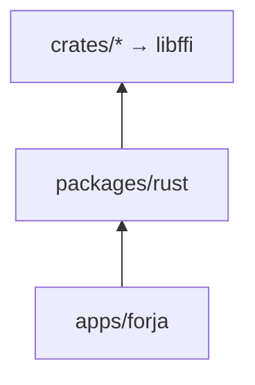

# Forja — as-built inventory

Evidence-based snapshot of the codebase **as it exists today**. Facts only — no target-state rules.

**Use with:** [ARCHITECTURE.md](ARCHITECTURE.md) (design) · [ENGINE_BOUNDARY.md](ENGINE_BOUNDARY.md) (boundary) · [architecture/services-map.md](architecture/services-map.md) (placement) · [migration/README.md](migration/README.md)

**Last reviewed:** 2026-08-25

---

## 1. What the system actually is

Forja is a **melos + Cargo monorepo** shipping:

| Surface | Path | Stack |
|---------|------|-------|
| Flutter app | `apps/forja` | Dart + `packages/rust` → `libffi` |
| Web portal | `apps/web` | Next/React + Supabase + `packages/forja-auth` |
| Admin | `apps/admin` | Web admin tooling |

Playback uses **media_kit** (all platforms) and **ExoPlayer/Media3** (Android option). Rust workspace (`crates/`) ships as `libffi`, loaded by `packages/rust`.

### Dependency graph (Flutter)

### Notable facts

- **`packages/api` deleted** (P3-03). Flutter packages under `packages/`: `rust`, `forja-auth` (TS, web-only).
- **Playback + catalog glue** in `packages/rust/lib/src/` (`playback/`, `catalog/`, `engine.dart`, jobs).
- **Nuvio** in `apps/forja/lib/shared/nuvio/` (permanent C4 host).
- **Long FFI** routes through `EngineWorkerPool` / `isolate_runner.dart` / `engine_jobs`.
- **C3 WebView** extractors remain in `apps/forja` (KissKh stream fallback, embed sniff, …).

---

## 2. Scale snapshot (order of magnitude)

| Layer | Role |
|-------|------|
| `packages/rust` | FFI bridge + thin services (~90 Dart files under `lib/`) |
| `crates/*` | ~27 workspace members → one `libffi` |
| `apps/forja/lib` | Shell + ~22 feature folders + shared player/design |

Exact LOC drifts quickly — re-run `wc -l` when needed. Feature god-file inventory: [feature-file-map.md](architecture/feature-file-map.md).

---

## 3. Rust engine — what exists today

### 3.1 Workspace crates

| Crate | Own HTTP? | What it does |
|-------|-----------|--------------|
| `ffi` | Delegates | C ABI, jobs, torrent/proxy/LAN engines |
| `webstreamr` | **Yes** | Full `get_streams_json` pipeline |
| `resolver-engine` | Yes (via plugins) | Provider race, scoring, cache, registry |
| `torrent` | BitTorrent + axum | Magnet → localhost stream URL |
| `proxy` | On request | `/proxy`, HLS, token, mega, jellyfin, … |
| `lan` | axum + mDNS | LAN server, pairing, browse |
| `scrapers` | **Yes** | Knaben / TPB / Uindex search |
| `stremio` | **Yes** | Parse + HTTP helpers |
| `iptv` | Mixed | Parse + Reddit catalog + probe + portal clients |
| `iptv-worker` | — | Standalone worker binary |
| `utils` | No | Matchers, HLS, crypto, cancel, runtime props |
| `stream` | No | Normalize / select / order helpers |
| `storage` | No | JSON file KV |
| `tmdb` / `trakt` / `jellyfin` / `anilist` | **Yes** | Catalog API clients |
| `anime` / `kisskh` / `live-matches` | **Yes** | Hub extract/catalog pipelines |
| `manga` / `books` / `catalog` | **Yes** | Vertical scrape/catalog |
| `indexer` | **Yes** | Jackett / Prowlarr |
| `debrid` | **Yes** | RD / AD / Premiumize / TorBox / Debrid-Link |
| `music` | **Yes** | Deezer / YouTube helpers |
| `engine-js` | Mixed | QuickJS extract / StreamCrypto-style jobs |

Default `ffi` features: `torrent-engine`, `local-proxy`, `lan-server`.

### 3.2 FFI patterns

**Pattern A — caller supplies body (legacy):** some `parse_*` / `extract_*_html_*` still live.

**Pattern B — Rust fetches end-to-end (preferred):** `webstreamr_get_streams_json`, `search_torrents_json`, catalog `*_json` jobs, torrent/proxy/LAN, resolver jobs, …

**Jobs:** `engine_jobs` + Dart `Engine` job APIs support cancel (`engine_cancel_*`).

Both Pattern A and B are live; new work should be Pattern B / jobs.

### 3.3 Still host-only (no Rust equivalent)

| Capability | Where |
|------------|-------|
| Headless WebView sniff | `apps/forja` extractors (C3) |
| Nuvio `flutter_js` | `shared/nuvio/` (C4) |
| Videasy WASM host | host adapter (C5) |
| Player decode / surface | media_kit + Exo (C6) |
| OAuth / secure storage UX | host (C12) |
| Some out-of-scope vertical scrape | e.g. Arabic / comics / audiobooks — see services-map |

---

## 4. `packages/rust` — bridge layout

| Area | Path | Notes |
|------|------|-------|
| FFI loader | `engine.dart`, `library_path.dart` | C ABI only |
| Jobs / workers | `engine_jobs.dart`, `engine_worker.dart`, `isolate_runner.dart` | Off UI isolate |
| Playback | `playback/` | Providers, torrent, proxy, selection, LAN bridge |
| Catalog | `catalog/`, `*_catalog.dart`, `*_http.dart` | Thin wrappers over Rust |
| Prefs | `settings_service.dart`, `kv.dart`, watch history | Rust KV when ready |
| Models | `models/` | Shared DTOs |

Apps import `package:rust/...` — there is no `packages/api`.

---

## 5. Flutter host pockets of engine-adjacent logic

| Location | What remains |
|----------|----------------|
| Hub `features/*/catalog/` | Orchestration + cache UX; HTTP/parse mostly Rust for in-scope hubs |
| `shared/extractors/`, `shared/nuvio/` | Permanent C3–C5 |
| `shared/playback/` | Provider-race UX, resume handoff |
| `shared/player/` | Decode, controls, Exo ↔ MediaKit swap |
| IPTV feature UI | Portal forms / scrape UI; catalog scrape in `crates/iptv` |

Detail: [services-map.md](architecture/services-map.md).

---

## 6. Split-brain / dual paths (live)

| Capability | Rust | Dart still |
|------------|------|------------|
| WebStreamr resolve | `webstreamr_get_streams_json` | Thin wrapper + isolate |
| Provider race | `resolver-engine` | Progress/cancel UX + C3–C5 adapters |
| Torrent search | `scrapers` | Jackett/Prowlarr via `indexer` + host config |
| KV | `crates/storage` | `kv.dart` + migration leftovers |
| Local proxy | Rust axum | Token registration from Dart |
| KissKh streams | Rust kkey + HTTP | WebView fallback extractor |

---

## 7. Doc vs code (cleared / remaining)

| Topic | Status |
|-------|--------|
| WebStreamr “Dart fetches HTML” | **Fixed in ARCHITECTURE** — Rust `fetcher.rs` |
| “No Riverpod” | **Fixed in ARCHITECTURE** — RFC-047 in progress |
| Crate map missing catalog crates | **Fixed in ARCHITECTURE** |
| “Only packages/rust” ignoring web auth | **Fixed** — `forja-auth` documented |
| UniFFI “deleted” | **Clarified** — scaffold may remain; Dart binds C ABI only |
| ENGINE_BOUNDARY still mentions `packages/api` pending | Doc lag — package is deleted; treat as historical |

---

## 8. Observations

1. **Rust engine is broad** — playback resolve, catalog APIs, hub scrapers, debrid, indexers, LAN — not just webstreamr/torrent.
2. **Host still owns platform** — WebView, Nuvio, WASM, player surfaces, OAuth.
3. **Riverpod migration is partial** — bootstrap has `ProviderScope`; many features still singleton + `setState`.
4. **Product scope ≠ nav map** — `nav_config` lists ~20 tabs; active polish scope is smaller (Home / Search / Anime / Asian Drama / IPTV / Live Matches / Lists / Settings).
5. **Web portal is first-class** — architecture of Flutter FFI ≠ architecture of `apps/web`.

---

## Related

| Doc | Purpose |
|-----|---------|
| [ARCHITECTURE.md](ARCHITECTURE.md) | System architecture and data flows |
| [ENGINE_BOUNDARY.md](ENGINE_BOUNDARY.md) | Host vs engine rules |
| [architecture/services-map.md](architecture/services-map.md) | Service placement + port checklist |
| [migration/README.md](migration/README.md) | Phases 1–3 (`fixed/`) |
