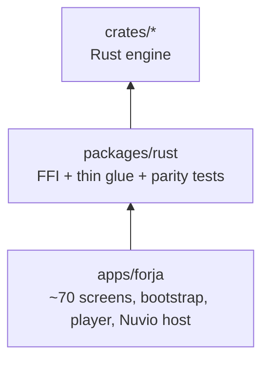
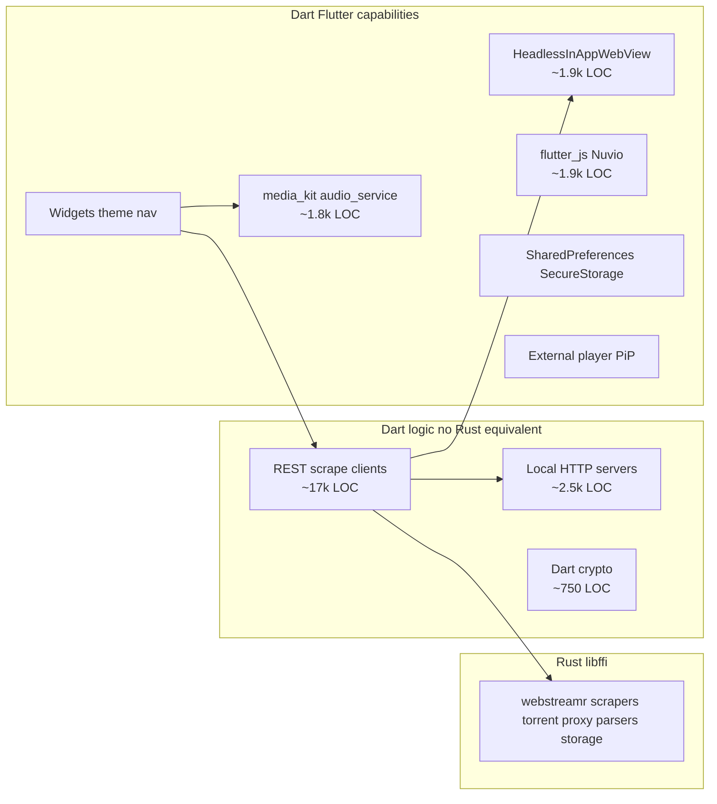

# Forja — as-built inventory

Evidence-based snapshot of the codebase **as it exists today**. Facts and observations only — no target-state rules.

**Use with:** [ARCHITECTURE.md](ARCHITECTURE.md) (target design) · [ENGINE_BOUNDARY.md](ENGINE_BOUNDARY.md) (boundary decisions) · [migration/README.md](migration/README.md) (phase plan)

**Last reviewed:** 2026-07-07

---

## 1. What the system actually is

Forja is a **melos monorepo** shipping one Flutter desktop/mobile app with **~20 content verticals** (movies/TV, torrents, IPTV, anime, Arabic, manga, music, Jellyfin, etc.). Playback uses **media_kit**. A **Rust workspace** (`crates/`) ships as `libffi` and is loaded at runtime by `packages/rust`.

### Dependency graph

### Notable facts

- **`packages/api` deleted** (P3-03). Only `packages/rust` remains under `packages/`.
- **Playback glue** in `packages/rust/lib/src/playback/`; Nuvio in `apps/forja/lib/shared/nuvio/`.
- **IPTV catalog scraper** in [`iptv_network.dart`](../apps/forja/lib/features/iptv/iptv/data/iptv_network.dart) (~1.1k LOC) — orchestration + portal discovery; HTTP/probe via Rust FFI.
- **Long catalog FFI** (TMDB, Trakt, Jellyfin, AniList, manga fetch) routes through `EngineWorkerPool` / `isolate_runner.dart`.
- **C2 verticals** (books, comics, Arabic, etc.) still scrape/parse in `apps/forja` — documented host exceptions.

---

## 2. Scale snapshot

| Layer | LOC (approx) | Files | Role |
|-------|-------------|-------|------|
| `packages/rust` | ~8k+ | 80+ | FFI bridge, thin playback/catalog glue, parity tests |
| `crates/*` (Rust) | ~15k+ | 150+ `.rs` | Engine: webstreamr, torrent, proxy, catalog APIs, metadata |
| `apps/forja/lib` | large | 61+ feature files + shell/shared | UI, C2/C3 vertical hosts, OAuth, player |

**Rust owns** stream-resolution, torrent, P3-04 catalog APIs (debrid, music, subtitles, metadata), and C1 clients (TMDB, Trakt, Jellyfin, AniList fetch). **Dart still owns** C2 vertical scrape (books, comics, Arabic), WebView extractors, and platform integration.

---

## 3. Rust engine — what exists today

### 3.1 Crates and HTTP behavior

| Crate | ~LOC | Own HTTP? | What it does |
|-------|------|-----------|--------------|
| `webstreamr` | largest | **Yes** — `fetcher.rs` blocking reqwest | 21 sources, 23 extractors, full `get_streams_json` pipeline |
| `torrent` | 635 | BitTorrent + local axum | librqbit session, magnet → localhost stream URL |
| `proxy` | 515 | On client request | axum: `/proxy`, `/hls-proxy`, `/proxy/{token}` |
| `scrapers` | 300 | **Yes** — async reqwest | Knaben / TPB / Uindex search |
| `stremio` | 212 | **Yes** — `fetch_get` | Parse + optional GET (FFI exposes both) |
| `iptv` | 540 | No | M3U / Xtream parse, paste decrypt |
| `utils` | 880 | No | Episode match, torrent filter, HLS parse, crypto |
| `stream` | 146 | No | Provider URL templates |
| `storage` | 103 | No | JSON file KV |
| `ffi` | 1,100 | Delegates | UDL + C ABI, 63 functions |

### 3.2 FFI surface — two patterns coexist

**Pattern A — caller supplies body (legacy split):**
`parse_*`, `extract_*_html_*`, `extract_vidsrc_chain_json`, Stremio parsers, scraper HTML parsers, `parse_hls_master_json`, etc.

**Pattern B — Rust fetches end-to-end:**
`search_torrents_json`, `resolve_vidsrc_embed_json`, `webstreamr_get_streams_json`, `stremio_http_get_json`, `torrent_*`, `proxy_*`.

**Observation:** The codebase is mid-transition. Granular HTML-in FFI functions reflect an older "Dart fetches, Rust parses" design. Newer paths (`webstreamr_get_streams_json`, `search_torrents_json`) bundle fetch + parse. **Both patterns are live.**

### 3.3 No Rust crates for (today)

- TMDB, Trakt, Simkl, MDBList
- Debrid (Real-Debrid, AllDebrid, etc.)
- Jackett / Prowlarr (separate from Knaben scrapers)
- Jellyfin
- Anime (AllAnime, Miruro, etc.), Arabic, manga, comics, music, audiobooks
- OAuth / secure credential storage
- Nuvio scraper ecosystem

---

## 4. `packages/api` — capability inventory

Grouped by **technology used**, not package role.

| Capability cluster | LOC | Count | Examples |
|-------------------|-----|-------|----------|
| HTTP REST / scrape | ~17,300 | 35+ | `tmdb_api`, `trakt_service`, `debrid_api`, `jellyfin_service`, `anime_service`, `arabic_service` |
| HTML/XML parse in Dart | overlaps above | 10 | `books_service`, `manga_service`, `bestsimilar_scraper` |
| Headless WebView | ~1,450 | 4 | `stream_extractor`, `kisskh_extractor`, `amri_extractor`, `comic_page_extractor` |
| media_kit / audio_service | ~1,770 | 8 | `music_player_service`, `player_pool_service`, `pip_service`, `external_player_service` |
| Dart crypto (no Rust) | ~750 | 3 | `allanime_extractor`, `mega_proxy`, `anime_arabic_extractor` |
| Rust parse only | ~600 | 2 | `stremio_service` (HTTP still Dart), `kisskh_subtitle_decryptor` |
| Local `dart:io` HttpServer | ~320 | 1 | `mega_proxy` (loopback AES proxy for Mega) |
| Persistence / OAuth | ~2,600 | 15+ | `trakt_service`, `simkl_service`, `my_list_service`, `webstreamr_settings` |

**Rust usage in api:** `Engine` — zero references. `RustLib` — `stremio_service`, `kisskh_subtitle_decryptor` only.

**Heavily mixed modules** (multiple capabilities in one file):

| Module | Mix |
|--------|-----|
| `arabic_service` | HTTP scrape + streaming proxy + WebView extraction |
| `anime_service` | GraphQL + 4 native extractors + caching |
| `stremio_service` | HTTP + storage + Rust JSON parse |
| `jellyfin_service` | HTTP + secure storage + streaming proxy |

**Apps import api from ~50 files** — primary integration surface for the Flutter app.

---

## 5. Playback glue — `packages/api/lib/playback/` + Nuvio host

| File | Nature | Technology |
|------|--------|------------|
| `torrent_stream_service.dart` | FFI orchestration | Rust torrent engine |
| `webstreamr_service.dart` | Thin wrapper | Rust `webstreamrGetStreamsJson` + isolate offload |
| `site111477_proxy.dart` | Thin FFI | Rust seekable proxy |
| `local_server_service.dart` | Thin FFI | Rust axum shelf routes (toky, comic, jellyfin, subtitlecat) |
| `videasy_extractor.dart` | Hybrid | Dart HTTP + WebView WASM + Rust AES |
| `stream_extractor.dart` | WebView sniffer | Used by player flows |
| `provider_registry.dart` | Provider orchestration | Rust `stream` templates |

Nuvio JS host lives in **`apps/forja/lib/shared/nuvio/`** (`nuvio_runtime.dart`, `nuvio_service.dart`).

### Localhost HTTP server implementations

| # | Location | Stack | Routes / purpose |
|---|----------|-------|------------------|
| 1 | `crates/proxy` | axum (Rust) | `/proxy`, `/hls-proxy`, `/proxy/{token}`, domain routes |
| 2 | `site111477` (Rust via FFI) | axum | Seekable byte-range proxy for 111477 |
| 3 | `mega_proxy.dart` (in api) | `dart:io` (Dart) | Mega.nz AES decrypt loopback |

**Deleted:** `packages/streaming` (shelf server, Dart 111477 proxy, duplicate extractors).

---

## 6. Host prefs — `packages/rust/lib/src/`

| Module | What it actually is |
|--------|---------------------|
| `settings_service.dart` | Singleton: streaming prefs, debrid, navbar, subtitles, theme key, stremio addons, provider order |
| `kv.dart` | Dual backend: Rust KV when engine ready, else SharedPreferences |
| `watch_history_service.dart` | Continue-watching CRUD |

**Deleted:** `packages/storage` (`app_theme` moved to app design layer).

**`flutter_secure_storage`** is used in api (Trakt, Jellyfin, MDBList).

---

## 7. Shared DTOs — `packages/api/lib/models/`

| File | Content |
|------|---------|
| `movie.dart`, `stream_source.dart` | JSON DTOs |
| `torrent_result.dart` | DTO + `qualityScore` / `sizeInBytes` parsing logic |

**Deleted:** `packages/core` — utils moved to `apps/forja/lib/shared/utils/`.

---

## 8. Engine logic outside `packages/`

| Location | LOC | What |
|----------|-----|------|
| [`iptv_network.dart`](../apps/forja/lib/features/iptv/iptv/data/iptv_network.dart) | thin | Xtream client + scrape UI glue; Reddit scrape via Rust `scrape_page` |
| [`m3u_store.dart`](../apps/forja/lib/features/iptv/iptv/m3u/m3u_store.dart) | small | M3U fetch via Rust `httpGetJson` |
| [`pastesh_decryptor.dart`](../apps/forja/lib/features/iptv/iptv/data/pastesh_decryptor.dart) | small | HTTP + decrypt via Rust FFI |
| [`details_screen.dart`](../apps/forja/lib/features/home/details_screen.dart) | — | Direct `Engine.sortTorrents` |
| Player screens | — | Inline provider resolution (webstreamr, nuvio, 111477, videasy) |

**Observation:** IPTV Reddit catalog discovery (fetch + portal extract + paste deep links) is engine (`crates/iptv`). Dart keeps Scrape UI / cancel / XML2 stub (disabled).

---

## 9. Split-brain and duplication

| Capability | Rust | Dart still active | Notes |
|------------|------|-------------------|-------|
| WebStreamr full resolve | `webstreamr_get_streams_json` fetches | Thin Dart wrapper + isolate | Rust does HTTP |
| Stremio | `stremio_http_get_json` | `StremioService` uses FFI | ✅ unified |
| IPTV Xtream HTTP | `http_get_json` FFI | `iptv_network` calls FFI | ✅ unified |
| IPTV Reddit catalog scrape | `iptv_reddit_catalog_json` `scrape_page` | thin `IptvScraper` wrapper | ✅ unified (issue 063) |
| IPTV probe | `iptv_probe_stream_json` | thin wrapper | ✅ unified |
| Torrent search | `search_torrents_json` | Jackett / Prowlarr separate in api | Two indexer systems |
| HLS qualities | `parse_hls_master_json` | Dart fetches master playlist first | Split fetch / parse |
| Stream embed sniff | — | WebView in **api** `stream_extractor` | Host WebView |
| Provider templates | `stream` | `provider_registry` wraps FFI | Aligned |
| KV storage | `crates/storage` | `kv.dart` + SharedPreferences fallback | Dual path |
| Local proxy | Rust axum only | — | shelf deleted |

---

## 10. Doc vs code contradictions

| Doc says | Code says |
|----------|-----------|
| [ARCHITECTURE.md §4.2](ARCHITECTURE.md) "Dart fetches HTML" for webstreamr | `WebStreamrService` → `webstreamrGetStreamsJson` only; Rust `fetcher.rs` does HTTP |
| [DEVELOPMENT.md](DEVELOPMENT.md) "Orchestration in packages/*" | Player/home screens orchestrate providers; `StreamResolver` unused |
| Migration: `packages/webstreamr` deleted | True for Dart package; logic lives in `crates/webstreamr` |
| Migration: engine only in `packages/` | IPTV HTTP in `apps/forja/features/iptv/` |
| RFC-001: no circular deps | `api ↔ streaming` cycle **resolved** (streaming deleted) |
| Target: "UI calls Engine only" | Apps call `TmdbApi`, `StremioService`, `SettingsService` widely |

---

## 11. Technical capability taxonomy

Actual technology classes in the codebase — basis for boundary rules, not package names.

| Class | Platform-specific runtime? | Rust implementation exists? | Current LOC (Dart) |
|-------|---------------------------|---------------------------|-------------------|
| REST/JSON client | No | No (for most verticals) | ~17k |
| HTML regex scrape | No | Yes (pattern in `webstreamr`, `scrapers`) | mixed |
| WebView network sniff | Yes — browser engine | No | ~1.9k |
| flutter_js scrapers | Yes — JS runtime | No (QuickJS-in-Rust possible) | ~1.9k |
| WASM in WebView (Videasy) | Yes — WASM host | Partial (AES in Rust) | ~400 |
| media_kit playback | Yes — decoder/surface | No | ~1.8k |
| OAuth secure storage | Yes — keychain/keystore | No | scattered |
| Local loopback servers | No | Partial (Rust proxy + Dart servers) | ~2.5k |
| Flutter ThemeData/widgets | Yes — Flutter host | No | ~330+ in storage |

---

## 12. Observations

1. **Rust engine is real but narrow** — strong on mainstream movie/TV stream resolution (webstreamr, torrent, stremio parse, scrapers); absent on most other shipped verticals (TMDB, Trakt, 15+ content types).

2. **Package boundaries are leaky** — circular deps, duplicate `stream_extractor`, dead repos, engine in app features (IPTV), orchestration split between unused `StreamResolver` and player screens.

3. **Four localhost server patterns** — accidental complexity; consolidation is independent of language choice.

4. **~73% of `packages/api` is plain HTTP** — homogeneous; WebView (~6%), player (~7%), Nuvio/WASM (~8%) are the distinct stacks.

5. **`storage` is not pure persistence** — contains UI (`app_theme.dart`) and a settings god-object; Rust KV is underneath but wrapped in layers.

6. **Migration progress is uneven** — torrent/webstreamr/vidsrc/scrapers are Rust-backed; Stremio splits HTTP (Dart) / parse (Rust) despite FFI for both; IPTV splits across app feature + Rust parsers.

7. **Deleting packages is phased** — wave 1 playback, wave 2 catalog. See [ENGINE_BOUNDARY.md](ENGINE_BOUNDARY.md) two-layer model.

---

## Related

| Doc | Purpose |
|-----|---------|
| [ENGINE_BOUNDARY.md](ENGINE_BOUNDARY.md) | Open decisions + draft boundary framework |
| [ARCHITECTURE.md](ARCHITECTURE.md) | Target architecture and data flows |
| [migration/README.md](migration/README.md) | Phase plan and package deletion table |
