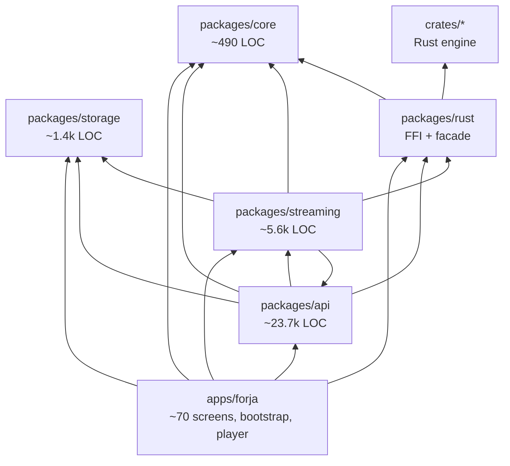
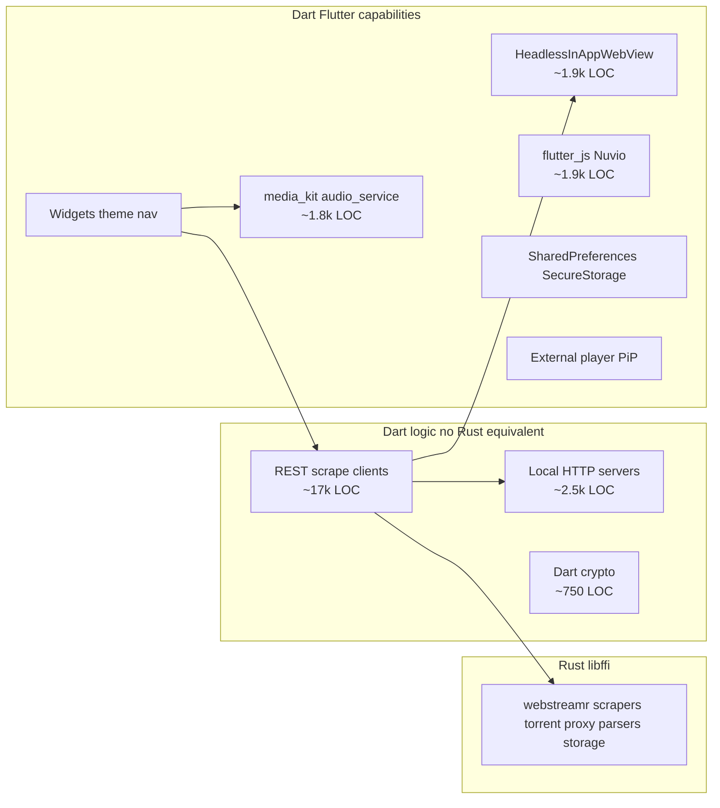

# Forja — as-built inventory

Evidence-based snapshot of the codebase **as it exists today**. Facts and observations only — no target-state rules.

**Use with:** [ARCHITECTURE.md](ARCHITECTURE.md) (target design) · [ENGINE_BOUNDARY.md](ENGINE_BOUNDARY.md) (boundary decisions) · [migration/README.md](migration/README.md) (phase plan)

**Last reviewed:** 2026-07-06

---

## 1. What the system actually is

Forja is a **melos monorepo** shipping one Flutter desktop/mobile app with **~20 content verticals** (movies/TV, torrents, IPTV, anime, Arabic, manga, music, Jellyfin, etc.). Playback uses **media_kit**. A **Rust workspace** (`crates/`, 10 domain crates) ships as `libffi` and is loaded at runtime by `packages/rust`.

### Dependency graph

### Notable facts

- **`api` and `streaming` are circular** (both declare each other in `pubspec.yaml`).
- **Engine logic is not confined to `packages/`** — IPTV HTTP client lives in [`apps/forja/lib/features/iptv/iptv/data/iptv_network.dart`](../apps/forja/lib/features/iptv/iptv/data/iptv_network.dart) (~1.2k LOC, Dart `http` + Rust parsers).
- **`apps/forja` barely touches Rust directly** — only ~8 files import `Engine` / `RustLib`; most engine calls go through `api`, `streaming`, or `storage`.
- **Migration docs** state all engine packages must be deleted ([migration/README.md](migration/README.md)) — that is a **project decision**, not enforced by runtime.

---

## 2. Scale snapshot

| Layer | LOC (approx) | Files | Role |
|-------|-------------|-------|------|
| `packages/api` | 23,700 | 59 | HTTP clients, scrapers, WebView extractors, players, orchestration |
| `packages/streaming` | 5,640 | 17 | Torrent/proxy FFI glue, Nuvio JS host, 111477 proxy, local shelf server |
| `packages/storage` | 1,380 | 8 | Settings singleton, watch history, theme/widgets, Rust KV glue |
| `packages/core` | 490 | 7 | DTOs + small utils |
| `packages/rust` | ~2,000+ | — | FFI bindings + facade + parity tests |
| `crates/*` (Rust) | ~8,500+ (excl. vendored sockets) | 90+ `.rs` | Parsers, webstreamr, torrent, proxy, storage |
| `apps/forja/lib` | large | 61 feature files + shell/shared | UI + IPTV network client |

**Rust is concentrated** in stream-resolution, torrent, and parsing paths. **Dart still owns** almost all metadata APIs (TMDB, Trakt, Jellyfin), vertical content (anime, Arabic, manga), and platform integration (players, OAuth, secure storage).

---

## 3. Rust engine — what exists today

### 3.1 Crates and HTTP behavior

| Crate | ~LOC | Own HTTP? | What it does |
|-------|------|-----------|--------------|
| `webstreamr` | largest | **Yes** — `fetcher.rs` blocking reqwest | 21 sources, 23 extractors, full `get_streams_json` pipeline |
| `torrent` | 635 | BitTorrent + local axum | librqbit session, magnet → localhost stream URL |
| `proxy` | 515 | On client request | axum: `/proxy`, `/hls-proxy`, `/proxy/{token}` |
| `scrapers` | 300 | **Yes** — async reqwest | Knaben / TPB / Uindex search |
| `stremio-core` | 212 | **Yes** — `fetch_get` | Parse + optional GET (FFI exposes both) |
| `iptv-core` | 540 | No | M3U / Xtream parse, paste decrypt |
| `utils` | 880 | No | Episode match, torrent filter, HLS parse, crypto |
| `stream-core` | 146 | No | Provider URL templates |
| `storage` | 103 | No | JSON file KV |
| `ffi` | 1,100 | Delegates | UDL + C ABI, 63 functions |

### 3.2 FFI surface — two patterns coexist

**Pattern A — caller supplies body (legacy split):**
`parse_*`, `extract_*_html_*`, `extract_vidsrc_chain_json`, Stremio parsers, scraper HTML parsers, `parse_hls_master_json`, etc.

**Pattern B — Rust fetches end-to-end:**
`search_torrents_json`, `resolve_vidsrc_embed_json`, `webstreamr_get_streams_json`, `stremio_http_get_json`, `torrent_*`, `proxy_*`.

**Observation:** The codebase is mid-transition. Granular HTML-in FFI functions reflect an older "Dart fetches, Rust parses" design. Newer paths (`webstreamr_get_streams_json`, `search_torrents_json`) bundle fetch + parse. **Both patterns are live.**

### 3.3 No Rust crates for (today)

- TMDB, Trakt, Simkl, MDBList
- Debrid (Real-Debrid, AllDebrid, etc.)
- Jackett / Prowlarr (separate from Knaben scrapers)
- Jellyfin
- Anime (AllAnime, Miruro, etc.), Arabic, manga, comics, music, audiobooks
- OAuth / secure credential storage
- Nuvio scraper ecosystem

---

## 4. `packages/api` — capability inventory

Grouped by **technology used**, not package role.

| Capability cluster | LOC | Count | Examples |
|-------------------|-----|-------|----------|
| HTTP REST / scrape | ~17,300 | 35+ | `tmdb_api`, `trakt_service`, `debrid_api`, `jellyfin_service`, `anime_service`, `arabic_service` |
| HTML/XML parse in Dart | overlaps above | 10 | `books_service`, `manga_service`, `bestsimilar_scraper` |
| Headless WebView | ~1,450 | 4 | `stream_extractor`, `kisskh_extractor`, `amri_extractor`, `comic_page_extractor` |
| media_kit / audio_service | ~1,770 | 8 | `music_player_service`, `player_pool_service`, `pip_service`, `external_player_service` |
| Dart crypto (no Rust) | ~750 | 3 | `allanime_extractor`, `mega_proxy`, `anime_arabic_extractor` |
| Rust parse only | ~600 | 2 | `stremio_service` (HTTP still Dart), `kisskh_subtitle_decryptor` |
| Local `dart:io` HttpServer | ~320 | 1 | `mega_proxy` (loopback AES proxy for Mega) |
| Persistence / OAuth | ~2,600 | 15+ | `trakt_service`, `simkl_service`, `my_list_service`, `webstreamr_settings` |

**Rust usage in api:** `Engine` — zero references. `RustLib` — `stremio_service`, `kisskh_subtitle_decryptor` only.

**Heavily mixed modules** (multiple capabilities in one file):

| Module | Mix |
|--------|-----|
| `arabic_service` | HTTP scrape + streaming proxy + WebView extraction |
| `anime_service` | GraphQL + 4 native extractors + caching |
| `stremio_service` | HTTP + storage + Rust JSON parse |
| `jellyfin_service` | HTTP + secure storage + streaming proxy |

**Apps import api from ~50 files** — primary integration surface for the Flutter app.

---

## 5. `packages/streaming` — capability inventory

| File | LOC | Nature | Technology |
|------|-----|--------|------------|
| `site111477_proxy.dart` | 1,572 | Substantial Dart logic | `dart:io` seekable proxy, captcha HTML, chunk cache |
| `nuvio_runtime.dart` | 1,164 | JS execution host | `flutter_js` + Dart `http` bridge + cheerio bundle |
| `nuvio_service.dart` | 730 | Addon lifecycle | HTTP manifest/scripts + prefs |
| `local_server_service.dart` | 443 | Parallel local server | **shelf** + Rust proxy start + domain routes |
| `videasy_extractor.dart` | 394 | Hybrid | Dart HTTP + WebView WASM + Rust AES |
| `torrent_stream_service.dart` | 281 | FFI orchestration | Rust torrent engine |
| `webstreamr_service.dart` | 156 | Thin wrapper | Rust `webstreamrGetStreamsJson` + HLS URL rewrite |
| `stream_extractor.dart` | 450 | WebView sniffer | **Duplicate of api copy** — unused by apps |
| `stream_resolver.dart` | 120 | Provider orchestration | **Unused by apps** |

### Localhost HTTP server implementations (four patterns)

| # | Location | Stack | Routes / purpose |
|---|----------|-------|------------------|
| 1 | `crates/proxy` | axum (Rust) | `/proxy`, `/hls-proxy`, `/proxy/{token}` |
| 2 | `local_server_service.dart` | shelf (Dart) | Jellyfin, toky, comic, subtitlecat translate |
| 3 | `site111477_proxy.dart` | `dart:io` (Dart) | Seekable byte-range proxy for 111477 |
| 4 | `mega_proxy.dart` (in api) | `dart:io` (Dart) | Mega.nz AES decrypt loopback |

**Apps never use** `StreamResolver`, the `ProviderSettingsRepo` → resolver path, or streaming's `stream_extractor`. They use the **api duplicate** and inline resolution in player/home screens.

---

## 6. `packages/storage` — capability inventory

| Module | LOC | What it actually is |
|--------|-----|---------------------|
| `settings_service.dart` | 471 | Singleton: streaming prefs, debrid, navbar, subtitles, theme key, stremio addons, provider order — duplicate keys in some cases |
| `app_theme.dart` | 331 | Flutter UI: `ThemeData`, GoogleFonts, `FocusableControl` widget |
| `kv.dart` | 160 | Dual backend: Rust KV when engine ready, else SharedPreferences |
| `watch_history_service.dart` | 166 | Continue-watching CRUD |
| `iptv_settings_repo.dart` | 141 | Models + Rust persistence — **zero app imports** |
| `provider_settings_repo.dart` | 51 | Rust KV — only used by unused `stream_resolver` |
| `playback_settings_repo.dart` | 29 | Rust KV — **zero imports anywhere** |
| `stremio_settings_repo.dart` | 25 | Rust KV — **dead** (apps use `SettingsService` instead) |

**Observation:** Rust KV exists and is wired, but persistence is fragmented across `SettingsService` (`kv.dart`), direct repos (mostly dead), and duplicate keys (`stream_provider_order` vs `forja_provider_order`).

**`flutter_secure_storage`** is used in api (Trakt, Jellyfin, MDBList), not in the storage package.

---

## 7. `packages/core`

| File | LOC | Content |
|------|-----|---------|
| `movie.dart`, `stream_source.dart` | 126 | JSON DTOs |
| `torrent_result.dart` | 47 | DTO + `qualityScore` / `sizeInBytes` parsing logic |
| `language_display.dart` | 172 | Pure Dart lookup table |
| `webview_cleanup.dart` | 99 | Platform FS cleanup |
| `smooth_page_route.dart` | 35 | Unused UI route helper |

Imported mainly by `api`, `streaming`, and app screens. Small but widely referenced.

---

## 8. Engine logic outside `packages/`

| Location | LOC | What |
|----------|-----|------|
| [`iptv_network.dart`](../apps/forja/lib/features/iptv/iptv/data/iptv_network.dart) | ~1,200 | Full Xtream HTTP client; Rust only parses responses |
| [`m3u_parser.dart`](../apps/forja/lib/features/iptv/iptv/m3u/m3u_parser.dart) | small | Delegates to `Engine.parseM3uChannels` |
| [`pastesh_decryptor.dart`](../apps/forja/lib/features/iptv/iptv/data/pastesh_decryptor.dart) | small | HTTP fetch in Dart, decrypt in Rust |
| [`details_screen.dart`](../apps/forja/lib/features/home/details_screen.dart) | — | Direct `Engine.sortTorrents` |
| Player screens | — | Inline provider resolution (webstreamr, nuvio, 111477, videasy) — not centralized in `StreamResolver` |

**Observation:** Deleting `packages/` does not automatically consolidate engine logic — some lives under `apps/forja/features/`.

---

## 9. Split-brain and duplication

| Capability | Rust | Dart still active | Notes |
|------------|------|-------------------|-------|
| WebStreamr full resolve | `webstreamr_get_streams_json` fetches | `webstreamr_service` builds request only | Main path: Rust does HTTP (`fetcher.rs`) |
| WebStreamr granular | `extract_*_html_json` parse-only | No active full-chain Dart caller found | Legacy FFI surface |
| Stremio | `stremio_http_get_json` exists | `StremioService` uses `package:http` | Rust HTTP export unused by app |
| Torrent search | `search_torrents_json` | Jackett / Prowlarr separate in api | Two indexer systems |
| HLS qualities | `parse_hls_master_json` | Dart fetches master playlist first | Split fetch / parse |
| IPTV Xtream | parsers in `iptv-core` | Full HTTP in app feature folder | Split fetch / parse |
| Stream embed sniff | — | WebView in **api** `stream_extractor` | streaming copy orphaned |
| Provider templates | `stream-core` | `provider_registry` wraps FFI | Aligned |
| KV storage | `crates/storage` | `kv.dart` + SharedPreferences fallback | Dual path |
| Local proxy | Rust axum | Dart shelf runs in parallel at boot | Two servers |

---

## 10. Doc vs code contradictions

| Doc says | Code says |
|----------|-----------|
| [ARCHITECTURE.md §4.2](ARCHITECTURE.md) "Dart fetches HTML" for webstreamr | `WebStreamrService` → `webstreamrGetStreamsJson` only; Rust `fetcher.rs` does HTTP |
| [DEVELOPMENT.md](DEVELOPMENT.md) "Orchestration in packages/*" | Player/home screens orchestrate providers; `StreamResolver` unused |
| Migration: `packages/webstreamr` deleted | True for Dart package; logic lives in `crates/webstreamr` |
| Migration: engine only in `packages/` | IPTV HTTP in `apps/forja/features/iptv/` |
| RFC-001: no circular deps | `api ↔ streaming` cycle exists |
| Target: "UI calls Engine only" | Apps call `TmdbApi`, `StremioService`, `SettingsService` widely |

---

## 11. Technical capability taxonomy

Actual technology classes in the codebase — basis for boundary rules, not package names.

| Class | Platform-specific runtime? | Rust implementation exists? | Current LOC (Dart) |
|-------|---------------------------|---------------------------|-------------------|
| REST/JSON client | No | No (for most verticals) | ~17k |
| HTML regex scrape | No | Yes (pattern in `webstreamr`, `scrapers`) | mixed |
| WebView network sniff | Yes — browser engine | No | ~1.9k |
| flutter_js scrapers | Yes — JS runtime | No (QuickJS-in-Rust possible) | ~1.9k |
| WASM in WebView (Videasy) | Yes — WASM host | Partial (AES in Rust) | ~400 |
| media_kit playback | Yes — decoder/surface | No | ~1.8k |
| OAuth secure storage | Yes — keychain/keystore | No | scattered |
| Local loopback servers | No | Partial (Rust proxy + Dart servers) | ~2.5k |
| Flutter ThemeData/widgets | Yes — Flutter/Compose | No | ~330+ in storage |

---

## 12. Observations

1. **Rust engine is real but narrow** — strong on mainstream movie/TV stream resolution (webstreamr, torrent, stremio parse, scrapers); absent on most other shipped verticals (TMDB, Trakt, 15+ content types).

2. **Package boundaries are leaky** — circular deps, duplicate `stream_extractor`, dead repos, engine in app features (IPTV), orchestration split between unused `StreamResolver` and player screens.

3. **Four localhost server patterns** — accidental complexity; consolidation is independent of language choice.

4. **~73% of `packages/api` is plain HTTP** — homogeneous; WebView (~6%), player (~7%), Nuvio/WASM (~8%) are the distinct stacks.

5. **`storage` is not pure persistence** — contains UI (`app_theme.dart`) and a settings god-object; Rust KV is underneath but wrapped in layers.

6. **Migration progress is uneven** — torrent/webstreamr/vidsrc/scrapers are Rust-backed; Stremio splits HTTP (Dart) / parse (Rust) despite FFI for both; IPTV splits across app feature + Rust parsers.

7. **Deleting packages is a packaging goal** — contents would land in `crates/*`, `apps/forja`, or future Compose adapters depending on boundary rules ([ENGINE_BOUNDARY.md](ENGINE_BOUNDARY.md)).

---

## Related

| Doc | Purpose |
|-----|---------|
| [ENGINE_BOUNDARY.md](ENGINE_BOUNDARY.md) | Open decisions + draft boundary framework |
| [ARCHITECTURE.md](ARCHITECTURE.md) | Target architecture and data flows |
| [migration/README.md](migration/README.md) | Phase plan and package deletion table |
