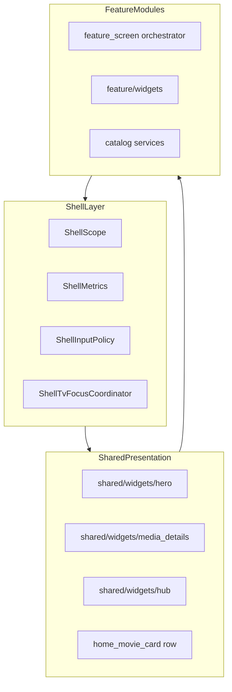

# Feature file map

**Status:** living doc  
**Area:** `apps/forja/lib/features/`  
**Line counts:** `wc -l` on repo HEAD — re-run when splits land  
**Related:** [RFC-019](../rfc/019-[draft]-god-file-decomposition.md) · [Architecture README](README.md)

## Status at a glance

| | |
|--|--|
| **Scope** | 92 Dart files · ~77.0k LOC under `features/` |
| **God-file pressure** | 30 files &gt;800 lines (~72% of feature LOC) |
| **Tier 1 (&gt;3k)** | 0 files in `features/` · 0 monoliths in `shared/player/player/` |
| **Next action** | `shared/player/` now ≤1.2k; next: player `controls/` extraction slice (R19-A05) |

**Legend:** Tier 1 = critical god file · Tier 2 = large splittable · Tier 3 = acceptable

---

## Summary

| Tier | Lines | Files | Action |
|------|------:|------:|--------|
| **Tier 1** | &gt;3,000 | 5 | Split urgently — blocks review and TV polish |
| **Tier 2** | 1,500–3,000 | 8 | Plan extractions; some already partial (IPTV workspace) |
| **Tier 3** | &lt;1,500 | 79 | Maintain; extract only when touching heavily |

**71% of feature LOC** lives in the 30 files over 800 lines.

### Feature folder rollup

| Feature | Files | LOC | Largest file |
|---------|------:|----:|--------------|
| **iptv** | 40 | ~17,900 | `iptv_controller_portal.dart` (532) + `iptv_catalog_portal_form.dart` (942) |
| **home** | 18+ | ~9,600 | `details_screen.dart` (1,144) + `details_screen_*.dart` |
| **anime** | 14 | ~7,100 | `catalog/anime_service.dart` (1,648) |
| **settings** | 12 | ~4,100 | `settings_screen.dart` (748) + `sections/` + `widgets/` |
| **jellyfin** | 3 | ~4,300 | `jellyfin_screen.dart` (1,697) |
| **live_matches** | 6 | ~3,563 | `live_matches_widgets.dart` (1,457) + `live_matches_screen.dart` (94) |
| **music** | 2 | ~3,300 | `music_screen.dart` (2,401) |
| **anime_arabic** | 6 | ~3,900 | `anime_arabic_screen.dart` (1,313) |
| **search** | 6 | ~2,007 | `search_widgets.dart` (609) + `search_screen.dart` (109) |
| **asian_drama** | 7 | ~3,500 | `asian_drama_screen.dart` (781) |
| *(others)* | 32 | ~15,400 | see inventory |

---

## Tier 1 — critical god files (&gt;3k lines)

No `features/` screen orchestrators above 3k. Largest IPTV files: `iptv_catalog_portal_form.dart` (942), `iptv_pt_browser_streams.dart` (809), `iptv_controller_portal.dart` (532).

---

## Tier 1b — TV-scope orchestrators (&lt;800) — done

| File | Lines | Role | TV scope | Notes |
|------|------:|------|----------|-------|
| [`iptv/iptv/screens/iptv_pt_screen.dart`](../../apps/forja/lib/features/iptv/iptv/screens/iptv_pt_screen.dart) | 152 | Orchestrator | In | Routing + `IptvController`; 7 widget part files |
| [`live_matches/live_matches_screen.dart`](../../apps/forja/lib/features/live_matches/live_matches_screen.dart) | 94 | Orchestrator | In | models/widgets parts + data/build/playback mixins |
| [`search/search_screen.dart`](../../apps/forja/lib/features/search/search_screen.dart) | 109 | Orchestrator | In | search/tv/build mixins + widgets part |
| [`anime/anime_screen.dart`](../../apps/forja/lib/features/anime/anime_screen.dart) | 131 | Orchestrator | In | feed/build mixins + widgets part |
| [`home/home_screen.dart`](../../apps/forja/lib/features/home/home_screen.dart) | 218 | Orchestrator | In | feed/build in `home_screen_feed.dart`, `home_screen_build.dart` |
| [`iptv/iptv/controller/iptv_controller.dart`](../../apps/forja/lib/features/iptv/iptv/controller/iptv_controller.dart) | 477 | Orchestrator | In | fields/init/dispose; portal/browser/live/channels/nav mixins |

---

## Tier 1c — home/details orchestrators — done

| File | Lines | Role | TV scope | Notes |
|------|------:|------|----------|-------|
| [`home/details_screen.dart`](../../apps/forja/lib/features/home/details_screen.dart) | 545 | Details orchestrator | In | 8 `details_screen_*.dart` mixins |
| [`settings/settings_screen.dart`](../../apps/forja/lib/features/settings/settings_screen.dart) | 748 | Orchestrator | In | `sections/` + `widgets/` |

---

## Tier 2 — large splittable (1.5k–3k lines)

| File | Lines | Role | TV scope | Notes |
|------|------:|------|----------|-------|
| [`settings/settings_screen.dart`](../../apps/forja/lib/features/settings/settings_screen.dart) | 748 | Orchestrator | In | Phase C done — see Tier 1c |
| [`iptv/iptv/screens/iptv_catalog_workspace.dart`](../../apps/forja/lib/features/iptv/iptv/screens/iptv_catalog_workspace.dart) | 67 | Library root | In | Shelf constants; `IptvCatalogTopBar` + `IptvPortalPanel` in parts |
| [`music/music_screen.dart`](../../apps/forja/lib/features/music/music_screen.dart) | 2,401 | Orchestrator | Out | No shell/TV wiring |
| [`iptv/iptv/screens/iptv_pt_player_screen.dart`](../../apps/forja/lib/features/iptv/iptv/screens/iptv_pt_player_screen.dart) | 288 | Orchestrator | In | State + lifecycle; engine/ui mixins |
| [`jellyfin/jellyfin_screen.dart`](../../apps/forja/lib/features/jellyfin/jellyfin_screen.dart) | 1,697 | Orchestrator | Out | |
| [`anime/catalog/anime_service.dart`](../../apps/forja/lib/features/anime/catalog/anime_service.dart) | 1,648 | Data/Service | In | Catalog backend |
| [`downloader/media_downloader_screen.dart`](../../apps/forja/lib/features/downloader/media_downloader_screen.dart) | 1,536 | Orchestrator | Out | |

---

## Tier 3 — TV-in-scope tabs (healthy enough)

These tabs are in [TV scope](../../.cursor/rules/forja-tv-scope.mdc) and under ~1.5k for the main screen — maintain, do not emergency-split:

| File | Lines | Notes |
|------|------:|-------|
| [`anime/anime_screen.dart`](../../apps/forja/lib/features/anime/anime_screen.dart) | 131 | Orchestrator | In |
| [`asian_drama/asian_drama_screen.dart`](../../apps/forja/lib/features/asian_drama/asian_drama_screen.dart) | 781 | Uses `HubCinematicHero` |
| [`my_list/lists_screen.dart`](../../apps/forja/lib/features/my_list/lists_screen.dart) | 763 | |
| [`my_list/my_list_screen.dart`](../../apps/forja/lib/features/my_list/my_list_screen.dart) | 379 | |

---

## Full inventory (92 files, sorted by lines)

Paths relative to `apps/forja/lib/features/`.

| Lines | Feature | File | Role | TV scope |
|------:|---------|------|------|----------|
| 545 | home | `home/details_screen.dart` | Details orchestrator | In |
| 218 | home | `home/home_screen.dart` | Orchestrator | In |
| 853 | home | `home/home_screen_feed.dart` | Home feed mixin | In |
| 313 | home | `home/home_screen_build.dart` | Home build mixin | In |
| 999 | home | `home/home_hero.dart` | Hero | In |
| 748 | settings | `settings/settings_screen.dart` | Orchestrator | In |
| 596 | home | `home/details_screen_webstreaming.dart` | Details webstreaming mixin | In |
| 576 | home | `home/widgets/home_mood_section.dart` | Section | In |
| 562 | home | `home/details_screen_stremio.dart` | Details Stremio/Nuvio mixin | In |
| 542 | home | `home/details_screen_play.dart` | Details play mixin | In |
| 499 | home | `home/details_screen_panel.dart` | Details panel mixin | In |
| 491 | home | `home/widgets/continue_watching_section.dart` | Section | In |
| 391 | home | `home/details_screen_torrent.dart` | Details torrent mixin | In |
| 376 | home | `home/details_screen_build.dart` | Details build mixin | In |
| 240 | home | `home/details_screen_fetch.dart` | Details fetch mixin | In |
| 231 | home | `home/details_screen_episodes.dart` | Details episodes mixin | In |
| 942 | iptv | `iptv/iptv/screens/iptv_catalog_portal_form.dart` | Portal add/edit dialog | In |
| 921 | iptv | `iptv/iptv/screens/iptv_pt_player_ui.dart` | Player UI mixin | In |
| 809 | iptv | `iptv/iptv/screens/iptv_pt_browser_streams.dart` | Stream cards + EPG widgets | In |
| 798 | iptv | `iptv/iptv/screens/iptv_pt_browser_view.dart` | Browser view state | In |
| 797 | iptv | `iptv/iptv/screens/iptv_pt_player_engine.dart` | Player engine mixin | In |
| 1457 | live_matches | `live_matches/live_matches_widgets.dart` | Cards + embed player | In |
| 815 | iptv | `iptv/iptv/screens/iptv_pt_widgets_channels.dart` | Channels hub/results | In |
| 93 | iptv | `iptv/iptv/screens/iptv_pt_browser_sidebar.dart` | Category sidebar row | In |
| 786 | iptv | `iptv/iptv/screens/iptv_catalog_top_bar.dart` | Catalog top bar + shelf tabs | In |
| 736 | iptv | `iptv/iptv/screens/iptv_catalog_portal_widgets.dart` | Portal dialog fields/tiles | In |
| 712 | live_matches | `live_matches/live_matches_build.dart` | Build mixin | In |
| 705 | live_matches | `live_matches/live_matches_models.dart` | Models + API | In |
| 570 | iptv | `iptv/iptv/screens/iptv_pt_widgets_portal.dart` | Portal list (legacy) | In |
| 358 | iptv | `iptv/iptv/screens/iptv_catalog_portal_panel.dart` | Portal side panel | In |
| 360 | live_matches | `live_matches/live_matches_data.dart` | Data mixin | In |
| 66 | iptv | `iptv/iptv/screens/iptv_catalog_workspace.dart` | Library root | In |
| 2401 | music | `music/music_screen.dart` | Orchestrator | Out |
| 288 | iptv | `iptv/iptv/screens/iptv_pt_player_screen.dart` | Player orchestrator | In |
| 68 | iptv | `iptv/iptv/screens/iptv_pt_player_widgets.dart` | Source chip | In |
| 191 | iptv | `iptv/iptv/screens/iptv_pt_widgets_episode.dart` | Episode list | In |
| 152 | iptv | `iptv/iptv/screens/iptv_pt_screen.dart` | Orchestrator | In |
| 137 | iptv | `iptv/iptv/screens/iptv_pt_widgets_section.dart` | Section pick (legacy) | In |
| 137 | iptv | `iptv/iptv/screens/iptv_pt_widgets_common.dart` | App bar + chips | In |
| 76 | iptv | `iptv/iptv/screens/iptv_pt_catalog_shell.dart` | Catalog shell | In |
| 235 | live_matches | `live_matches/live_matches_playback.dart` | Playback mixin | In |
| 94 | live_matches | `live_matches/live_matches_screen.dart` | Orchestrator | In |
| 609 | search | `search/search_widgets.dart` | Cards + my-list buttons | In |
| 547 | search | `search/search_build.dart` | Build mixin | In |
| 397 | search | `search/search_tv.dart` | TV focus mixin | In |
| 304 | search | `search/search_search.dart` | Search API mixin | In |
| 109 | search | `search/search_screen.dart` | Orchestrator | In |
| 41 | search | `search/search_models.dart` | Models | In |
| 477 | iptv | `iptv/iptv/controller/iptv_controller.dart` | Orchestrator | In |
| 532 | iptv | `iptv/iptv/controller/iptv_controller_portal.dart` | Portal mixin | In |
| 363 | iptv | `iptv/iptv/controller/iptv_controller_channels.dart` | Channels mixin | In |
| 307 | iptv | `iptv/iptv/controller/iptv_controller_browser.dart` | Browser mixin | In |
| 97 | iptv | `iptv/iptv/controller/iptv_controller_live.dart` | Live mixin | In |
| 34 | iptv | `iptv/iptv/controller/iptv_controller_nav.dart` | Nav mixin | In |
| 18 | iptv | `iptv/iptv/controller/iptv_controller_models.dart` | Models | In |
| 1697 | jellyfin | `jellyfin/jellyfin_screen.dart` | Orchestrator | Out |
| 1648 | anime | `anime/catalog/anime_service.dart` | Data/Service | In |
| 1536 | downloader | `downloader/media_downloader_screen.dart` | Orchestrator | Out |
| 1313 | anime_arabic | `anime_arabic/anime_arabic_screen.dart` | Orchestrator | Out |
| 1301 | jellyfin | `jellyfin/jellyfin_details_screen.dart` | Details | Out |
| 1292 | home | `home/stremio_catalog_screen.dart` | Sub-hub | In |
| 1285 | anime | `anime/anime_player_screen.dart` | Player | In |
| 1271 | jellyfin | `jellyfin/catalog/jellyfin_service.dart` | Data/Service | Out |
| 1196 | iptv | `iptv/iptv/data/iptv_network.dart` | Data/Service | In |
| 1153 | books | `books/book_reader_screen.dart` | Player | Out |
| 1127 | iptv | `iptv/iptv/m3u/m3u_playlists_screen.dart` | Sub-hub | In |
| 535 | anime | `anime/anime_screen_build.dart` | Build mixin | In |
| 255 | anime | `anime/anime_widgets.dart` | Continue-watching card | In |
| 195 | anime | `anime/anime_screen_feed.dart` | Feed mixin | In |
| 131 | anime | `anime/anime_screen.dart` | Orchestrator | In |
| 1040 | audiobooks | `audiobooks/catalog/audiobook_service.dart` | Data/Service | Out |
| 1026 | iptv | `iptv/iptv/channel_guide/iptv_channel_guide_panel.dart` | UI Panel | In |
| 920 | music | `music/music_player_screen.dart` | Player | Out |
| 888 | similar | `similar/similar_results_screen.dart` | Sub-hub | Out |
| 857 | manga | `manga/manga_screen.dart` | Orchestrator | Out |
| 846 | books | `books/books_screen.dart` | Orchestrator | Out |
| 787 | audiobooks | `audiobooks/generate_audiobook_screen.dart` | Sub-hub | Out |
| 781 | asian_drama | `asian_drama/asian_drama_screen.dart` | Orchestrator | In |
| 780 | iptv | `iptv/iptv/iptv_tv_focus.dart` | UI Panel | In |
| 771 | discover | `discover/discover_screen.dart` | Orchestrator | Out |
| 763 | my_list | `my_list/lists_screen.dart` | Sub-hub | In |
| 721 | arabic | `arabic/arabic_screen.dart` | Orchestrator | Out |
| 717 | anime_arabic | `anime_arabic/anime_arabic_details_screen.dart` | Details | Out |
| 715 | similar | `similar/similar_hub_screen.dart` | Orchestrator | Out |
| 663 | asian_drama | `asian_drama/catalog/kisskh_service.dart` | Data/Service | In |
| 640 | asian_drama | `asian_drama/asian_drama_explore_screen.dart` | Sub-hub | In |
| 634 | anime_arabic | `anime_arabic/catalog/anime_arabic_extractor.dart` | Data/Service | Out |
| 617 | manga | `manga/manga_reader_screen.dart` | Player | Out |
| 610 | audiobooks | `audiobooks/audiobook_screen.dart` | Orchestrator | Out |
| 608 | anime_arabic | `anime_arabic/catalog/anime_arabic_service.dart` | Data/Service | Out |
| 601 | audiobooks | `audiobooks/audiobook_player_screen.dart` | Player | Out |
| 598 | anime | `anime/anime_discover_screen.dart` | Sub-hub | In |
| 569 | comics | `comics/comics_screen.dart` | Orchestrator | Out |
| 532 | comics | `comics/comic_reader_screen.dart` | Player | Out |
| 526 | iptv | `iptv/iptv/channel_guide/iptv_guide_epg.dart` | UI Panel | In |
| 521 | iptv | `iptv/iptv/channel_guide/iptv_channel_search_overlay.dart` | UI Panel | In |
| 503 | asian_drama | `asian_drama/catalog/kisskh_extractor.dart` | Data/Service | In |
| 498 | manga | `manga/manga_details_screen.dart` | Details | Out |
| 486 | asian_drama | `asian_drama/asian_drama_player_screen.dart` | Player | In |
| 482 | arabic | `arabic/arabic_details_screen.dart` | Details | Out |
| 479 | comics | `comics/catalog/comics_service.dart` | Data/Service | Out |
| 478 | anime | `anime/anime_details_screen.dart` | Details | In |
| 458 | iptv | `iptv/iptv/data/hardcoded_channels.dart` | Data/Service | In |
| 453 | manga | `manga/catalog/manga_service.dart` | Data/Service | Out |
| 435 | audiobooks | `audiobooks/audiobook_downloads_screen.dart` | Sub-hub | Out |
| 416 | asian_drama | `asian_drama/asian_drama_details_screen.dart` | Details | In |
| 382 | anime | `anime/catalog/miruro_extractor.dart` | Data/Service | In |
| 380 | magnet | `magnet/magnet_player_screen.dart` | Player | Out |
| 379 | my_list | `my_list/my_list_screen.dart` | Orchestrator | In |
| 379 | anime | `anime/catalog/allanime_extractor.dart` | Data/Service | In |
| 371 | comics | `comics/comic_details_screen.dart` | Details | Out |
| 351 | comics | `comics/catalog/comic_page_extractor.dart` | Data/Service | Out |
| 351 | anime | `anime/catalog/watchhentai_extractor.dart` | Data/Service | In |
| 333 | anime_arabic | `anime_arabic/anime_arabic_player_screen.dart` | Player | Out |
| 307 | anime | `anime/catalog/hentaini_extractor.dart` | Data/Service | In |
| 288 | audiobooks | `audiobooks/catalog/audiobook_scrapers.dart` | Data/Service | Out |
| 285 | anime_arabic | `anime_arabic/anime_arabic_search_screen.dart` | Sub-hub | Out |
| 265 | iptv | `iptv/iptv/data/iptv_portal_share.dart` | Data/Service | In |
| 257 | iptv | `iptv/iptv/data/storage.dart` | Data/Service | In |
| 245 | books | `books/catalog/books_service.dart` | Data/Service | Out |
| 242 | iptv | `iptv/iptv/channel_guide/iptv_player_stats_panel.dart` | UI Panel | In |
| 222 | settings | `settings/widgets/provider_priority_table.dart` | UI Panel | In |
| 215 | settings | `settings/webstreamr_settings_screen.dart` | Sub-hub | In |
| 206 | anime | `anime/catalog/animerealms_extractor.dart` | Data/Service | In |
| 194 | anime | `anime/catalog/miruro_pipe_session.dart` | Data/Service | In |
| 193 | arabic | `arabic/arabic_player_screen.dart` | Player | Out |
| 189 | comics | `comics/catalog/readcomicsonline_scraper.dart` | Data/Service | Out |
| 169 | iptv | `iptv/iptv/channel_guide/iptv_channel_guide.dart` | UI Panel | In |
| 148 | iptv | `iptv/iptv/data/models.dart` | Data/Service | In |
| 102 | anime | `anime/catalog/anime_stream_providers.dart` | Data/Service | In |
| 92 | iptv | `iptv/iptv/m3u/m3u_models.dart` | Data/Service | In |
| 80 | iptv | `iptv/iptv/m3u/m3u_store.dart` | Data/Service | In |
| 71 | iptv | `iptv/iptv/iptv_shell_style.dart` | Support | In |
| 57 | asian_drama | `asian_drama/asian_drama_search_screen.dart` | Sub-hub | In |
| 56 | anime | `anime/anime_search_screen.dart` | Sub-hub | In |
| 43 | iptv | `iptv/iptv/data/pastesh_decryptor.dart` | Data/Service | In |
| 42 | home | `home/home_genre_categories.dart` | Support | In |
| 40 | settings | `settings/splash_preview_screen.dart` | Sub-hub | In |
| 22 | iptv | `iptv/iptv/m3u/m3u_parser.dart` | Data/Service | In |
| 19 | anime | `anime/catalog/anime_provider_map.dart` | Support | In |

**Role legend:** Orchestrator = shell tab / main hub · Sub-hub = discover/explore within feature · Details · Player · Data/Service · UI Panel · Support

**TV scope:** **In** = supported Android TV tab or direct sub-route per [forja-tv-scope.mdc](../../.cursor/rules/forja-tv-scope.mdc) · **Out** = not in TV QA scope unless expanded

---

## Target architecture

### Three layers



| Layer | Location | Owns | Does NOT own |
|-------|----------|------|--------------|
| Shell / profile | `shared/design/`, `shell/adapters/`, `shared/tv/` | Metrics, input policy, D-pad coordinator | Feature fetching |
| Shared presentation | `shared/widgets/` | Reusable UI + callbacks | State machines, routing |
| Feature modules | `features/<name>/` | Orchestrator &lt;800 lines, `widgets/`, `catalog/` | Cross-feature UI clones |

### Canonical feature folder

```
features/<feature>/
  <feature>_screen.dart       # orchestrator — fetch, compose, navigate
  <feature>_details_screen.dart
  widgets/                    # feature-private sections
  catalog/                    # services, extractors
  controller/                 # state machines (IPTV pattern)
```

### Home target ([RFC-019 R19-A03](../rfc/019-[draft]-god-file-decomposition.md))

```
features/home/
  home_screen.dart              # <800 lines
  home_hero.dart
  home_rails.dart
  home_stremio_section.dart
  widgets/
    continue_watching_section.dart
    mood_section.dart
    because_you_watched_section.dart
```

| Inline class (today) | Move to |
|----------------------|---------|
| `_HomeScreenState` hero block | `home_hero.dart` |
| `_MovieSection`, `_StaticMovieSection` | `home_rails.dart` or thin `HomeMovieRow` wrapper |
| `_ContinueWatchingSection`, `_HistoryCard` | `widgets/continue_watching_section.dart` |
| `_StremioCatalogSection`, `_StremioCatalogCard` | `home_stremio_section.dart` |
| `_MoodSection`, mood circles | `widgets/mood_section.dart` |
| `_BecauseYouWatchedSection` | `widgets/because_you_watched_section.dart` |
| `_HeroTitleSlot` | Delete — use `shared/widgets/hero/hero_title.dart` |

### Details target ([RFC-019](../rfc/019-[draft]-god-file-decomposition.md) + [RFC-026](../rfc/026-[draft]-media-details-player-ux.md))

```
features/home/details/          # later → features/media/details/ (R26-C03)
  details_screen.dart           # <800 lines — compose only
  details_torrents.dart
  details_stremio.dart
  details_episodes.dart
  details_webstreaming.dart
```

**Built and wired** in `details_screen.dart` (Phase A, 2026-07):

| Widget | Path | Replaces |
|--------|------|----------|
| `MediaDetailsScrollPage` | `shared/widgets/media_details/media_details_scroll_page.dart` | Inline scroll + `MediaDetailsTvScope` wrapper |
| `MediaDetailsRecommendationsSection` | `shared/widgets/media_details/media_details_recommendations_section.dart` | `_buildRecommendationsSection` |
| `MediaDetailsTrackerHandlers` | `shared/widgets/media_details/media_details_tracker_handlers.dart` | Trakt/Simkl rating, collection, check-in, list (~400 lines) |

**Remaining** (Phase D): `details_webstreaming` mixin/part, `details_episodes` / TV picker; then RFC-026 R26-C03 → `features/media/details/`

**Shipped** (Phase D, 2026-07):

| Extract | Path | Lines |
|---------|------|------:|
| Torrent search + Jackett/Prowlarr | `details_screen_torrent.dart` (`_DetailsScreenTorrent` mixin) | 391 |
| Stremio/Nuvio fetch + cancel | `details_screen_stremio.dart` (`_DetailsScreenStremio` mixin) | 562 |
| Webstreaming extract/play/cache | `details_screen_webstreaming.dart` (`_DetailsScreenWebstreaming` mixin) | 596 |
| TV season/episode picker + fetch | `details_screen_episodes.dart` (`_DetailsScreenEpisodes` mixin) | 231 |
| Play + auto-play | `details_screen_play.dart` (`_DetailsScreenPlay` mixin) | 542 |
| Panel filters + sources UI | `details_screen_panel.dart` (`_DetailsScreenPanel` mixin) | 499 |
| Fetch + recommendations | `details_screen_fetch.dart` (`_DetailsScreenFetch` mixin) | 240 |
| Build + hero + scroll | `details_screen_build.dart` (`_DetailsScreenBuild` mixin) | 376 |
| Collection list UI | `widgets/details_collection_section.dart` | 158 |

`details_screen.dart`: 4,061 → **545** lines (−3,516).

### Settings target ([RFC-019 R19-A04](../rfc/019-[draft]-god-file-decomposition.md))

```
features/settings/
  settings_screen.dart          # ListView router + search
  sections/
    playback_settings.dart
    streaming_settings.dart
    stremio_settings.dart
    accounts_settings.dart
    iptv_settings.dart
    about_settings.dart
```

### IPTV follow-on (not in RFC-019)

```
features/iptv/iptv/
  screens/iptv_pt_screen.dart       # 152 — routing only (Phase E done)
  screens/iptv_pt_catalog_shell.dart
  screens/iptv_pt_browser_*.dart      # view, sidebar, streams
  screens/iptv_pt_widgets_*.dart    # channels, episode, portal, section, common
  screens/iptv_catalog_workspace.dart   # 67 — shelf constants + part directives
  screens/iptv_catalog_top_bar.dart
  screens/iptv_catalog_portal_panel.dart
  screens/iptv_catalog_portal_form.dart
  screens/iptv_catalog_portal_widgets.dart
  controller/iptv_controller.dart           # 477 — fields, init, dispose
  controller/iptv_controller_portal.dart
  controller/iptv_controller_browser.dart
  controller/iptv_controller_live.dart
  controller/iptv_controller_channels.dart
  controller/iptv_controller_nav.dart
  controller/iptv_controller_models.dart
```

### Player ([RFC-019 R19-A05](../rfc/019-[draft]-god-file-decomposition.md))

| File | Lines (current) | Target |
|------|----------------:|--------|
| [`mobile_player_screen.dart`](../../apps/forja/lib/shared/player/player/mobile_player_screen.dart) | 387 | Orchestrator ✅ |
| `mobile_player_sources.dart` | 787 | Core stream menu/scoring mixin ✅ |
| `mobile_player_sources_alt.dart` | 212 | Torrent/Stremio/player-menu mixin |
| `mobile_player_sources_settings.dart` | 241 | Settings popup mixin |
| `mobile_player_sources_provider.dart` | 195 | Load/switch provider mixin |
| `mobile_player_playback.dart` | 937 | — |
| `mobile_player_build.dart` | 960 | — |
| `mobile_player_lifecycle.dart` | 634 | — |
| `mobile_player_glass.dart` | 301 | Glass primitives |
| `mobile_player_tracks.dart` | 344 | Subtitles/audio/quality |
| `mobile_player_ui.dart` | 205 | Gestures/aspect/timer |
| `mobile_player_episodes.dart` | 515 | Skip/next-ep + episode switch |
| `mobile_player_seekbar.dart` | 253 | Seekbar widgets |
| [`desktop_player_screen.dart`](../../apps/forja/lib/shared/player/player/desktop_player_screen.dart) | 364 | Orchestrator ✅ |
| `desktop_player_episodes.dart` | 1,126 | Episodes + provider load/switch |
| `desktop_player_playback.dart` | 922 | — |
| `desktop_player_build.dart` | 629 | — |
| `desktop_player_lifecycle.dart` | 516 | — |
| `desktop_player_sources.dart` | 796 | Stream menu mixin |
| `desktop_player_tracks.dart` | 632 | HW decode/subtitles/audio |
| `desktop_player_glass.dart` | 350 | Glass primitives |
| `desktop_player_ui.dart` | 161 | Auto-hide/fullscreen/keyboard |
| `desktop_player_seekbar.dart` | 263 | Seekbar widgets |

---

## Extraction rules

From [RFC-019](../rfc/019-[draft]-god-file-decomposition.md) and [forja-shared-ui.mdc](../../.cursor/rules/forja-shared-ui.mdc):

1. **One PR per split** — no mega-refactor
2. **No behavior change** — pure move/extract
3. **Shared widgets** only when used in 2+ features (Home + details → `hero/`; torrent + streaming → `media_details/`)
4. **Feature-only** sections → `features/<x>/widgets/`
5. **TV policy-driven** — `ShellScope.inputPolicyOf` / `shellFocusableTap`; never `ShellTokens.isTvLayout` in widgets
6. **Line budget** — no file under `features/` or `shared/player/` exceeds ~1,200 lines (R19-A01)
7. **Verify** — `flutter analyze` + smoke on affected tab + one unrelated tab

---

## Phased roadmap (code — pick one to start)

### Phase 0 — documentation (this file)

Map and targets only. No Dart changes.

### Phase A — details quick wins (shipped 2026-07)

| PR | Action | Status |
|----|--------|--------|
| A1 | Wire `MediaDetailsScrollPage` | Done |
| A2 | Wire `MediaDetailsRecommendationsSection` | Done |
| A3 | Adopt `MediaDetailsTrackerHandlers` | Done |

`details_screen.dart`: 4,509 → 4,061 lines.

### Phase B — home decomposition (done)

| PR | Extract | Status |
|----|---------|--------|
| B1 | `_HeroTitleSlot` → shared `HeroTitle` | Done |
| B2 | Hero carousel + actions | Done → `home_hero.dart` (`HomeCinematicHero`, `HomeHeroController`) |
| B3 | `HomeMovieSection`, `HomeStaticMovieSection` | Done → `widgets/home_movie_section.dart` |
| B4 | Continue watching + history card | Done → `widgets/continue_watching_section.dart` |
| B5 | Mood, Stremio catalog, Because-you-watched | Done → `widgets/` |
| B6 | Feed loading | Done → `home_screen_feed.dart` |
| B7 | Sliver build | Done → `home_screen_build.dart` |

`home_screen.dart`: 4,092 → **218** lines (orchestrator &lt;800 ✅).

### Phase C — settings sections (done)

| PR | Extract | Status |
|----|---------|--------|
| C1 | `sections/settings_trakt_panel.dart` | Done |
| C2 | `sections/settings_simkl_panel.dart` | Done |
| C3 | `sections/settings_mdblist_panel.dart` | Done |
| C4 | `sections/settings_about_panel.dart` | Done |
| C5 | `sections/settings_playback_section.dart` + `widgets/settings_focus_controls.dart` | Done |
| C6 | `sections/settings_search_torrents_section.dart`, `settings_providers_section.dart`, `settings_debrid_section.dart` + `widgets/settings_expandable_section.dart` | Done |

`settings_screen.dart`: 3,844 → **748** lines (−3,096). Orchestrator holds backup, navbar, lists, developer, version footer.

### Phase D — details logic splits + media move (~4 PRs)

| PR | Extract | Status |
|----|---------|--------|
| D1 | Torrent search → `details_screen_torrent.dart` | Done |
| D2 | Stremio/Nuvio fetch → `details_screen_stremio.dart` | Done |
| D3 | Collection section → `widgets/details_collection_section.dart` | Done |
| D4 | Webstreaming extract → `details_screen_webstreaming.dart` | Done |
| D5 | Episodes / TV picker → `details_screen_episodes.dart` | Done |
| D6 | Play + auto-play → `details_screen_play.dart` | Done |
| D7 | Panel filters + sources UI → `details_screen_panel.dart` | Done |
| D8 | Fetch + build → `details_screen_fetch.dart`, `details_screen_build.dart` | Done |
| D9 | RFC-026 R26-C03 → `features/media/details/` | ⬜ |

`details_screen.dart`: 4,061 → **545** lines (orchestrator &lt;800 ✅).

### Phase E — IPTV, player, remainder

IPTV + mobile/desktop player screen splits done; `shared/player/` now has no files &gt;1,200 (R19-A01 satisfied on this slice). Next: player `controls/` extraction slice (R19-A05).

---

## Decision guide

| If your priority is… | Start with | Why |
|------------------------|------------|-----|
| Lowest risk / existing code | **Phase A** | Done — scroll, recommendations, tracker handlers wired |
| Home TV polish | **Phase B** | Most TV shell refs in `home_screen.dart` |
| Fast file-count win | **Phase C** | Settings lowest coupling |
| RFC-026 / media module unblock | **Phase D** | Required before `features/media/` move |
| IPTV maintainability | **Phase E** | Largest feature folder (~17.9k LOC) |

---

## Backlog alignment

| Version | God-file work |
|---------|---------------|
| [1.0.1](../backlog/1.0.1-[open].md) | B101-S01, S03 deferred; UX widgets shipped (RFC-026) |
| [1.0.2](../backlog/1.0.2-[draft].md) | B102-S05 — home + settings remainder (RFC-019) |

When a split PR lands: update RFC-019 acceptance rows, backlog shipped rows, and re-run line counts in this doc.

---

## Related

- [Architecture README](README.md)
- [RFC-019](../rfc/019-[draft]-god-file-decomposition.md)
- [RFC-026](../rfc/026-[draft]-media-details-player-ux.md)
- [RFC-028](../rfc/028-[draft]-adaptive-shell-profiles.md)
- [Features user guide](../features/README.md)
