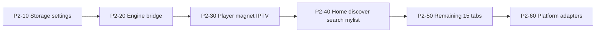

# Phase 2 — Kotlin Compose UI

**Status:** Next  
**Depends on:** [Phase 1 complete](./01-rust-engine.md)  
**Next phase:** [Phase 3 — Delete Flutter](./03-delete-flutter.md)

---

## Goal

Replace the Flutter UI with Kotlin Compose Multiplatform. All engine calls go through `forja_kotlin` → `libffi`, not `dart:ffi`. Orchestration (HTTP fetch, registry, shelf) ports from Dart packages to Kotlin.

---

## Exit criteria

- [ ] Feature parity with Flutter ([RFC-011](../rfc/011-v1.0-mvp.md): 19 nav tabs + player + settings)
- [ ] `forja_kotlin` covers all FFI surfaces in [`rust_delegates.dart`](../../apps/forja/lib/app/rust_delegates.dart)
- [ ] Mobile magnet playback works (B2 resolved or temporary Kotlin libtorrent bridge)
- [ ] Automated smoke tests for engine bridge + core flows

---

## Monorepo layout (target)

```
apps/forja_compose/
  shared/           # Compose UI + ViewModels
  androidApp/
  iosApp/
  desktopApp/       # if CMP desktop chosen
packages/forja_kotlin/   # uniffi/JNI wrapper over libffi
```

Existing Rust build scripts stay: `scripts/build_rust.sh`, `scripts/build_rust_mobile.sh`.

---

## Tasks

### Scaffold (P2-0x)

| ID | Task | Paths |
|----|------|-------|
| P2-01 | Create KMP app skeleton | `apps/forja_compose/` |
| P2-02 | Create Kotlin FFI package | `packages/forja_kotlin/` |
| P2-03 | Reuse Rust mobile build scripts | `scripts/build_rust_mobile.sh`, Gradle/Xcode copy phases |
| P2-04 | uniffi Kotlin bindgen POC | `crates/ffi/src/forja.udl` — expand beyond scaffold |
| P2-05 | CI job: Kotlin smoke test | One test: `parseM3uChannels` round-trip |

### Port order



| ID | Task | Flutter source | Kotlin target |
|----|------|----------------|---------------|
| P2-10 | Storage + theme + prefs | `storage` | KMP DataStore/SQLite |
| P2-11 | Shell + nav (19 tabs) | `shell/nav_config.dart`, `main_screen.dart` | Compose navigation |
| P2-20 | Engine bridge | `packages/rust`, `rust_delegates.dart` | `forja_kotlin` |
| P2-21 | Mobile torrent (B2) | `torrent_stream_service.dart`, `libtorrent_flutter` | Rust librqbit via FFI OR temporary Kotlin libtorrent bridge |
| P2-30 | Unified player | `shared/player/` | Compose + ExoPlayer/AVPlayer |
| P2-31 | Magnet tab | `features/magnet/` | Compose |
| P2-32 | IPTV | `features/iptv/` | Compose + Rust parsers |
| P2-40 | Core browse | home, discover, search, my_list | Compose + Kotlin HTTP (TMDB, Stremio) |
| P2-50 | Remaining tabs | anime, arabic, manga, music, jellyfin, etc. | Feature modules |
| P2-51 | Dart package ports | `api`, `streaming`, `webstreamr`, `scrapers` | parse→FFI, orchestration→Kotlin |
| P2-60 | WebView extractors | `stream_extractor.dart`, kisskh, videasy, etc. | `expect/actual` WebView modules |
| P2-61 | Nuvio JS runtime | `nuvio_runtime.dart` (`flutter_js`) | KMP QuickJS host |
| P2-62 | HLS proxy | `local_server_service.dart` `/hls-proxy` | Kotlin HTTP server or platform proxy |
| P2-63 | PiP, casting stubs | `shared/casting/` | Platform modules |
| P2-70 | Feature parity sign-off | Manual + automated smoke | Checklist vs RFC-011 |

### P2-21 — Mobile torrent (B2)

Deferred from Phase 1. Must resolve before Flutter delete.

| Option | Detail |
|--------|--------|
| **Preferred** | Fix librqbit iOS/Android build (`librqbit-dualstack-sockets` → `bind_device` on iOS); enable `torrent-engine` in mobile FFI |
| **Fallback** | Temporary Kotlin libtorrent bridge until librqbit compiles |

Probe: `./scripts/try_build_mobile_torrent.sh ios`

Files: `packages/streaming/lib/src/torrent_stream_service.dart`, `crates/torrent/`

---

## Dart package migration map

| Package | Phase 2 action |
|---------|----------------|
| `rust` | Replace with `forja_kotlin`; delete in Phase 3 |
| `core` | Models → Kotlin shared; backend hooks → direct FFI |
| `storage` | Full port |
| `api` | HTTP clients port; WebView extractors → platform |
| `streaming` | Orchestration → Kotlin; engine stays Rust |
| `webstreamr` | Fetcher/registry → Kotlin; parse → FFI |
| `scrapers` | Search HTTP → Kotlin; parse → FFI |

---

## Orchestration strategy

**Recommended:** port orchestration to Kotlin during Compose (matches RFC-009 intent). Rust stays parsers only.

**Stays out of Rust permanently (by design):**

- HLS `/hls-proxy` (m3u8 rewrite + PNG strip)
- WebView/WASM extractors (videasy, kisskh, stream_extractor)
- Nuvio JS runtime → KMP QuickJS (upstream reference is Kotlin)

---

## Platform rollout

| Path | When | Notes |
|------|------|-------|
| **Android-first** (recommended) | P2-30 | Validates engine + torrent on device |
| iOS | After Android magnet/player green | |
| Desktop CMP | After mobile parity OR keep Flutter desktop until Phase 3 subset | |

---

## FFI surfaces to bind (`forja_kotlin`)

Mirror [`rust_delegates.dart`](../../apps/forja/lib/app/rust_delegates.dart):

| Backend | Rust FFI domain |
|---------|-----------------|
| `TorrentFilterBackend` | normalize + scene parse |
| `StremioServiceBackend` | URL + JSON + HTTP |
| `ScraperParseBackend` | knaben/tpb/uindex + dedup |
| `PasteShDecryptorBackend` | paste.sh |
| `IptvClientBackend` | Xtream decode/parse |
| `WebstreamrParseBackend` | all extractors/sources |
| `JsUnpackBackend` | JS unpack |
| `KissKhDecryptBackend` | subtitle decrypt |
| `TorrentEngineBackend` | librqbit start/stream/list |
| `ForjaEngine` facade | M3U, provider URLs, episode matcher, HLS |

---

## Related

- [Phase 1 — Rust engine](./01-rust-engine.md)
- [Phase 3 — Delete Flutter](./03-delete-flutter.md)
- [RFC-009](../rfc/009-rust-ffi.md)
