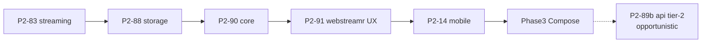

# Phase 2 — Rust engine complete (tier-1)

**Status:** In progress  
**Depends on:** [Phase 1 complete](./01-rust-engine.md)  
**Next phase:** [Phase 3 — Kotlin Compose UI](./03-kotlin-compose.md)  
**Migration index:** [README.md](./README.md)  
**Boundary:** [ENGINE_BOUNDARY.md](../ENGINE_BOUNDARY.md)  
**Spec:** [RFC-009](../rfc/009-rust-ffi.md)

---

## Goal

**Tier-1 playback path** lives in `crates/*`. Delete `packages/{streaming,storage,core}` and tier-1 slices of `packages/api`.

Tier-2 catalog (`packages/api` verticals) is **frozen** — no new Dart logic; full delete in Phase 3/4 (P2-89b).

---

## Migration rule (tier-1)

| Step | Action |
|------|--------|
| 1 | Port tier-1 logic → Rust crate |
| 2 | Add FFI in `crates/ffi` / uniffi (fetch+parse, Pattern B) |
| 3 | UI calls `ForjaEngine.*` for tier-1 paths |
| 4 | **Delete the Dart equivalent** — directory slice, deps, imports |

### Only these `packages/` survive after Phase 2

| Package | Purpose |
|---------|---------|
| `packages/rust` | Dart FFI loader (deleted Phase 4) |
| `packages/kotlin` | uniffi bindings (permanent) |
| `packages/api` | **Tier-2 only** — frozen catalog APIs |

---

## Architecture

```
UI (apps/forja — Flutter · Compose Phase 3)
  → widgets, navigation, player chrome, provider race UX
  → calls ForjaEngine / kotlin FFI for tier-1; tier-2 api frozen

Rust tier-1 (crates/* + libffi)
  → playback path: stream resolve, torrent, proxy, storage, parsers
```

| **Rust tier-1** | **Host** |
|-----------------|----------|
| Stream resolve, torrent, proxy | Player (media_kit) |
| Storage, prefs, history | WebView, Nuvio, WASM |
| Parse, crypto, extract (playback) | OAuth, secure storage |
| | Theme, navigation |
| | Tier-2 catalog (`packages/api`) |

**Anti-patterns:**
- Dart wrapper calling Rust instead of deleting Dart (tier-1)
- Sync FFI on UI thread for long resolve/search — use isolate (P2-91)
- New Pattern A FFI (`*_html_json`) for tier-1
- New engine logic in tier-2 `packages/api`
- `*Backend` hooks (P2-86 ✅ — stay dead)

**Allowed:**
- Host orchestration for provider race + loading/cancel UX ([ENGINE_BOUNDARY](../ENGINE_BOUNDARY.md) R6)
- `Isolate.run` for long FFI calls

---

## Status at a glance

| | |
|--|--|
| **Goal** | Tier-1 complete; `streaming` + `storage` + `core` deleted |
| **Blocks Phase 3** | P2-83, 88, 90, 91, 92, 93, 94, 14 |
| **Deferred Phase 3** | P2-89b (full api tier-2 port) |

**Legend:** ✅ done · 🔄 partial · ⬜ not started

### Task tracker

#### ✅ Finished

| IDs | What |
|-----|------|
| P2-20 → P2-23 | Drop libtorrent |
| P2-30 → P2-33 | Strip Dart HTML parse fallbacks |
| **P2-87** | `packages/scrapers` **deleted** |
| **P2-60** | Legacy `packages/forja_*` **deleted** |
| P2-12, P2-13, P2-15 | Mobile torrent wiring |
| P2-50, P2-51 | uniffi UDL + Kotlin bindgen scaffold |
| **P2-81** | Scraper pipeline → `search_torrents_json` |
| **P2-84** | Torrent filter → `filter_torrents_json` |
| **P2-86** | All `*Backend` hooks removed |
| **P2-85** | HLS proxy in Rust |
| **P2-82** | `packages/webstreamr` **deleted**; `webstreamr_get_streams_json` in Rust (**no rollback**) |

#### 🔄 Partial

| ID | Rust done | Dart still alive |
|----|-----------|------------------|
| **P2-83** | vidsrc, webstreamr service, videasy AES, provider URLs | **`packages/streaming`** — Nuvio (host), 111477 proxy, shelf routes |
| **P2-88** | `crates/storage` KV + FFI | **`packages/storage`** — kv glue, `app_theme`, thin repos |
| **P2-89** | Stremio parse via Rust | Stremio **HTTP still Dart** — P2-93 |

#### ⬜ Tier-1 todo

| ID | What |
|----|------|
| **P2-91** | WebStreamr: `Isolate.run` for `webstreamrGetStreamsJson`; cancel token — [issue 001](../issues/001-webstreamr-blocks-ui.md) |
| **P2-92** | Consolidate shelf + 111477 + mega routes into `crates/proxy` |
| **P2-93** | Stremio: wire `stremio_http_get_json` (kill Dart HTTP split) |
| **P2-94** | IPTV: move `iptv_network.dart` HTTP to Rust or unified FFI |
| **P2-95** | Dead code: unused repos, duplicate `stream_extractor`, `StreamResolver` |
| **P2-96** | Move `app_theme.dart` → `apps/forja` |
| **P2-83** | Finish streaming engine delete (with 92) |
| **P2-88** | Finish storage delete (with 96) |
| **P2-90** | Delete `packages/core` — JSON from Rust / maps in UI |

#### ⬜ Tier-2 deferred (Phase 3 — P2-89b)

| ID | What |
|----|------|
| **P2-89b** | `packages/api` tier-2 verticals — port opportunistically per Compose screen; **freeze** until then |

#### ⬜ Mobile + sign-off

| ID | What |
|----|------|
| P2-14 | Magnet → stream mobile E2E |
| P2-11, P2-52 | Android NDK CI, JNI proof |
| P2-70 → P2-72 | Smoke · RFC · README gate |

---

## Tier-1 exit checklist

**Phase 3 starts when all rows are ✅.**

| # | Criterion | |
|---|-----------|---|
| T1 | `packages/streaming` engine deleted (P2-83, 92) | ⬜ |
| T2 | `packages/storage` deleted; theme in app (P2-88, 96) | ⬜ |
| T3 | `packages/core` deleted (P2-90) | ⬜ |
| T4 | WebStreamr non-blocking (P2-91) | ⬜ |
| T5 | Stremio/IPTV no fetch split-brain (P2-93, 94) | ⬜ |
| T6 | Mobile magnet E2E (P2-14) | ⬜ |
| T7 | No tier-1 engine logic in `apps/forja/features/*/data/` except host adapters | ⬜ |
| T8 | Sign-off (P2-70) | ⬜ |

---

## Full engine exit (Phase 4)

| # | Criterion | |
|---|-----------|---|
| F1 | `packages/api` deleted (P2-89b) | ⬜ |
| F2 | Only `packages/rust` + `packages/kotlin` under `packages/` | ⬜ |

---

## Quick health check

```bash
./scripts/build_rust.sh
cd crates && cargo test --workspace
melos run rust:test && melos run rust:integration
```

---

## Dependency chain



---

## Related

- [Phase 1](./01-rust-engine.md) · [Phase 3 UI](./03-kotlin-compose.md) · [ENGINE_BOUNDARY](../ENGINE_BOUNDARY.md) · [RFC-009](../rfc/009-rust-ffi.md)
