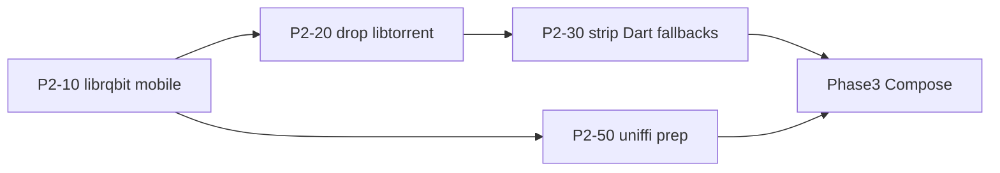

# Phase 2 — Rust engine complete (Flutter-free engine layer)

**Status:** Next  
**Depends on:** [Phase 1 complete](./01-rust-engine.md)  
**Next phase:** [Phase 3 — Kotlin Compose](./03-kotlin-compose.md)

---

## Goal

Finish the engine migration in Rust **before** any Compose UI work. Flutter remains the temporary UI shell, but **zero engine logic stays in Dart**:

- No `libtorrent_flutter` — torrent playback is librqbit via FFI on all platforms
- No Dart HTML parse fallbacks in engine packages
- No libtorrent desktop fallback when Rust loads
- `packages/rust` is a **thin FFI loader only** (facade + bindings + library_path)

Orchestration (HTTP fetch, registry routing, shelf `/hls-proxy`) may still live in Dart packages — that is UI glue, not engine. It ports to Kotlin in Phase 3.

---

## Torrent engine decision (locked)

**Decision:** keep **librqbit** (rqbit) as the only torrent engine. No swap, no from-scratch build.

| Option | Verdict |
|--------|---------|
| **librqbit** (current — `crates/torrent`) | **Ship.** Pure Rust, streaming-first (Range HTTP, piece prioritization, DHT, magnets). Desktop already wired. |
| **libtorrent_flutter** | **Remove in P2-20** — temporary mobile fallback only. |
| **irontide** | Rejected — GPL copyleft + no mobile track record; swap adds risk for no gain. |
| **cratetorrent / hightorrent / bip-rs / FX Torrent** | Rejected — toy, parse-only, stale, or no mobile story. |
| **[perpetus/stream-server](https://github.com/perpetus/stream-server)** | Reference only — backend trait + range/archive patterns; do not depend on it. |

**B2 is not a dead end.** The iOS blocker was `librqbit-dualstack-sockets` using Linux `bind_device` on iOS. Fix: vendored patch in `crates/third_party/librqbit-dualstack-sockets` (Apple cfg → `bind_device_by_index_v4/v6`). iOS compile verified; runtime smoke on device still required before P2-20.

Implementation already matches rqbit streaming: `crates/torrent` runs `librqbit::Session` + local axum HTTP with **Range** seek (`stream_file_handler`).

---

## Exit criteria

- [ ] Mobile FFI builds with `torrent-engine` + `local-proxy` (full features on iOS/Android)
- [ ] Magnet → HTTP stream works on iOS + Android via librqbit (B2 resolved)
- [ ] `libtorrent_flutter` removed from all pubspecs (`apps/forja`, `streaming`, `api`)
- [ ] `TorrentStreamService` is Rust-only — no libtorrent code path
- [ ] Dart HTML fallbacks removed from webstreamr sources/extractors (Rust required)
- [ ] Orphan engine copies deleted from `packages/rust/lib/src/` (if any remain)
- [ ] Desktop boot never falls back to libtorrent when dylib loads
- [ ] RFC-009 Step 9 acceptance fully checked
- [ ] `forja.udl` expanded + uniffi Kotlin bindgen POC (prep for Phase 3)

---

## Current gaps (from Phase 1)

| Gap | Blocker | Phase 2 task |
|-----|---------|--------------|
| Mobile librqbit won't compile | B2 — `librqbit-dualstack-sockets` / `bind_device` on iOS | P2-10 (**iOS compile done**) |
| `libtorrent_flutter` in 3 pubspecs | B2 | P2-20 |
| Desktop libtorrent fallback in `TorrentStreamService` | B2 | P2-21 |
| Dart HTML fallbacks in 44 webstreamr files | confidence after B2 | P2-30 |
| Optional scrapers still full Dart (YTS, EZTV, …) | not blocking | P2-40 |

---

## Tasks

### B2 — Mobile librqbit (critical path)

| ID | Task | Detail |
|----|------|--------|
| P2-10 | Fix librqbit iOS/Android build | **iOS done** — vendored patch `crates/third_party/librqbit-dualstack-sockets` (bind_device iOS cfg). Android: verify with NDK locally/CI |
| P2-11 | Probe + CI | **iOS done** — `./scripts/try_build_mobile_torrent.sh ios` · Android via NDK/CI |
| P2-12 | Enable full features in mobile build | **done** — `build_rust_mobile.sh` defaults to full features; `FORJA_RUST_MOBILE_PARSER_ONLY=1` for legacy |
| P2-13 | Wire `TorrentEngineBackend` on mobile | Same path as desktop — no platform branch |
| P2-14 | Integration test | Extend `integration_test/engine_smoke_test.dart` — magnet→stream on device when CI allows |
| P2-15 | Port `applyConnectionsLimit` | librqbit session config (was libtorrent-only) |
| P2-16 | (optional) Facade patterns | Skim [perpetus/stream-server](https://github.com/perpetus/stream-server) backend trait for range/archive edge cases — ideas only |

Probe: `./scripts/try_build_mobile_torrent.sh ios`  
Files: `crates/torrent/`, `packages/streaming/lib/src/torrent_stream_service.dart`

### Drop libtorrent / Rust-only torrent

| ID | Task | Files |
|----|------|-------|
| P2-20 | Remove `libtorrent_flutter` from pubspecs | `apps/forja/pubspec.yaml`, `packages/streaming/pubspec.yaml`, `packages/api/pubspec.yaml` |
| P2-21 | Simplify `torrent_stream_service.dart` | Remove libtorrent import, init, fallback branch — Rust-only |
| P2-22 | Remove libtorrent from player/magnet call sites | Verify only `TorrentStreamService` touched libtorrent |
| P2-23 | Update bootstrap shutdown | `cleanup()` — librqbit teardown only |

### Strip Dart engine fallbacks

| ID | Task | Files |
|----|------|-------|
| P2-30 | Webstreamr: remove Dart HTML parse fallbacks | 44 files in `packages/webstreamr/` — keep `tryRust*` only, fail if backend null |
| P2-31 | Delete orphan engine copies | `packages/rust/lib/src/dart_fallback/`, `lib/src/reference/` if present |
| P2-32 | Provider registry: remove static Dart URL fallbacks | `provider_fallback_urls.dart` — Rust required or explicit error |
| P2-33 | Scrapers: remove Dart parse for knaben/tpb/uindex | Already Rust-wired; delete dead Dart parse branches |

### Optional engine hardening

| ID | Task | Detail |
|----|------|--------|
| P2-40 | Port remaining scrapers to Rust | YTS, EZTV, EliteTorrent, etc. — `crates/scrapers/` |
| P2-41 | lulustream/fastream stream-fetch parity | Expand Dart parity or document as Rust-only |
| P2-42 | `FORJA_RUST_STRICT=1` on mobile debug | Fail fast when dylib missing on Android/iOS debug |

### Kotlin FFI prep (parallel, low risk)

| ID | Task | Detail |
|----|------|--------|
| P2-50 | Expand `forja.udl` | Document C ABI surfaces needed for Kotlin |
| P2-51 | uniffi Kotlin bindgen | Generate to `packages/forja_kotlin/` scaffold |
| P2-52 | JNI packaging proof | Reuse mobile `.so` / `.dylib` from B7 scripts |

### Sign-off

| ID | Task | Detail |
|----|------|--------|
| P2-70 | Manual smoke | Boot · IPTV import · magnet play (mobile + desktop) · one VidLink stream |
| P2-71 | Update RFC-009 | Mark Step 9 + B2 complete |
| P2-72 | Mark Phase 2 complete in README | Gate Phase 3 Compose start |

---

## What stays Dart after Phase 2 (not engine)

These are **orchestration / UI glue** — OK until Phase 3 ports them to Kotlin:

| Area | Package / path | Why not Rust |
|------|----------------|--------------|
| Webstreamr page fetch + registry | `packages/webstreamr` fetcher, registry | HTTP orchestration |
| Scraper search HTTP | `packages/scrapers` base_scraper, aggregator | HTTP orchestration |
| HLS `/hls-proxy` | `local_server_service.dart` | shelf rewrite — out of Rust scope |
| Nuvio JS runtime | `nuvio_runtime.dart` (`flutter_js`) | UI-layer scraper host |
| WebView extractors | `stream_extractor.dart`, kisskh, videasy, etc. | Platform WebView (~1,900 LOC) |
| Flutter UI + player | `apps/forja/lib/features/**`, `shared/player/` | Phase 3/4 scope |

---

## Dependency chain

**Do not start Phase 3 until P2-20 + P2-21 + P2-30 are done.**

---

## Acceptance checklist

- [x] `./scripts/try_build_mobile_torrent.sh ios` passes (vendored iOS patch)
- [ ] `./scripts/build_rust_mobile.sh all` with full features (Android needs NDK)
- [ ] Zero `libtorrent_flutter` references in repo
- [ ] `melos run rust:test` + `melos run rust:integration` green
- [ ] Release APK/IPA plays magnet via librqbit

---

## Related

- [Phase 1 — Rust engine](./01-rust-engine.md)
- [Phase 3 — Kotlin Compose](./03-kotlin-compose.md)
- [RFC-009](../rfc/009-rust-ffi.md)
