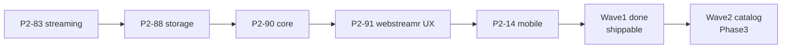

# Phase 2 — Playback engine (wave 1)

**Status:** In progress  
**Depends on:** [Phase 1 complete](./01-rust-engine.md)  
**Next phase:** [Phase 3 — Catalog engine (wave 2)](./03-engine-catalog.md)  
**Migration index:** [README.md](./README.md)  
**Boundary:** [ENGINE_BOUNDARY.md](../ENGINE_BOUNDARY.md)  
**Spec:** [RFC-009](../rfc/009-rust-ffi.md)

---

## Goal

**Playback-path engine** lives in `crates/*`. Delete `packages/{streaming,storage,core}` and playback slices of `packages/api`.

Catalog engine (`packages/api` verticals) ports in **wave 2** (Phase 3) — same destination (`crates/*`), different schedule.

---

## Migration rule

| Step | Action |
|------|--------|
| 1 | Port engine logic → Rust crate |
| 2 | Add FFI in `crates/ffi` (fetch+parse, Pattern B) |
| 3 | UI calls `ForjaEngine.*` |
| 4 | **Delete the Dart equivalent** — directory slice, deps, imports |

### `packages/` after wave 1

| Package | Purpose |
|---------|---------|
| `packages/rust` | Dart FFI bridge (**permanent**) |
| `packages/api` | **Legacy catalog engine** — wave 2 |

---

## Architecture

```
UI (apps/forja — Flutter permanent host)
  → widgets, navigation, player chrome, provider race UX
  → calls ForjaEngine for engine paths

Engine (crates/* + libffi)
  → playback: stream resolve, torrent, proxy, storage, parsers
```

| **Engine (`crates/*`)** | **Host (`apps/forja`)** |
|-------------------------|-------------------------|
| Stream resolve, torrent, proxy | Player (media_kit) |
| Storage, prefs, history | WebView, Nuvio, WASM |
| Parse, crypto, extract (playback) | OAuth, secure storage |
| | Theme, navigation |

**Anti-patterns:**
- Dart wrapper calling Rust instead of deleting Dart
- Sync FFI on UI thread for long resolve/search — use isolate (P2-91)
- New Pattern A FFI (`*_html_json`) for engine work
- New engine logic in Dart anywhere
- `*Backend` hooks (P2-86 ✅ — stay dead)

**Allowed:**
- Host orchestration for provider race + loading/cancel UX ([ENGINE_BOUNDARY](../ENGINE_BOUNDARY.md) R6)
- `Isolate.run` for long FFI calls

---

## Status at a glance

| | |
|--|--|
| **Goal** | Playback engine normalized; `streaming` + `storage` + `core` deleted |
| **Blocks wave 2** | P2-83, 88, 90, 91, 92, 93, 94, 14 |
| **Wave 2 (catalog)** | P3-01 → P3-03 in [Phase 3](./03-engine-catalog.md) |

**Legend:** ✅ done · 🔄 partial · ⬜ not started

### Task tracker

#### ✅ Finished

| IDs | What |
|-----|------|
| P2-20 → P2-23 | Drop libtorrent |
| P2-30 → P2-33 | Strip Dart HTML parse fallbacks |
| **P2-87** | `packages/scrapers` **deleted** |
| **P2-60** | Legacy `packages/forja_*` **deleted** |
| P2-12, P2-13, P2-15 | Mobile torrent wiring |
| P2-50, P2-51 | uniffi UDL + Kotlin bindgen scaffold (kotlin deleted in wave 2) |
| **P2-81** | Scraper pipeline → `search_torrents_json` |
| **P2-84** | Torrent filter → `filter_torrents_json` |
| **P2-86** | All `*Backend` hooks removed |
| **P2-85** | HLS proxy in Rust |
| **P2-82** | `packages/webstreamr` **deleted**; logic in `crates/webstreamr` |
| **P2-91** | WebStreamr `Isolate.run` offload + `cancelPending()` — UI no longer frozen |
| **P2-96** | `app_theme.dart` → `apps/forja/lib/shared/theme/` |
| **P2-93** | Stremio HTTP via `stremioHttpGet` — no Dart `package:http` split |

#### 🔄 Partial

| ID | Rust done | Dart still alive |
|----|-----------|------------------|
| **P2-83** | vidsrc, webstreamr service, videasy AES, provider URLs | **`packages/streaming`** — Nuvio (host), 111477 proxy, shelf routes |
| **P2-88** | `crates/storage` KV + FFI | **`packages/storage`** — kv glue, thin repos |
| **P2-89** | Stremio parse + HTTP via Rust | Stremio service still in **`packages/api`** (wave 2 catalog) |

#### ⬜ Wave 1 todo

| ID | What |
|----|------|
| **P2-92** | Consolidate shelf + 111477 + mega routes into `crates/proxy` |
| **P2-94** | IPTV: move `iptv_network.dart` HTTP to Rust or unified FFI |
| **P2-95** | Dead code: unused repos, duplicate `stream_extractor`, `StreamResolver` |
| **P2-83** | Finish streaming engine delete (with 92) |
| **P2-88** | Finish storage delete |
| **P2-90** | Delete `packages/core` — JSON from Rust / maps in UI |

#### ⬜ Mobile + sign-off

| ID | What |
|----|------|
| P2-14 | Magnet → stream mobile E2E |
| P2-11, P2-52 | Android NDK CI, JNI proof |
| P2-70 → P2-72 | Smoke · RFC · README gate |

---

## Playback engine exit checklist

**Wave 2 (catalog) starts when all rows are ✅.**

| # | Criterion | |
|---|-----------|---|
| T1 | `packages/streaming` engine deleted (P2-83, 92) | ⬜ |
| T2 | `packages/storage` deleted (P2-88) | ⬜ |
| T3 | `packages/core` deleted (P2-90) | ⬜ |
| T4 | WebStreamr non-blocking (P2-91) | ✅ |
| T5 | Stremio/IPTV no fetch split-brain (P2-93, 94) | 🔄 P2-93 ✅ |
| T6 | Mobile magnet E2E (P2-14) | ⬜ |
| T7 | No engine logic in `apps/forja/features/*/data/` except host adapters | ⬜ |
| T8 | Sign-off (P2-70) | ⬜ |

---

## Architecture normalized checklist (wave 2 — Phase 3)

See [03-engine-catalog.md](./03-engine-catalog.md#exit-checklist).

| # | Criterion | |
|---|-----------|---|
| A1 | `packages/api` deleted | ⬜ |
| A2 | All C1 catalog logic in `crates/*` | ⬜ |
| A3 | Only `packages/rust` under `packages/` | ⬜ |
| A4 | No engine logic in Dart outside FFI calls | ⬜ |

---

## Quick health check

```bash
./scripts/build_rust.sh
cd crates && cargo test --workspace
melos run rust:test && melos run rust:integration
```

---

## Dependency chain



---

## Related

- [Phase 1](./01-rust-engine.md) · [Phase 3 catalog](./03-engine-catalog.md) · [ENGINE_BOUNDARY](../ENGINE_BOUNDARY.md) · [RFC-009](../rfc/009-rust-ffi.md)
