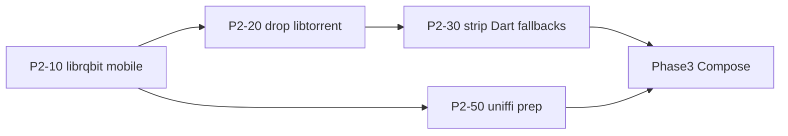

# Phase 2 — Rust engine complete (Flutter-free engine layer)

**Status:** Next (in progress)  
**Depends on:** [Phase 1 complete](./01-rust-engine.md)  
**Next phase:** [Phase 3 — Kotlin Compose](./03-kotlin-compose.md)  
**Migration index:** [README.md](./README.md)  
**Spec:** [RFC-009](../rfc/009-rust-ffi.md)

---

## Status at a glance

**Goal:** finish the engine in Rust before Compose. Flutter stays the UI shell; **zero engine logic in Dart** — librqbit everywhere, no libtorrent, no HTML parse fallbacks, `packages/rust` thin loader only.

**Phase 2 in progress.** Exit criteria **5 / 8** · critical path **B2** (mobile librqbit smoke).

### Three columns — read every table this way

| Column | Question |
|--------|----------|
| **Rust** | Code exists in `crates/` + exposed via FFI? |
| **App** | Running app calls Rust when native library loads? |
| **Dart removed** | Old duplicate / fallback deleted? |

**Done = ✅** when every row in a workstream is ✅/✅. Dart may keep HTTP fetch, registry routing, and shelf proxy — **no parse, crypto, torrent logic, or HTML extractors in Dart**.

### Workstreams

| Workstream | Done | Target | Status |
|------------|-----:|-------:|--------|
| B2 — mobile librqbit | 4 | 6 | iOS compile done · device smoke + Android NDK open |
| Drop libtorrent | 4 | 4 | **done** |
| Strip Dart fallbacks | 4 | 4 | **done** |
| Legacy engine purge | 4 | 4 | **done** — P2-60 deleted `forja_*` duplicates |
| Optional hardening | 1 | 3 | P2-40 scrapers · P2-41 parity · P2-42 **done** |
| Kotlin FFI prep | 2 | 3 | P2-50 UDL **done** · P2-51 bindgen **done** · P2-52 JNI proof open |
| Sign-off | 0 | 3 | P2-70 smoke · P2-71 RFC · P2-72 README gate |

### Feature matrix

| Area | Rust | App | Dart removed | Notes |
|------|:----:|:---:|:------------:|-------|
| **B2 — mobile librqbit** | ✅ iOS | partial | N/A | desktop E2E **done** · mobile device + Android NDK open |
| **Drop libtorrent** | ✅ | ✅ | ✅ | P2-20/21 done — no pubspec refs, Rust-only torrent |
| **Strip fallbacks** | ✅ | ✅ | ✅ | webstreamr · provider registry · scrapers |
| **Optional scrapers** | — | — | — | YTS, EZTV, EliteTorrent — not blocking |
| **Kotlin FFI prep** | — | — | — | parallel · low risk |
| **Sign-off** | — | — | — | blocked on B2 tail |

### Exit criteria

| Criterion | Status |
|-----------|--------|
| Mobile FFI full features (iOS/Android) | open |
| Magnet → HTTP stream on mobile | open |
| Magnet → HTTP stream on desktop | ✅ (P2-14 E2E + Range) |
| `libtorrent_flutter` removed | ✅ |
| `TorrentStreamService` Rust-only | ✅ |
| Dart HTML fallbacks removed | ✅ |
| Zero Dart engine logic in active packages | ✅ |
| Dart parity baselines removed (`dart_baseline/`) | ✅ |
| Disabled Dart-only scrapers deleted | ✅ |
| Orphan engine copies deleted | ✅ |
| Legacy `packages/forja_*` duplicates deleted | ✅ |
| Desktop no libtorrent when dylib loads | ✅ |
| RFC-009 Step 9 + uniffi POC | partial (UDL + Kotlin gen) |

### What stays Dart after Phase 2 (orchestration only — not engine)

| Area | Package | Why |
|------|---------|-----|
| Webstreamr HTTP fetch + registry | `packages/webstreamr` | fetch pages, call Rust parse via `*Backend` |
| Scraper search HTTP | `packages/scrapers` | fetch HTML, call Rust parse via `ScraperParseBackend` |
| HLS `/hls-proxy` | `local_server_service.dart` | shelf rewrite |
| Nuvio JS + WebView extractors | app + `packages/api` | UI-layer |
| Flutter UI + player | `apps/forja` | Phase 3/4 |

**Engine boundary:** all parse / crypto / torrent / template / dedup / episode-match / HLS-parse logic lives in `crates/` only. Dart `*Backend` hooks are thin FFI glue — no fallback implementations.

### Numbers

| Metric | Value |
|--------|-------|
| Exit criteria met | 5 / 8 |
| Core workstreams done | 2 / 3 (libtorrent · fallbacks) |
| B2 tasks done | 4 / 6 (excl. optional P2-16) |
| Acceptance checklist | 3 / 5 |
| `libtorrent_flutter` pubspec refs | 0 |

### Quick health check

```bash
./scripts/try_build_mobile_torrent.sh ios
./scripts/build_rust_mobile.sh all          # Android needs NDK
cd crates && cargo test --workspace
melos run rust:test && melos run rust:integration
```

### Next work

1. **P2-14** — magnet E2E on iOS/Android device
2. **P2-11** — Android NDK full-features build in CI
3. **P2-70** — manual sign-off smoke

Blockers → [Torrent engine decision](#torrent-engine-decision-locked) · [Current gaps](#current-gaps-from-phase-1)

---

## Torrent engine decision (locked)

**Decision:** keep **librqbit** (rqbit) as the only torrent engine. No swap, no from-scratch build.

| Option | Verdict |
|--------|---------|
| **librqbit** (current — `crates/torrent`) | **Ship.** Pure Rust, streaming-first (Range HTTP, piece prioritization, DHT, magnets). Desktop already wired. |
| **libtorrent_flutter** | **Remove in P2-20** — temporary mobile fallback only. |
| **irontide** | Rejected — GPL copyleft + no mobile track record; swap adds risk for no gain. |
| **cratetorrent / hightorrent / bip-rs / FX Torrent** | Rejected — toy, parse-only, stale, or no mobile story. |
| **[perpetus/stream-server](https://github.com/perpetus/stream-server)** | Reference only — backend trait + range/archive patterns; do not depend on it. |

**B2 is not a dead end.** The iOS blocker was `librqbit-dualstack-sockets` using Linux `bind_device` on iOS. Fix: vendored patch in `crates/third_party/librqbit-dualstack-sockets` (Apple cfg → `bind_device_by_index_v4/v6`). iOS compile verified; runtime smoke on device still required before P2-20.

Implementation already matches rqbit streaming: `crates/torrent` runs `librqbit::Session` + local axum HTTP with **Range** seek (`stream_file_handler`).

---

## Current gaps (from Phase 1)

| Gap | Blocker | Phase 2 task |
|-----|---------|--------------|
| Mobile librqbit won't compile | B2 — `librqbit-dualstack-sockets` / `bind_device` on iOS | P2-10 (**iOS compile done**) |
| `libtorrent_flutter` in 3 pubspecs | B2 | P2-20 (**done**) |
| Desktop libtorrent fallback in `TorrentStreamService` | B2 | P2-21 (**done**) |
| Dart HTML fallbacks in 44 webstreamr files | confidence after B2 | P2-30 (**done**) |
| Optional scrapers still full Dart (YTS, EZTV, …) | not blocking | P2-40 (**deleted** — re-port to Rust when re-enabled) |

---

## Tasks

### B2 — Mobile librqbit (critical path)

| ID | Task | Detail |
|----|------|--------|
| P2-10 | Fix librqbit iOS/Android build | **iOS done** — vendored patch `crates/third_party/librqbit-dualstack-sockets` (bind_device iOS cfg). Android: verify with NDK locally/CI |
| P2-11 | Probe + CI | **iOS done** — `./scripts/try_build_mobile_torrent.sh ios` · Android via NDK/CI |
| P2-12 | Enable full features in mobile build | **done** — `build_rust_mobile.sh` defaults to full features; `FORJA_RUST_MOBILE_PARSER_ONLY=1` for legacy |
| P2-13 | Wire `TorrentEngineBackend` on mobile | Same path as desktop — no platform branch |
| P2-14 | Integration test | **partial** — optional `FORJA_TORRENT_E2E=1` + `FORJA_TORRENT_MAGNET` · peer-limit restart test added |
| P2-15 | Port `applyConnectionsLimit` | **done** — `SessionOptions::peer_limit` via FFI |
| P2-16 | (optional) Facade patterns | Skim [perpetus/stream-server](https://github.com/perpetus/stream-server) backend trait for range/archive edge cases — ideas only |

Probe: `./scripts/try_build_mobile_torrent.sh ios`  
Files: `crates/torrent/`, `packages/streaming/lib/src/torrent_stream_service.dart`

### Drop libtorrent / Rust-only torrent

| ID | Task | Files |
|----|------|-------|
| P2-20 | Remove `libtorrent_flutter` from pubspecs | `apps/forja/pubspec.yaml`, `packages/streaming/pubspec.yaml`, `packages/api/pubspec.yaml` |
| P2-21 | Simplify `torrent_stream_service.dart` | Remove libtorrent import, init, fallback branch — Rust-only |
| P2-22 | Remove libtorrent from player/magnet call sites | Verify only `TorrentStreamService` touched libtorrent |
| P2-23 | Update bootstrap shutdown | `cleanup()` — librqbit teardown only |

### Strip Dart engine fallbacks

| ID | Task | Files |
|----|------|-------|
| P2-30 | Webstreamr: remove Dart HTML parse fallbacks | 44 files in `packages/webstreamr/` — keep `tryRust*` only, fail if backend null |
| P2-31 | Delete orphan engine copies | `packages/rust/lib/src/dart_fallback/`, `lib/src/reference/` if present |
| P2-32 | Provider registry: remove static Dart URL fallbacks | **done** — `ForjaEngine.requireMovieUrl` / `requireTvUrl` |
| P2-33 | Scrapers: remove Dart parse for knaben/tpb/uindex | **done** — already Rust-only via `ScraperParseBackend!` |

### Optional engine hardening

| ID | Task | Detail |
|----|------|--------|
| P2-40 | Port remaining scrapers to Rust | **deferred** — disabled Dart scrapers deleted; only knaben/tpb/uindex active |
| P2-41 | lulustream/fastream stream-fetch parity | Expand Rust goldens or document as Rust-only |
| P2-42 | `FORJA_RUST_STRICT=1` on mobile debug | **done** — boot warns/fails on all platforms in debug |
| P2-62 | Drop Dart parity baselines | **done** — `dart_baseline/` removed; tests use `crates/*/tests/fixtures/` |
| P2-64 | Zero Dart engine in active packages | **done** — `torrent_filter` + `episode_matcher` Rust-only; dead scrapers deleted |

### Legacy engine purge (still Phase 2 — blocks Phase 3)

| ID | Task | Detail |
|----|------|--------|
| P2-60 | Delete `packages/forja_*` duplicates | **done** — removed 7 packages; app uses `packages/{rust,api,core,...}` only |
| P2-61 | Remove `dart_fallback/` + `reference/` if any | **done** — `packages/rust/lib/src/` is 3 files |
| P2-63 | Audit `melos.yaml` / CI for `forja_*` refs | **done** — no CI refs; cursor rule updated |

**Do not add a separate “engine cleanup” phase.** Engine cleanup **is** Phase 2. Phase 3 is Compose UI + porting orchestration. Phase 4 deletes Flutter entirely.

### Kotlin FFI prep (parallel, low risk)

| ID | Task | Detail |
|----|------|--------|
| P2-50 | Expand `forja.udl` | **done** — full engine surface (52 fns) |
| P2-51 | uniffi Kotlin bindgen | **done** — `./scripts/generate_kotlin_ffi.sh` → `packages/kotlin/` |
| P2-52 | JNI packaging proof | Reuse mobile `.so` / `.dylib` from B7 scripts |

### Sign-off

| ID | Task | Detail |
|----|------|--------|
| P2-70 | Manual smoke | Boot · IPTV import · magnet play (mobile + desktop) · one VidLink stream |
| P2-71 | Update RFC-009 | Mark Step 9 + B2 complete |
| P2-72 | Mark Phase 2 complete in README | Gate Phase 3 Compose start |

---

## Dependency chain



**Do not start Phase 3 until P2-20 + P2-21 + P2-30 are done.**

---

## Acceptance checklist

- [x] `./scripts/try_build_mobile_torrent.sh ios` passes (vendored iOS patch)
- [ ] `./scripts/build_rust_mobile.sh all` with full features (Android needs NDK)
- [x] Zero `libtorrent_flutter` references in active packages
- [x] Zero Dart engine logic in `packages/{api,core,scrapers,webstreamr,streaming,rust}`
- [x] `packages/rust/test/parity/dart_baseline/` deleted
- [ ] `melos run rust:test` + `melos run rust:integration` green (run manually: `flutter test integration_test/` passes)
- [ ] Release APK/IPA plays magnet via librqbit

---

## Related

- [Phase 1 — Rust engine](./01-rust-engine.md)
- [Phase 3 — Kotlin Compose](./03-kotlin-compose.md)
- [RFC-009](../rfc/009-rust-ffi.md)
