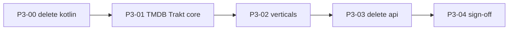

# Phase 3 — Catalog engine (wave 2)

**Status:** 4 / 5 tasks — P3-04 next  
**Depends on:** [Playback engine exit checklist](./02-rust-engine-complete.md#playback-engine-exit-checklist) ✅  
**Next phase:** [Phase 4 — Web client](./04-web-client.md) (parallel)  
**Migration index:** [README.md](./README.md)  
**Boundary:** [ENGINE_BOUNDARY.md](../ENGINE_BOUNDARY.md)  
**Spec:** [RFC-009](../rfc/009-rust-ffi.md)

---

## Goal

Catalog engine lives in `crates/*`. Delete `packages/api` and any remaining legacy engine under `packages/`.

TMDB, Trakt, Jellyfin, and vertical APIs are **C1 engine** — same destination as playback (`crates/*`), different wave. ~~`packages/api`~~ **deleted** (P3-03 ✅); residual Dart engine debt lives in `apps/forja` until ported.

---

## Status at a glance

| | |
|--|--|
| **Progress** | **4 / 5 tasks** — P3-04 sign-off |
| **Blocked by** | — |
| **Deferred from wave 1** | P2-89 (Stremio catalog service) |

**Legend:** ✅ done · 🔄 in progress · ⬜ not started

---

## Tasks

| # | ID | Description | Status |
|--:|----|-------------|--------|
| 1 | P3-00 | Delete `packages/kotlin/` + `scripts/generate_kotlin_ffi.sh` references (Compose cancelled) | ✅ |
| 2 | P3-01 | Port TMDB/Trakt core to `crates/*` | ✅ |
| 3 | P3-02 | Port verticals incrementally (anime, manga, jellyfin, music, Arabic, …) | ✅ |
| 4 | P3-03 | Delete `packages/api` | ✅ |
| 5 | P3-04 | Architecture normalized sign-off | ⬜ |

### P3-03 — done

`packages/api` deleted. Final relocation: playback/debrid/torrent services → `apps/forja/lib/shared/playback/`; `music_service` → `apps/forja/lib/shared/audio/`; `jellyfin_service` → `apps/forja/lib/features/jellyfin/catalog/`; `subtitle_api` → `packages/rust/lib/src/catalog/`. See [023-[fixed]-packages-api-delete-blocked-host-relocation.md](../issues/fixed/023-[fixed]-packages-api-delete-blocked-host-relocation.md).

| Step | Status |
|------|--------|
| Move `anime_http.dart` → `packages/rust/lib/src/catalog_http.dart` | ✅ |
| Move shared DTOs (`Movie`, `StreamSource`, `TorrentResult`) → `packages/rust/lib/src/models/` | ✅ |
| Move host services (`pip`, `external_player`, `player_pool`, `android_player_launcher`, `app_updater`) → `apps/forja/lib/shared/services/` | ✅ |
| Move `episode_watched_service` → `packages/rust` (Trakt/Simkl sync via host callback) | ✅ |
| Move `my_list_service` + `book_progress_service` → `packages/rust`; `BookResult` → `packages/rust/lib/src/models/` | ✅ |
| Consolidate tracker sync in `apps/forja/lib/shared/services/tracker_sync.dart` | ✅ |
| Move playback glue (11 files) + `webstreamr_settings` → `packages/rust/lib/src/playback/` | ✅ |
| Move catalog metadata services → `packages/rust/lib/src/catalog/` | ✅ |
| Move host utils + music/audio cluster → `apps/forja` | ✅ |
| Move catalog verticals + extractors → `apps/forja` | ✅ |
| Relocate final 14 files (playback resolvers, debrid, music, jellyfin, subtitle) | ✅ |
| Remove `packages/api` from workspace | ✅ |

---

## Catalog engine exit checklist {#exit-checklist}

**Architecture fully normalized when all rows are ✅.**

| # | Criterion | Task | Status |
|---|-----------|------|--------|
| A1 | `packages/api` deleted | P3-03 | ✅ |
| A2 | All C1 catalog logic in `crates/*` | P3-01, P3-02 | ⬜ |
| A3 | Only `packages/rust` under `packages/` | P3-03, P3-04 | ✅ |
| A4 | No engine logic in Dart outside FFI calls | P3-01 → P3-03 | ⬜ |
| A5 | `packages/kotlin` deleted | P3-00 | ✅ |

---

## Migration rule

| Step | Action |
|------|--------|
| 1 | Port vertical to `crates/<vertical>/` or shared catalog crate |
| 2 | Add FFI in `crates/ffi` (fetch+parse, Pattern B) |
| 3 | Wire `apps/forja` to `ForjaEngine.*` |
| 4 | **Delete the Dart slice** — directory, pubspec deps, imports |
| 5 | Rust tests + Dart parity in `packages/rust/test/parity/` where applicable |

**No new engine logic in Dart** during wave 2.

### Port order (suggested)



| Vertical | Current location | Target crate |
|----------|------------------|--------------|
| TMDB | `packages/api` | `crates/tmdb-core` ✅ |
| Trakt | `packages/api` | `crates/trakt-core` ✅ |
| Jellyfin | `packages/api` | `crates/jellyfin-core` ✅ |
| Anime (AniList + HTTP) | `packages/api` | `crates/anilist-core` + `crates/anime-core` ✅ |
| KissKh metadata | `packages/api` | `crates/anime-core` (shared HTTP) ✅ |
| Arabic (Larozaa/DimaToon/Brstej) | `packages/api` | `crates/anime-core` (shared HTTP) ✅ |
| Books (LibGen) | `packages/api` | `crates/anime-core` (shared HTTP) ✅ |
| Comics (RCO) | `packages/api` | `crates/anime-core` (shared HTTP) ✅ |
| Music (Deezer + downloads) | `packages/api` | `crates/anime-core` (shared HTTP) ✅ |
| Manga (WeebCentral fetch) | `packages/api` | `crates/manga-core` ✅ |
| Anime Arabic (AnimeSlayer) | `packages/api` | `crates/anime-core` (shared HTTP) ✅ |
| Subtitles/metadata (Wyzie, Levrx, SubtitleCat, Mysubs, MDBlist, Simkl, IntroDB) | `packages/api` | `crates/anime-core` (shared HTTP) ✅ |
| Comics (RCO.ru) | `packages/api` | `crates/anime-core` (shared HTTP) ✅ |
| Audiobook (browse/search + downloads) | `packages/api` | `crates/anime-core` (shared HTTP) ✅ |
| Paper2Audio | `packages/api` | `crates/anime-core` (shared HTTP) ✅ |
| Lyrics (LRCLIB) | `packages/api` | `crates/anime-core` (shared HTTP) ✅ |
| Debrid / site111477 / mega_proxy | ~~`packages/api`~~ | `apps/forja/lib/shared/playback/` (Dart — port to `crates/*` in P3-04+) |

### `packages/` after wave 2

| Package | Purpose |
|---------|---------|
| `packages/rust` | Dart FFI bridge + parity tests (**permanent**) |
| `packages/rust/lib/src/catalog_http.dart` | Shared catalog HTTP (`animeHttp` / `animeHttpBytes`) — moved from `packages/api` in P3-03 |
| `packages/rust/lib/src/models/` | Shared DTOs (`Movie`, `StreamSource`, `TorrentResult`) — moved from ~~`packages/api`~~ in P3-03 |
| `apps/forja/lib/shared/playback/` | Host playback orchestration (debrid, site111477, jackett, stremio resolver) — relocated from ~~`packages/api`~~ in P3-03 |

---

## Architecture

```
UI (apps/forja — Flutter permanent host)
  → widgets, navigation, OAuth, secure storage
  → calls ForjaEngine / RustLib for catalog paths

Engine (crates/* + libffi)
  → catalog: tmdb, trakt, jellyfin, vertical APIs
  → playback: stream resolve, torrent, proxy, storage (wave 1 ✅)

apps/forja/lib/shared/playback/
  → residual Dart playback HTTP (debrid, site111477, jackett) — port to crates in P3-04+
```

| **Engine (`crates/*`)** | **Host (`apps/forja`)** |
|-------------------------|-------------------------|
| TMDB/Trakt/Jellyfin fetch+parse | Browse UI, details screens |
| Vertical APIs (anime, manga, …) | OAuth flows, theme |
| Stremio catalog (P2-89 → P3) | My list UX, navigation |

**Allowed:** `Isolate.run` for long FFI · no **new** Dart engine logic in host

**Anti-patterns:** sync FFI on UI thread · Pattern A FFI · new engine logic in Dart

---

## Quick health check

```bash
./scripts/build_rust.sh
cd crates && cargo test --workspace
cd packages/rust && flutter test test/parity/tmdb_test.dart test/parity/trakt_test.dart test/parity/jellyfin_test.dart test/parity/anilist_manga_test.dart test/parity/anime_test.dart

# After each vertical port — grep for deleted Dart slice:
rg "packages/api/lib/api/<vertical>" apps/forja packages/rust
```

---

## Related

- [Phase 2 playback](./02-rust-engine-complete.md) · [Phase 4 web](./04-web-client.md) · [ENGINE_BOUNDARY](../ENGINE_BOUNDARY.md) · [RFC-009](../rfc/009-rust-ffi.md)
