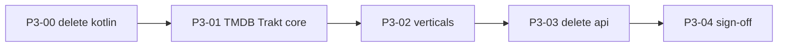

# Phase 3 — Catalog engine (wave 2)

**Status:** Future (blocked on wave 1)  
**Depends on:** [Playback engine exit checklist](./02-rust-engine-complete.md#playback-engine-exit-checklist)  
**Next phase:** [Phase 4 — Web client](./04-web-client.md) (parallel)  
**Migration index:** [README.md](./README.md)  
**Boundary:** [ENGINE_BOUNDARY.md](../ENGINE_BOUNDARY.md)

---

## Goal

Normalize **catalog engine** — same rules as webstreamr/torrent (engine → `crates/*`), different wave.

TMDB, Trakt, Jellyfin, and vertical APIs are **C1 engine** — not a separate layer from playback. `packages/api` is legacy debt until deleted.

---

## Status at a glance

| | |
|--|--|
| **Progress** | **0 / 5 tasks (0%)** |
| **Blocked by** | [Playback engine exit checklist](./02-rust-engine-complete.md#playback-engine-exit-checklist) |

**Legend:** ✅ done · ⬜ not started

### Task tracker

| ID | What |
|----|------|
| **P3-00** | Delete `packages/kotlin/` + `scripts/generate_kotlin_ffi.sh` references (Compose cancelled) |
| **P3-01** | Port TMDB/Trakt core to `crates/*` |
| **P3-02** | Port verticals incrementally (anime, manga, jellyfin, music, Arabic, …) |
| **P3-03** | Delete `packages/api` |
| **P3-04** | Architecture normalized sign-off |

### Exit checklist {#exit-checklist}

**Architecture fully normalized when all rows are ✅.**

| # | Criterion | |
|---|-----------|---|
| A1 | `packages/api` deleted | ⬜ |
| A2 | All C1 catalog logic in `crates/*` | ⬜ |
| A3 | Only `packages/rust` under `packages/` | ⬜ |
| A4 | No engine logic in Dart outside FFI calls | ⬜ |
| A5 | `packages/kotlin` deleted (P3-00) | ⬜ |

---

## Migration rule

Same as wave 1:

1. Port vertical to `crates/<vertical>/` or shared catalog crate.
2. Add FFI in `crates/ffi` (Pattern B).
3. Wire `apps/forja` to `ForjaEngine.*`.
4. Delete Dart slice from `packages/api`.
5. Rust tests + parity where applicable.

**No new engine logic in Dart** during wave 2.

---

## Port order (suggested)

| Vertical | Current location | Target crate |
|----------|------------------|--------------|
| TMDB / Trakt | `packages/api` | `crates/*` (TBD) |
| Jellyfin | `packages/api` | `crates/*` |
| Anime, manga, music, Arabic | `packages/api` | `crates/*` per vertical |

---

## Related

- [Phase 2 playback](./02-rust-engine-complete.md)
- [ENGINE_BOUNDARY](../ENGINE_BOUNDARY.md)
- [RFC-009](../rfc/009-rust-ffi.md)
