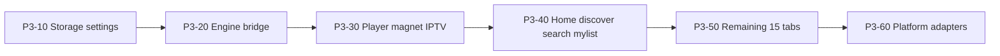

# Phase 3 — Kotlin Compose UI

**Status:** Future  
**Depends on:** [Phase 2 complete](./02-rust-engine-complete.md) — engine 100% Rust, no libtorrent  
**Next phase:** [Phase 4 — Delete Flutter](./04-delete-flutter.md)

---

## Goal

Replace the Flutter UI with Kotlin Compose Multiplatform. Engine is already complete in Rust (Phase 2). Compose calls `forja_kotlin` → `libforja_ffi`. Orchestration (HTTP fetch, registry, shelf) ports from Dart packages to Kotlin.

---

## Exit criteria

- [ ] Feature parity with Flutter ([RFC-011](../rfc/011-v1.0-mvp.md): 19 nav tabs + player + settings)
- [ ] `forja_kotlin` covers all FFI surfaces in [`rust_delegates.dart`](../../apps/forja/lib/app/rust_delegates.dart)
- [ ] Magnet playback on mobile via Rust librqbit (already done in Phase 2)
- [ ] Automated smoke tests for engine bridge + core flows

---

## Monorepo layout (target)

```
apps/forja_compose/
  shared/                    # Compose UI + ViewModels
  androidApp/
  iosApp/
  desktopApp/                # if CMP desktop chosen
packages/forja_kotlin/       # uniffi/JNI wrapper over libforja_ffi
```

Existing Rust build scripts unchanged: `scripts/build_rust.sh`, `scripts/build_rust_mobile.sh`.

---

## Tasks

### Scaffold (P3-0x)

| ID | Task | Paths |
|----|------|-------|
| P3-01 | Create KMP app skeleton | `apps/forja_compose/` |
| P3-02 | Finish Kotlin FFI package | `packages/forja_kotlin/` — expand Phase 2 uniffi POC |
| P3-03 | CI job: Kotlin smoke test | Full delegate surface round-trip |
| P3-04 | Gradle/Xcode link `libforja_ffi` | Reuse Phase 2 mobile artifacts |

### Port order



| ID | Task | Flutter source | Kotlin target |
|----|------|----------------|---------------|
| P3-10 | Storage + theme + prefs | `forja_storage` | KMP DataStore/SQLite |
| P3-11 | Shell + nav (19 tabs) | `shell/nav_config.dart`, `main_screen.dart` | Compose navigation |
| P3-20 | Engine bridge | `packages/forja_rust`, `rust_delegates.dart` | `forja_kotlin` |
| P3-30 | Unified player | `shared/player/` | Compose + ExoPlayer/AVPlayer |
| P3-31 | Magnet tab | `features/magnet/` | Compose + Rust torrent FFI |
| P3-32 | IPTV | `features/iptv/` | Compose + Rust parsers |
| P3-40 | Core browse | home, discover, search, my_list | Compose + Kotlin HTTP (TMDB, Stremio) |
| P3-50 | Remaining tabs | anime, arabic, manga, music, jellyfin, etc. | Feature modules |
| P3-51 | Dart package ports | `forja_api`, `forja_streaming`, `forja_webstreamr`, `forja_scrapers` | orchestration→Kotlin, parse→FFI |
| P3-60 | WebView extractors | `stream_extractor.dart`, kisskh, videasy, etc. | `expect/actual` WebView modules |
| P3-61 | Nuvio JS runtime | `nuvio_runtime.dart` (`flutter_js`) | KMP QuickJS host |
| P3-62 | HLS proxy | `local_server_service.dart` `/hls-proxy` | Kotlin HTTP server or platform proxy |
| P3-63 | PiP, casting stubs | `shared/casting/` | Platform modules |
| P3-70 | Feature parity sign-off | Manual + automated smoke | Checklist vs RFC-011 |

---

## Dart package migration map

| Package | Phase 3 action |
|---------|----------------|
| `forja_rust` | Replace with `forja_kotlin`; delete in Phase 4 |
| `forja_core` | Models → Kotlin shared; backend hooks → direct FFI |
| `forja_storage` | Full port |
| `forja_api` | HTTP clients port; WebView extractors → platform |
| `forja_streaming` | Orchestration → Kotlin; engine stays Rust |
| `forja_webstreamr` | Fetcher/registry → Kotlin; parse → FFI |
| `forja_scrapers` | Search HTTP → Kotlin; parse → FFI |

---

## Orchestration strategy

Port orchestration to Kotlin during Compose. Rust engine is frozen after Phase 2.

**Stays platform-specific (not Rust):**

- HLS `/hls-proxy` (m3u8 rewrite + PNG strip)
- WebView/WASM extractors (videasy, kisskh, stream_extractor)
- Nuvio JS runtime → KMP QuickJS

---

## Platform rollout

| Path | When | Notes |
|------|------|-------|
| **Android-first** (recommended) | P3-30 | Validates Compose + Rust engine on device |
| iOS | After Android player green | |
| Desktop CMP | After mobile parity OR keep Flutter desktop until Phase 4 subset | |

---

## FFI surfaces to bind (`forja_kotlin`)

Mirror [`rust_delegates.dart`](../../apps/forja/lib/app/rust_delegates.dart):

| Backend | Rust FFI domain |
|---------|-----------------|
| `TorrentFilterBackend` | normalize + scene parse |
| `StremioServiceBackend` | URL + JSON + HTTP |
| `ScraperParseBackend` | knaben/tpb/uindex + dedup |
| `PasteShDecryptorBackend` | paste.sh |
| `IptvClientBackend` | Xtream decode/parse |
| `WebstreamrParseBackend` | all extractors/sources |
| `JsUnpackBackend` | JS unpack |
| `KissKhDecryptBackend` | subtitle decrypt |
| `TorrentEngineBackend` | librqbit start/stream/list |
| `ForjaEngine` facade | M3U, provider URLs, episode matcher, HLS |

---

## Related

- [Phase 2 — Rust engine complete](./02-rust-engine-complete.md)
- [Phase 4 — Delete Flutter](./04-delete-flutter.md)
- [RFC-009](../rfc/009-rust-ffi.md)
