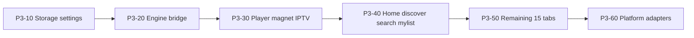

# Phase 3 — Kotlin Compose UI

**Status:** Future (blocked on Phase 2 tier-1)  
**Depends on:** [Phase 2 tier-1 exit checklist](./02-rust-engine-complete.md#tier-1-exit-checklist) — **not** full `packages/api` delete  
**Next phase:** [Phase 4 — Delete Flutter](./04-delete-flutter.md)  
**Migration index:** [README.md](./README.md)  
**Boundary:** [ENGINE_BOUNDARY.md](../ENGINE_BOUNDARY.md)  
**Spec:** [RFC-011](../rfc/011-v1.0-mvp.md)

---

## Status at a glance

**Goal:** replace Flutter **UI** with Compose. **Same Rust tier-1 engine** — no tier-1 logic port to Kotlin.

| | |
|--|--|
| **Progress** | **0 / 17 tasks (0%)** |
| **Blocked by** | [Phase 2 tier-1 exit checklist](./02-rust-engine-complete.md#tier-1-exit-checklist) (P2-83, 88, 90, 91, 14, …) |

**Legend:** ✅ done · 🔄 started · ⬜ not started

### Task tracker

#### ⬜ Scaffold (P3-01 → P3-04)

| ID | What |
|----|------|
| P3-01 | KMP app skeleton — `apps/forja_compose/` |
| P3-02 | Finish `packages/kotlin/` (expand P2-50/51 uniffi) |
| P3-03 | CI: Kotlin smoke test — full delegate round-trip |
| P3-04 | Gradle/Xcode link `libffi_ffi` |

#### ⬜ Port order (P3-10 → P3-70)

| ID | What | Flutter source |
|----|------|----------------|
| P3-10 | Storage + theme + prefs | `ffi_storage` |
| P3-11 | Shell + 19-tab nav | `shell/nav_config.dart` |
| P3-20 | Engine bridge — `kotlin` → uniffi | not `rust_delegates.dart` hooks |
| P3-30 | Unified player | `shared/player/` |
| P3-31 | Magnet tab | `features/magnet/` |
| P3-32 | IPTV | `features/iptv/` |
| P3-40 | Core browse (home, discover, search, my_list) | feature modules |
| P3-50 | Remaining 15 tabs | anime, manga, jellyfin, … |
| P3-51 | Tier-2 catalog screens — port UI; bridge to `packages/api` temporarily **or** port vertical to Rust (P2-89b) | `packages/api` tier-2 verticals |
| P3-60 | WebView extractors — **host only** | kisskh, videasy, … |
| P3-61 | Nuvio JS — **host only** | `nuvio_runtime.dart` |
| P3-62 | Player PiP / casting stubs | `shared/casting/` |
| P3-70 | RFC-011 feature parity sign-off | manual + automated smoke |

#### Prerequisites (tier-1 — must be done in Phase 2)

Phase 2 [tier-1 exit checklist](./02-rust-engine-complete.md#tier-1-exit-checklist) must be ✅:

- `packages/streaming`, `packages/storage`, `packages/core` **deleted**
- Tier-1 engine in `crates/*`; WebStreamr non-blocking (P2-91)
- Mobile magnet E2E (P2-14)

**`packages/api` may remain** during early Phase 3 — tier-2 catalog only. **Freeze:** no new Dart engine logic. Delete in Phase 3/4 as Compose screens port (P2-89b).

Phase 3 ports **UI screens** from `apps/forja` — tier-1 via Kotlin FFI; tier-2 via temporary api bridge or incremental Rust port.

#### ⬜ Phase 4 deletes

| What | Action |
|------|--------|
| `apps/forja/` | Compose replaces Flutter |
| `packages/rust/` | Kotlin FFI (`packages/kotlin`) replaces Dart FFI |

### Exit checklist

| # | Criterion | |
|---|-----------|---|
| 1 | 19 nav tabs + player + settings (RFC-011) | ⬜ |
| 2 | `kotlin` covers Phase 2 high-level FFI | ⬜ |
| 3 | Magnet on mobile via Rust librqbit | ⬜ |
| 4 | Smoke: UI renders engine JSON | ⬜ |

**0 / 4 exit criteria met.**

**Starts when:** [Phase 2 tier-1 exit checklist](./02-rust-engine-complete.md#tier-1-exit-checklist) is fully ✅.

---

## Monorepo layout (target)

```
apps/forja_compose/
  shared/                    # Compose UI + ViewModels
  androidApp/
  iosApp/
  desktopApp/                # if CMP desktop chosen
packages/kotlin/             # uniffi/JNI bindings over libffi_ffi (only package/ survivor with rust)
```

Existing Rust build scripts unchanged: `scripts/build_rust.sh`, `scripts/build_rust_mobile.sh`.

---

## Tasks

### Scaffold (P3-0x)

| ID | Task | Paths |
|----|------|-------|
| P3-01 | Create KMP app skeleton | `apps/forja_compose/` |
| P3-02 | Finish Kotlin FFI package | `packages/kotlin/` — expand Phase 2 uniffi POC |
| P3-03 | CI job: Kotlin smoke test | Full delegate surface round-trip |
| P3-04 | Gradle/Xcode link `libffi_ffi` | Reuse Phase 2 mobile artifacts |

### Port order



| ID | Task | Flutter source | Kotlin target |
|----|------|----------------|---------------|
| P3-10 | Settings UI + theme | `apps/forja` settings screens | Compose — reads/writes via **Rust FFI** (`crates/storage`) |
| P3-11 | Shell + nav (19 tabs) | `shell/nav_config.dart`, `main_screen.dart` | Compose navigation |
| P3-20 | Engine bridge | `packages/rust` (loader only) | `packages/kotlin` uniffi — P2-80 engine API |
| P3-30 | Unified player | `shared/player/` | Compose + ExoPlayer/AVPlayer |
| P3-31 | Magnet tab | `features/magnet/` | Compose + Rust torrent FFI |
| P3-32 | IPTV | `features/iptv/` | Compose + Rust parsers |
| P3-40 | Core browse | home, discover, search, my_list | Compose + **Rust engine** for streams; TMDB HTTP may stay UI-adjacent |
| P3-50 | Remaining tabs | anime, arabic, manga, music, jellyfin, etc. | Feature modules — engine via FFI |
| P3-51 | Tier-2 catalog screens | anime, manga, jellyfin, … | UI in Compose; **freeze** tier-2 api or port vertical to Rust per P2-89b |
| P3-60 | WebView extractors | player embed hosts | `expect/actual` WebView modules |
| P3-61 | Nuvio JS runtime | `nuvio_runtime.dart` | KMP QuickJS **host** |
| P3-62 | ~~HLS proxy~~ | — | **Rust** (`crates/proxy`) since P2-85 — Compose uses engine URL |
| P3-63 | PiP, casting stubs | `shared/casting/` | Platform modules |
| P3-70 | Feature parity sign-off | Manual + automated smoke | Checklist vs RFC-011 |

---

## Dart package migration map

Phase 3 ports **screens**, not tier-1 engine logic.

| Package | Phase 2 | Phase 3 |
|---------|---------|---------|
| `packages/rust` | FFI loader | → `packages/kotlin`; delete Phase 4 |
| `packages/scrapers`, `webstreamr`, `streaming` | **Deleted** | N/A |
| `packages/storage`, `core` | **Deleted** (tier-1) | N/A |
| `packages/api` | Tier-1 slices out; tier-2 **frozen** | Delete incrementally (P2-89b) as screens port |

---

## Engine strategy

**Tier-1 frozen in Rust after Phase 2.** Compose binds the same tier-1 FFI as Flutter. Provider race UX stays in Compose (host orchestration per [ENGINE_BOUNDARY](../ENGINE_BOUNDARY.md) R6).

Tier-2 catalog may use remaining `packages/api` temporarily — no new Dart logic.

---

## Platform rollout

| Path | When | Notes |
|------|------|-------|
| **Android-first** (recommended) | P3-30 | Validates Compose + Rust engine on device |
| iOS | After Android player green | |
| Desktop CMP | After mobile parity OR keep Flutter desktop until Phase 4 subset | |

---

## FFI surfaces to bind (`kotlin`)

Bind Phase 2 high-level engine API (post P2-80), e.g.:

| Engine call | Purpose |
|-------------|---------|
| `search_torrents_json` | Torrent tab |
| `filter_torrents_json` | Details screen filter |
| `resolve_stream_json` | Play (when P2-83 lands) |
| `torrent_stream_json` | Magnet play |
| Storage FFI (P2-88) | Settings, history |

Do **not** mirror `rust_delegates.dart` — delete hooks in P2-86.

---

## Related

- [Phase 2 — Rust engine complete](./02-rust-engine-complete.md)
- [Phase 4 — Delete Flutter](./04-delete-flutter.md)
- [RFC-009](../rfc/009-rust-ffi.md)
