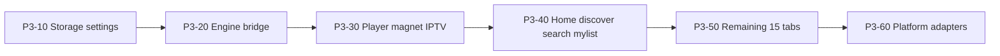

# Phase 3 — Kotlin Compose UI

**Status:** Future (blocked on Phase 2)  
**Depends on:** [Phase 2 complete](./02-rust-engine-complete.md) — engine 100% Rust, no libtorrent  
**Next phase:** [Phase 4 — Delete Flutter](./04-delete-flutter.md)  
**Migration index:** [README.md](./README.md)  
**Spec:** [RFC-011](../rfc/011-v1.0-mvp.md)

---

## Status at a glance

**Goal:** replace Flutter **UI** with Kotlin Compose Multiplatform. **Rust engine is frozen** after Phase 2 — Compose calls the same FFI/uniffi surface. **No orchestration port to Kotlin.**

**Phase 3 not started.** Blocked on Phase 2 **P2-80** (engine pipelines) + **P2-86** (kill `*Backend` hooks).

### Three columns — read every table this way

| Column | Question |
|--------|----------|
| **Compose** | UI + ViewModel exists in `apps/forja_compose/`? |
| **FFI bound** | `forja_kotlin` calls Rust for this surface? |
| **Dart replaced** | Flutter package / screen no longer needed for this flow? |

**Done = ✅** when every row in a port group is ✅/✅/✅. All engine logic stays in Rust — Compose never re-implements fetch/parse/route.

### Workstreams

| Workstream | Done | Target | Status |
|------------|-----:|-------:|--------|
| Scaffold (P3-0x) | 0 | 4 | app skeleton · FFI package · CI · Gradle/Xcode link |
| Port order (P3-1x–7x) | 0 | 11 | storage → engine → player → browse → tabs → platform |
| Dart package migration | 0 | 7 | see [migration map](#dart-package-migration-map) |
| Sign-off (P3-70) | 0 | 1 | RFC-011 parity checklist |

### Feature matrix

| Area | Compose | FFI bound | Dart replaced | Notes |
|------|:-------:|:---------:|:-------------:|-------|
| **P3-10 Storage + shell** | — | — | — | prefs · theme · 19-tab nav |
| **P3-20 Engine bridge** | — | — | — | `forja_kotlin` → uniffi; **not** a port of `rust_delegates.dart` hooks |
| **P3-30 Player + magnet + IPTV** | — | partial | — | torrent FFI done in Phase 2 |
| **P3-40 Core browse** | — | partial | — | home · discover · search · my_list |
| **P3-50 Remaining tabs** | — | — | — | 15 feature modules |
| **P3-60 Platform adapters** | — | — | — | WebView · Nuvio JS · HLS proxy · PiP |

### Exit criteria

| Criterion | Status |
|-----------|--------|
| Feature parity with Flutter (RFC-011: 19 tabs + player + settings) | open |
| `forja_kotlin` covers Phase 2 high-level engine FFI (post P2-80) | open |
| Magnet playback on mobile via Rust librqbit | open |
| Automated smoke: UI renders engine JSON | open |

### Stays in UI layer (not Rust)

| Area | Phase 3 target |
|------|----------------|
| WebView/WASM extractors | `expect/actual` WebView modules — **host only**; extract logic stays Rust |
| Nuvio JS runtime | KMP QuickJS host — **host only** |
| Player chrome | ExoPlayer/AVPlayer wiring |

HLS proxy, scraper HTTP, webstreamr resolve, torrent filter — **already in Rust after P2-80**. Compose does not re-implement them.

### Numbers

| Metric | Value |
|--------|-------|
| Exit criteria met | 0 / 4 |
| Scaffold tasks | 0 / 4 |
| Port-order tasks | 0 / 11 |
| Dart packages to migrate | 0 / 7 |
| Nav tabs (RFC-011) | 0 / 19 |
| FFI backends to bind | 0 / 10 |

### Quick health check

_Not applicable until Phase 2 exit criteria met._

```bash
# After P3-01 scaffold exists:
# ./gradlew :apps:forja_compose:shared:test
# uniffi round-trip smoke (P3-03)
```

### Next work

Blocked until [Phase 2 sign-off](./02-rust-engine-complete.md#sign-off). First tasks when unblocked: **P3-01** app skeleton · **P3-02** expand uniffi POC from P2-50/51.

---

## Monorepo layout (target)

```
apps/forja_compose/
  shared/                    # Compose UI + ViewModels
  androidApp/
  iosApp/
  desktopApp/                # if CMP desktop chosen
packages/forja_kotlin/       # uniffi/JNI wrapper over libforja_ffi
```

Existing Rust build scripts unchanged: `scripts/build_rust.sh`, `scripts/build_rust_mobile.sh`.

---

## Tasks

### Scaffold (P3-0x)

| ID | Task | Paths |
|----|------|-------|
| P3-01 | Create KMP app skeleton | `apps/forja_compose/` |
| P3-02 | Finish Kotlin FFI package | `packages/forja_kotlin/` — expand Phase 2 uniffi POC |
| P3-03 | CI job: Kotlin smoke test | Full delegate surface round-trip |
| P3-04 | Gradle/Xcode link `libforja_ffi` | Reuse Phase 2 mobile artifacts |

### Port order



| ID | Task | Flutter source | Kotlin target |
|----|------|----------------|---------------|
| P3-10 | Storage + theme + prefs | `forja_storage` | KMP DataStore/SQLite |
| P3-11 | Shell + nav (19 tabs) | `shell/nav_config.dart`, `main_screen.dart` | Compose navigation |
| P3-20 | Engine bridge | `packages/rust` (loader only) | `packages/kotlin` uniffi — P2-80 engine API |
| P3-30 | Unified player | `shared/player/` | Compose + ExoPlayer/AVPlayer |
| P3-31 | Magnet tab | `features/magnet/` | Compose + Rust torrent FFI |
| P3-32 | IPTV | `features/iptv/` | Compose + Rust parsers |
| P3-40 | Core browse | home, discover, search, my_list | Compose + **Rust engine** for streams; TMDB HTTP may stay UI-adjacent |
| P3-50 | Remaining tabs | anime, arabic, manga, music, jellyfin, etc. | Feature modules — engine via FFI |
| P3-51 | Delete Dart packages | `packages/{scrapers,webstreamr,streaming}` engine code | Already gone in P2-87; port **UI screens only** |
| P3-60 | WebView extractors | player embed hosts | `expect/actual` WebView modules |
| P3-61 | Nuvio JS runtime | `nuvio_runtime.dart` | KMP QuickJS **host** |
| P3-62 | ~~HLS proxy~~ | — | **Rust** (`crates/proxy`) since P2-85 — Compose uses engine URL |
| P3-63 | PiP, casting stubs | `shared/casting/` | Platform modules |
| P3-70 | Feature parity sign-off | Manual + automated smoke | Checklist vs RFC-011 |

---

## Dart package migration map

Phase 3 ports **screens**, not engine logic.

| Package | Phase 2 (engine) | Phase 3 (UI) |
|---------|------------------|--------------|
| `packages/rust` | Thin FFI loader | Replaced by `packages/kotlin`; delete in Phase 4 |
| `packages/scrapers` | **Deleted** (P2-87) | N/A |
| `packages/webstreamr` | **Deleted** (P2-87) | N/A |
| `packages/streaming` | Engine code **deleted** (P2-87) | UI stream picker only if needed |
| `packages/api` | Engine services **deleted** | Remaining UI-adjacent HTTP (TMDB keys, etc.) → Kotlin or Rust |
| `packages/core` | Models only | Shared models → Kotlin |
| `packages/storage` | — | Port prefs/repos |

---

## Engine strategy

**Frozen in Rust after Phase 2.** Compose binds the same high-level FFI as Flutter. No fetch/route/filter re-port to Kotlin.

---

## Platform rollout

| Path | When | Notes |
|------|------|-------|
| **Android-first** (recommended) | P3-30 | Validates Compose + Rust engine on device |
| iOS | After Android player green | |
| Desktop CMP | After mobile parity OR keep Flutter desktop until Phase 4 subset | |

---

## FFI surfaces to bind (`forja_kotlin`)

Mirror [`rust_delegates.dart`](../../apps/forja/lib/app/rust_delegates.dart):

| Backend | Rust FFI domain |
|---------|-----------------|
| `TorrentFilterBackend` | normalize + scene parse |
| `StremioServiceBackend` | URL + JSON + HTTP |
| `ScraperParseBackend` | knaben/tpb/uindex + dedup |
| `PasteShDecryptorBackend` | paste.sh |
| `IptvClientBackend` | Xtream decode/parse |
| `WebstreamrParseBackend` | all extractors/sources |
| `JsUnpackBackend` | JS unpack |
| `KissKhDecryptBackend` | subtitle decrypt |
| `TorrentEngineBackend` | librqbit start/stream/list |
| `ForjaEngine` facade | M3U, provider URLs, episode matcher, HLS |

---

## Related

- [Phase 2 — Rust engine complete](./02-rust-engine-complete.md)
- [Phase 4 — Delete Flutter](./04-delete-flutter.md)
- [RFC-009](../rfc/009-rust-ffi.md)
