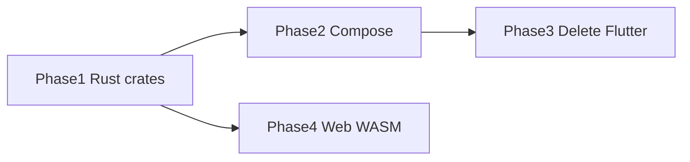

# Phase 4 — Web client (parallel track)

**Status:** Parallel — does not block Phase 2 or 3  
**Spec:** [RFC-014](../rfc/014-v3-web-rust.md) · [RFC-010](../rfc/010-web-client.md)

---

## Goal

Browser-based Forja with shared logic in Rust (WASM), HLS-only playback, optional cloud sync.

Can start anytime after [Phase 1](./01-rust-engine.md) crates are stable.

---

## Exit criteria

- [ ] Engine crates compile to WASM (`wasm_bindgen`)
- [ ] Web app loads browse + plays HLS stream
- [ ] No libtorrent in web bundle
- [ ] IPTV parse + provider templates work via WASM

---

## Tasks

| ID | Task | Detail |
|----|------|--------|
| P4-01 | WASM build pipeline | `wasm_bindgen` for `utils`, `iptv-core`, `stream-core` |
| P4-02 | Web app scaffold | `apps/forja_web/` or guarded web target |
| P4-03 | HLS-only playback | Hide torrent/magnet; video element or hls.js |
| P4-04 | Shared WASM module | IPTV parse + provider URL templates |
| P4-05 | Optional Supabase sync | RFC-006 backend on web |

---

## Scope limits (web)

| Capability | Web |
|------------|-----|
| Browse / details | yes |
| HLS/MP4 playback | yes |
| Torrent / libtorrent | **no** |
| IPTV live | HLS-only streams |
| Download / magnet | hidden |
| WebView extractors | limited — may need server-side or simplified paths |

---

## Relationship to other phases

Phase 4 shares Rust crates with native but does not require Compose or Flutter deletion.

---

## Related

- [Migration index](./README.md)
- [RFC-014](../rfc/014-v3-web-rust.md)
- [RFC-009](../rfc/009-rust-ffi.md) — WASM acceptance checkbox
