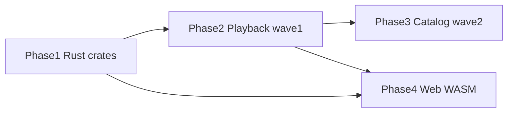

# Phase 4 — Web client (parallel track)

**Status:** Parallel (not started) — does not block Phases 2 or 3  
**Depends on:** [Phase 1](./01-rust-engine.md) crates stable · best after [Phase 2](./02-rust-engine-complete.md) playback engine complete  
**Migration index:** [README.md](./README.md)  
**Spec:** [RFC-014](../rfc/014-v3-web-rust.md) · [RFC-010](../rfc/010-web-client.md)

---

## Status at a glance

**Goal:** browser Forja — Rust logic in WASM, HLS playback, no torrent.

| | |
|--|--|
| **Progress** | **0 / 5 tasks (0%)** |
| **Can start** | Anytime (Phase 1 crates exist). Best after wave 1 complete. |
| **Does not block** | Phases 2 or 3 |

**Legend:** ✅ done · ⬜ not started · — out of scope on web

### Task tracker

| ID | What | Status |
|----|------|--------|
| P4-01 | WASM build pipeline — `forja-utils`, `forja-iptv-core`, `forja-stream-core` | ⬜ |
| P4-02 | Web app scaffold — `apps/forja_web/` | ⬜ |
| P4-03 | HLS playback — video element or hls.js | ⬜ |
| P4-04 | Shared WASM module — IPTV parse + provider URL templates | ⬜ |
| P4-05 | Optional Supabase sync (RFC-006) | ⬜ optional |

### Exit checklist

| # | Criterion | |
|---|-----------|---|
| 1 | Engine crates compile to WASM | ⬜ |
| 2 | Web app browse + HLS play | ⬜ |
| 3 | No libtorrent in web bundle | ⬜ |
| 4 | IPTV parse + provider templates via WASM | ⬜ |

**0 / 4 exit criteria met.**

### Web scope

| Capability | Web |
|------------|-----|
| Browse / details | yes |
| HLS/MP4 playback | yes |
| Torrent / magnet | **no** |
| IPTV live | HLS-only |
| WebView extractors | limited |

**Excluded from WASM by design:** `crates/torrent`, `crates/proxy`

---

## Tasks

| ID | Task | Detail |
|----|------|--------|
| P4-01 | WASM build pipeline | `wasm_bindgen` for `forja-utils`, `forja-iptv-core`, `forja-stream-core` |
| P4-02 | Web app scaffold | `apps/forja_web/` or guarded web target |
| P4-03 | HLS-only playback | Hide torrent/magnet; video element or hls.js |
| P4-04 | Shared WASM module | IPTV parse + provider URL templates |
| P4-05 | Optional Supabase sync | RFC-006 backend on web |

---

## Relationship to other phases

---

## Related

- [Migration index](./README.md)
- [RFC-014](../rfc/014-v3-web-rust.md)
- [RFC-009](../rfc/009-rust-ffi.md)
