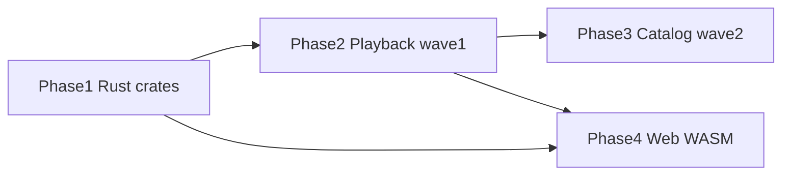

# Phase 4 — Web client (parallel track)

**Status:** 0 / 5 tasks  
**Depends on:** [Phase 1](./01-rust-engine.md) crates stable · best after [Phase 2](./02-rust-engine-complete.md) playback engine complete  
**Next phase:** — (parallel; does not block Phases 2 or 3)  
**Migration index:** [README.md](./README.md)  
**Boundary:** [ENGINE_BOUNDARY.md](../ENGINE_BOUNDARY.md)  
**Spec:** [RFC-014](../rfc/014-v3-web-rust.md) · [RFC-010](../rfc/010-web-client.md)

---

## Goal

Browser Forja — Rust logic in WASM, HLS playback, no torrent. Runs in parallel with wave 2 catalog migration; does not block Phases 2 or 3.

---

## Status at a glance

| | |
|--|--|
| **Progress** | **0 / 5 tasks** |
| **Can start** | Anytime (Phase 1 crates exist). Best after wave 1 complete. |
| **Does not block** | Phases 2 or 3 |

**Legend:** ✅ done · ⬜ not started · — out of scope on web

---

## Tasks

| # | ID | Description | Status |
|--:|----|-------------|--------|
| 1 | P4-01 | WASM build pipeline — `forja-utils`, `forja-iptv-core`, `forja-stream-core` | ⬜ |
| 2 | P4-02 | Web app scaffold — `apps/forja_web/` | ⬜ |
| 3 | P4-03 | HLS playback — video element or hls.js | ⬜ |
| 4 | P4-04 | Shared WASM module — IPTV parse + provider URL templates | ⬜ |
| 5 | P4-05 | Optional Supabase sync (RFC-006) | ⬜ optional |

---

## Web client exit checklist {#exit-checklist}

**Web client shippable when all rows are ✅.**

| # | Criterion | Task | Status |
|---|-----------|------|--------|
| W1 | Engine crates compile to WASM | P4-01 | ⬜ |
| W2 | Web app browse + HLS play | P4-02, P4-03 | ⬜ |
| W3 | No libtorrent in web bundle | P4-01 | ⬜ |
| W4 | IPTV parse + provider templates via WASM | P4-04 | ⬜ |

---

## Migration rule

| Step | Action |
|------|--------|
| 1 | Add `wasm_bindgen` targets to eligible `crates/*` |
| 2 | Scaffold `apps/forja_web/` (or guarded web target) |
| 3 | Wire browse + HLS playback — hide torrent/magnet |
| 4 | Share IPTV parse + provider URL templates via WASM |
| 5 | Optional: Supabase sync per RFC-006 |

### Web scope

| Capability | Web |
|------------|-----|
| Browse / details | yes |
| HLS/MP4 playback | yes |
| Torrent / magnet | **no** |
| IPTV live | HLS-only |
| WebView extractors | limited |

**Excluded from WASM by design:** `crates/torrent`, `crates/proxy`

---

## Architecture

```
Browser (apps/forja_web)
  → browse UI, HLS player (video element / hls.js)
  → calls WASM exports from engine crates

Engine (crates/* → WASM)
  → forja-utils, forja-iptv-core, forja-stream-core
  → no torrent, no proxy loopback

Excluded
  → crates/torrent, crates/proxy, libtorrent, magnet flows
```

| **Engine (WASM)** | **Host (browser)** |
|-------------------|--------------------|
| IPTV parse, provider URL templates | Browse UI, routing |
| Stream URL build (non-torrent) | HLS/MP4 playback |
| | Optional Supabase sync (P4-05) |

**Anti-patterns:** bundling libtorrent · proxy loopback on web · duplicating engine logic in JS

**Allowed:** hls.js for playback · limited WebView extractors · parallel track with native migration

---

## Relationship to other phases



---

## Quick health check

```bash
# After P4-01 — verify WASM targets compile:
cd crates && cargo build --target wasm32-unknown-unknown -p forja-utils
cd crates && cargo build --target wasm32-unknown-unknown -p forja-iptv-core
cd crates && cargo build --target wasm32-unknown-unknown -p forja-stream-core

# After P4-02 — web app smoke:
cd apps/forja_web && npm run build && npm run dev
```

---

## Related

- [Phase 2 playback](./02-rust-engine-complete.md) · [Phase 3 catalog](./03-engine-catalog.md) · [ENGINE_BOUNDARY](../ENGINE_BOUNDARY.md) · [RFC-014](../rfc/014-v3-web-rust.md) · [RFC-010](../rfc/010-web-client.md)
