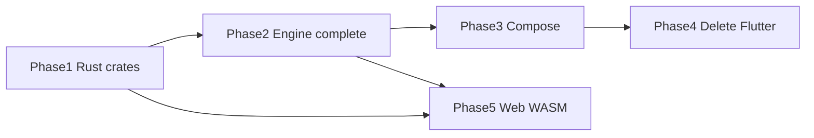

# Phase 5 — Web client (parallel track)

**Status:** Parallel (not started) — does not block Phase 2, 3, or 4  
**Depends on:** [Phase 1](./01-rust-engine.md) crates stable · best after [Phase 2](./02-rust-engine-complete.md) engine complete  
**Migration index:** [README.md](./README.md)  
**Spec:** [RFC-014](../rfc/014-v3-web-rust.md) · [RFC-010](../rfc/010-web-client.md)

---

## Status at a glance

**Goal:** browser Forja with shared logic in Rust (WASM), HLS-only playback, optional cloud sync. No libtorrent in the web bundle.

**Phase 5 not started.** Exit criteria **0 / 4** · can begin after Phase 1; engine-complete Phase 2 recommended.

### Three columns — read every table this way

| Column | Question |
|--------|----------|
| **Rust/WASM** | Crate compiles to `wasm32` + `wasm_bindgen` exports? |
| **Web app** | Browser client calls WASM for this surface? |
| **In scope** | Capability allowed on web (torrent/magnet excluded)? |

**Done = ✅** when row is ✅/✅/✅. Torrent, magnet, and libtorrent are permanently out of scope on web.

### Workstreams

| Workstream | Done | Target | Status |
|------------|-----:|-------:|--------|
| WASM pipeline (P5-01) | 0 | 1 | utils · iptv-core · stream-core |
| Web app (P5-02–04) | 0 | 3 | scaffold · HLS playback · shared module |
| Optional sync (P5-05) | 0 | 1 | Supabase (RFC-006) |

### Feature matrix

| Area | Rust/WASM | Web app | In scope | Notes |
|------|:---------:|:-------:|:--------:|-------|
| **P5-01 WASM build** | — | — | N/A | `wasm_bindgen` pipeline |
| **P5-02 Web scaffold** | — | — | ✅ | `apps/forja_web/` or guarded target |
| **P5-03 HLS playback** | N/A | — | ✅ | video element or hls.js |
| **P5-04 Shared module** | — | — | ✅ | IPTV parse + provider URL templates |
| **P5-05 Cloud sync** | — | — | optional | RFC-006 |
| Browse / details | partial | — | ✅ | reuses Phase 1 crates |
| Torrent / magnet | N/A | N/A | **no** | hidden on web |

### Exit criteria

| Criterion | Status |
|-----------|--------|
| Engine crates compile to WASM | open |
| Web app loads browse + plays HLS stream | open |
| No libtorrent in web bundle | open |
| IPTV parse + provider templates via WASM | open |

### Scope limits (web)

| Capability | Web |
|------------|-----|
| Browse / details | yes |
| HLS/MP4 playback | yes |
| Torrent / libtorrent | **no** |
| IPTV live | HLS-only streams |
| Download / magnet | hidden |
| WebView extractors | limited — server-side or simplified |

### Numbers

| Metric | Value |
|--------|-------|
| Exit criteria met | 0 / 4 |
| Tasks done | 0 / 5 |
| WASM-ready crates | 0 / 3 (utils · iptv-core · stream-core) |
| Crates excluded from WASM | torrent · proxy (by design) |

### Quick health check

_Not applicable until P5-01 pipeline exists._

```bash
# After WASM pipeline:
# wasm-pack build crates/forja-utils --target web
# cd apps/forja_web && npm run dev
```

### Next work

Can start in parallel with Phase 2+. Recommended first task: **P5-01** WASM build pipeline for `forja-utils`, `forja-iptv-core`, `forja-stream-core`.

---

## Tasks

| ID | Task | Detail |
|----|------|--------|
| P5-01 | WASM build pipeline | `wasm_bindgen` for `forja-utils`, `forja-iptv-core`, `forja-stream-core` |
| P5-02 | Web app scaffold | `apps/forja_web/` or guarded web target |
| P5-03 | HLS-only playback | Hide torrent/magnet; video element or hls.js |
| P5-04 | Shared WASM module | IPTV parse + provider URL templates |
| P5-05 | Optional Supabase sync | RFC-006 backend on web |

---

## Relationship to other phases



---

## Related

- [Migration index](./README.md)
- [RFC-014](../rfc/014-v3-web-rust.md)
- [RFC-009](../rfc/009-rust-ffi.md)
