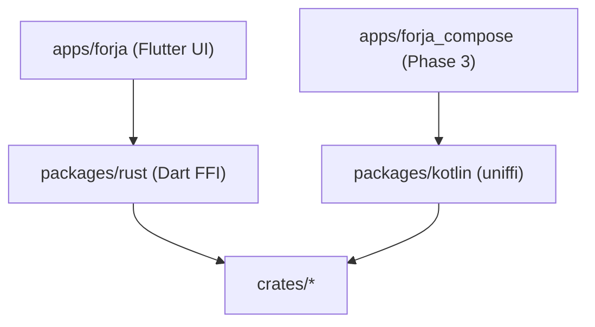

# Forja global migration

**Last updated:** 2026-07-05  
**Current phase:** [Phase 2 — Rust engine complete](./02-rust-engine-complete.md)

---

## Phases

| # | Doc | Summary |
|---|-----|---------|
| 1 | [01-rust-engine.md](./01-rust-engine.md) | ✅ Rust crates + FFI primitives |
| 2 | [02-rust-engine-complete.md](./02-rust-engine-complete.md) | 🔄 **Port every engine package → `crates/*`, delete Dart engine** |
| 3 | [03-kotlin-compose.md](./03-kotlin-compose.md) | ⬜ Compose UI — **same Rust engine**, no logic port |
| 4 | [04-delete-flutter.md](./04-delete-flutter.md) | ⬜ Delete Flutter app + `packages/rust` |
| 5 | [05-web-client.md](./05-web-client.md) | ⬜ WASM parallel |

---

## Migration rule (locked — no negotiation)

**Move = rewrite in Rust `crates/*`, expose FFI, delete the Dart package completely.**

There is no “Dart wrapper calling Rust”, no “backend swap”, no “facade until Phase 4”.
When a package is moved, its Dart source is **gone**.

### What survives in `packages/`

| Package | Role | When deleted |
|---------|------|--------------|
| **`packages/rust`** | Dart FFI loader + parity tests for Flutter UI | Phase 4 (Flutter gone) |
| **`packages/kotlin`** | Kotlin/uniffi bindings for Compose UI | **Never** — permanent FFI surface |

**Everything else under `packages/` is engine and must be deleted** once ported to Rust.

### Dart packages — must rewrite in Rust, then delete

| Dart package | Rust destination | Status |
|--------------|------------------|--------|
| `packages/api` | `crates/*` (tmdb, debrid, stremio, …) | ⬜ P2-89 |
| `packages/storage` | `crates/storage` | 🔄 P2-88 — **delete package when done** |
| `packages/core` | engine JSON / generated types | ⬜ P2-90 |
| `packages/scrapers` | `crates/scrapers` | 🔄 delete remainder after P2-81 |
| `packages/webstreamr` | `crates/webstreamr` | ⬜ P2-82 |
| `packages/streaming` | `crates/streaming`, `crates/proxy`, … | ⬜ P2-83 |

Legacy `packages/forja_*` — already deleted (P2-60).

### Per-package workflow (mandatory)

For each engine Dart package:

1. **Port** — implement logic in the matching `crates/<name>/` crate (not a Dart shim).
2. **FFI** — expose via `crates/ffi` / uniffi (`*_json` or typed API).
3. **Wire UI** — `apps/forja` calls `ForjaEngine.*` only (no intermediate Dart package).
4. **Delete** — remove the Dart package directory, pubspec deps, and all imports.
5. **Test** — Rust unit tests + `packages/rust/test/parity/`; no Dart engine code left.

If step 4 is skipped, the migration is **not done**.

---

## Architecture

**Engine works in Rust. UI shows pixels.**

| Rust (`crates/*`) | UI only |
|-------------------|---------|
| HTTP, APIs (TMDB, Trakt, debrid, Stremio, …) | `apps/forja` widgets |
| Storage, prefs, watch history | Navigation |
| Scrapers, webstreamr, stream resolver | Player chrome (media_kit) |
| Torrent (librqbit), proxy (HLS) | WebView **host** |
| Parse, crypto, extract, models (JSON) | Theme, loading/error states |

No Kotlin orchestration layer. Phase 3 swaps UI; Phase 4 deletes Flutter + `packages/rust`.

---

## Principles

1. **Rust = engine** — all non-pixel logic lives in `crates/*`.
2. **UI = show** — call FFI, render JSON; zero engine Dart.
3. **Move = port + delete** — not rewire, not wrap, not “partial”.
4. **Phase 2 finishes the engine** — every row in the deletion table above is ✅ before Phase 3.
5. **Phase 3 = UI swap only** — Compose replaces Flutter; same `crates/*`.
6. **Phase 4 = delete Flutter** — `apps/forja`, `packages/rust`; keep `packages/kotlin` + `crates/*`.

**Do not start Phase 3** until [Phase 2 exit checklist](./02-rust-engine-complete.md#exit-checklist) is fully ✅.

Agent workflow: [`.cursor/rules/rust-migration.mdc`](../../.cursor/rules/rust-migration.mdc)
