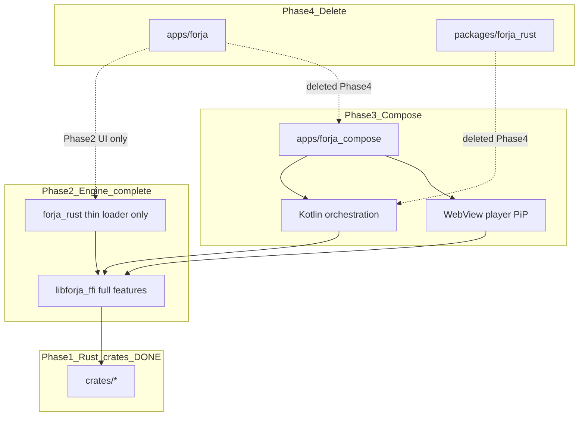

# Forja global migration

**Last updated:** 2026-07-05  
**Current phase:** [Phase 2 — Rust engine complete](./02-rust-engine-complete.md)

Forja is migrating from a Flutter monolith to a **Rust engine** with a **Kotlin Compose** UI. Flutter is temporary; it will be deleted once Compose reaches feature parity.

**Order matters:** finish the engine in Rust and remove Flutter from the engine layer (Phase 2) **before** starting Compose (Phase 3).

---

## Phases

| # | Doc | Status | Summary |
|---|-----|--------|---------|
| 1 | [01-rust-engine.md](./01-rust-engine.md) | **Complete** | Rust crates + FFI wired via `forja_rust`; parsers in production |
| 2 | [02-rust-engine-complete.md](./02-rust-engine-complete.md) | **Next** | Finish engine on Rust: B2 librqbit, drop libtorrent, strip Dart fallbacks — Flutter UI only |
| 3 | [03-kotlin-compose.md](./03-kotlin-compose.md) | Future | KMP Compose UI + `forja_kotlin`; port orchestration from Dart |
| 4 | [04-delete-flutter.md](./04-delete-flutter.md) | Future | Remove `apps/forja`, `forja_rust`, melos Flutter CI |
| 5 | [05-web-client.md](./05-web-client.md) | Parallel | WASM engine + browser client ([RFC-014](../rfc/014-v3-web-rust.md)) |

---

## End-state architecture

---

## Principles

1. **Rust owns the engine** — parsers, crypto, extractors, templates, proxy, torrent (librqbit).
2. **Phase 2 before Compose** — no Kotlin UI until Flutter is gone from the engine layer (no libtorrent, no Dart parse fallbacks).
3. **Flutter is temporary UI only** — deleted in Phase 4.
4. **No feature loss** — every capability must have a replacement before deletion.
5. **Orchestration is not engine** — HTTP fetch, registry, shelf, Nuvio JS host ports to Kotlin in Phase 3.
6. **Platform-specific stays platform-specific** — WebView extractors, player, PiP are UI adapters.

---

## Quick links

| Resource | Path |
|----------|------|
| Engine spec | [RFC-009](../rfc/009-rust-ffi.md) |
| Rust crates | [crates/README.md](../../crates/README.md) |
| Desktop build | `./scripts/build_rust.sh` |
| Mobile build | `./scripts/build_rust_mobile.sh all` |
| Test gates | `melos run rust:test` · `melos run rust:integration` |
| Flutter app (transitional UI) | [apps/forja/README.md](../../apps/forja/README.md) |

---

## Doc maintenance

- Update the **active phase file** when work completes.
- Phase 1 is frozen except factual corrections.
- B2: **librqbit locked** — P2-20/21/30/32/33/15 done. Next: P2-14 device smoke, Android NDK verify.
- Do not start Phase 3 until Phase 2 exit criteria are met.
- Agent workflow: [`.cursor/rules/rust-migration.mdc`](../../.cursor/rules/rust-migration.mdc)
