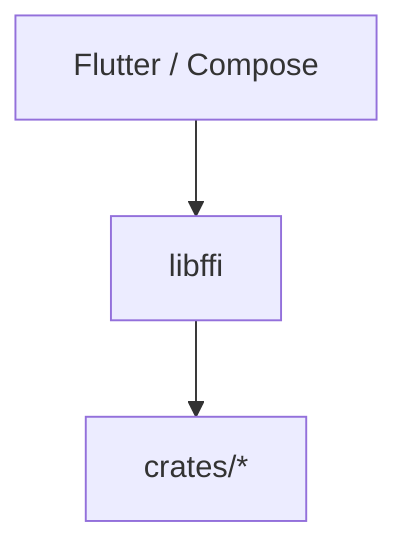

# Forja global migration

**Last updated:** 2026-07-05  
**Current phase:** [Phase 2 — Rust engine complete](./02-rust-engine-complete.md)

---

## Phases

| # | Doc | Summary |
|---|-----|---------|
| 1 | [01-rust-engine.md](./01-rust-engine.md) | ✅ Rust crates + FFI primitives |
| 2 | [02-rust-engine-complete.md](./02-rust-engine-complete.md) | 🔄 **Full engine in Rust** — Flutter UI only |
| 3 | [03-kotlin-compose.md](./03-kotlin-compose.md) | ⬜ Compose UI — **same engine**, no logic port |
| 4 | [04-delete-flutter.md](./04-delete-flutter.md) | ⬜ Delete all Dart |
| 5 | [05-web-client.md](./05-web-client.md) | ⬜ WASM parallel |

---

## Architecture (locked)

**Engine works. UI shows.**

| Rust engine | UI only |
|-------------|---------|
| `packages/api` — TMDB, Trakt, debrid, extractors | Widgets |
| `packages/storage` — prefs, history | Navigation |
| `packages/scrapers`, `webstreamr`, `streaming` | Player chrome |
| `packages/core` — DTOs from engine JSON | WebView host |
| Fetch, parse, route, torrent, proxy | |

Nothing in the table’s left column stays in Dart past Phase 2 (except temporary FFI loader in `packages/rust`).

No Kotlin orchestration layer. Phase 3 swaps UI; Phase 4 deletes Dart.

---

## Principles

1. **Rust = engine** — storage, API, fetch, parse, torrent, everything non-pixel.
2. **UI = show** — call FFI, render JSON.
3. **Phase 2 before Compose** — engine complete first.
4. **Phase 3 = UI swap only.**
5. **Phase 4 = delete Flutter + all Dart packages** — keep `packages/kotlin` + `crates/`.

**Do not start Phase 3** until [Phase 2 exit checklist](./02-rust-engine-complete.md#exit-checklist) #9–#11 are ✅.

Agent workflow: [`.cursor/rules/rust-migration.mdc`](../../.cursor/rules/rust-migration.mdc)
