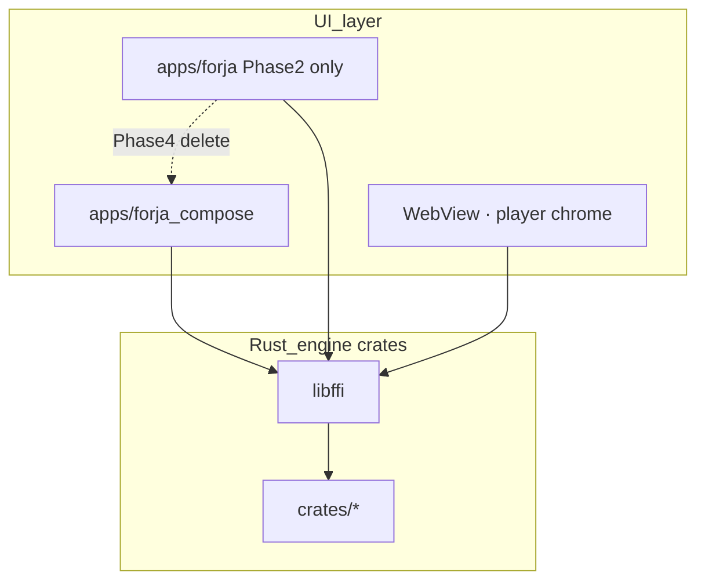

# Forja global migration

**Last updated:** 2026-07-05  
**Current phase:** [Phase 2 — Rust engine complete](./02-rust-engine-complete.md)

Forja is migrating from a Flutter monolith to a **Rust engine** with a **Kotlin Compose** UI. Flutter is temporary shell; it will be deleted once Compose reaches feature parity.

**Order matters:** Rust must own the **full engine** (fetch, route, parse, torrent) in Phase 2 **before** Compose UI in Phase 3.

---

## Phases

| # | Doc | Progress | Summary |
|---|-----|----------|---------|
| 1 | [01-rust-engine.md](./01-rust-engine.md) | **100%** ✅ | Rust crates + FFI; parse primitives shipped |
| 2 | [02-rust-engine-complete.md](./02-rust-engine-complete.md) | **53%** 🔄 | **17/32 tasks** — P2-80 pipelines block Phase 3 |
| 3 | [03-kotlin-compose.md](./03-kotlin-compose.md) | **0%** ⬜ | Compose UI — blocked on Phase 2 P2-80 |
| 4 | [04-delete-flutter.md](./04-delete-flutter.md) | **0%** ⬜ | Delete Flutter — blocked on Phase 3 |
| 5 | [05-web-client.md](./05-web-client.md) | **0%** ⬜ | WASM + browser — parallel, optional |

---

## End-state architecture

**No Kotlin orchestration layer.** Compose calls Rust the same way Flutter does today (via uniffi/JNI). UI shows; engine works.

---

## Principles

1. **Rust owns the engine** — fetch, HTTP, routing, parse, crypto, extractors, templates, proxy, torrent (librqbit). Everything that is not pixels.
2. **UI shows only** — Flutter (Phase 2) and Compose (Phase 3) call engine APIs and render JSON. No `*Backend` hooks, no Dart/Kotlin fetch for engine ops.
3. **Phase 2 before Compose** — P2-80 pipelines must land before Phase 3 starts.
4. **Phase 3 = UI swap** — port screens to Compose; engine unchanged.
5. **Phase 4 = delete Flutter** — not a logic migration.
6. **Platform-specific stays in UI** — WebView host, ExoPlayer/AVPlayer, PiP are presentation adapters, not engine.

---

## Quick links

| Resource | Path |
|----------|------|
| Engine spec | [RFC-009](../rfc/009-rust-ffi.md) |
| Rust crates | [crates/README.md](../../crates/README.md) |
| Desktop build | `./scripts/build_rust.sh` |
| Mobile build | `./scripts/build_rust_mobile.sh all` |
| Test gates | `melos run rust:test` · `melos run rust:integration` |
| Flutter app (transitional UI) | [apps/forja/README.md](../../apps/forja/README.md) |

---

## Doc maintenance

- Update the **active phase file** when work completes.
- Phase 1 is frozen except factual corrections.
- **Do not start Phase 3** until Phase 2 P2-80 + P2-86 exit criteria are met.
- Agent workflow: [`.cursor/rules/rust-migration.mdc`](../../.cursor/rules/rust-migration.mdc)
