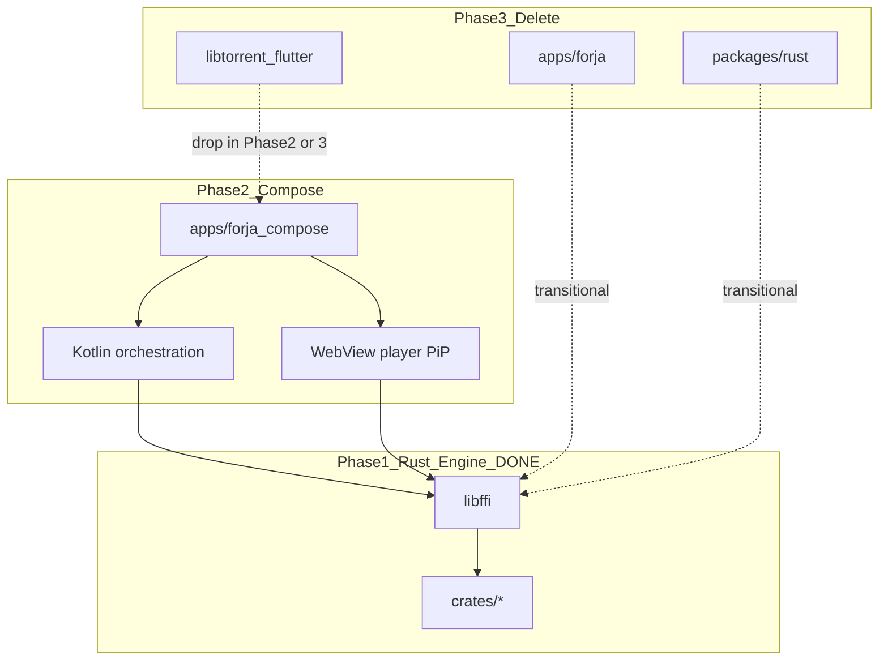

# Forja global migration

**Last updated:** 2026-07-05  
**Current phase:** [Phase 2 — Kotlin Compose](./02-kotlin-compose.md)

Forja is migrating from a Flutter monolith to a **Rust engine** with a **Kotlin Compose** UI. Flutter is temporary; it will be deleted once Compose reaches feature parity.

---

## Phases

| # | Doc | Status | Summary |
|---|-----|--------|---------|
| 1 | [01-rust-engine.md](./01-rust-engine.md) | **Complete** | Rust owns parsers, crypto, extractors, proxy; Flutter calls `libforja_ffi` via `forja_rust` |
| 2 | [02-kotlin-compose.md](./02-kotlin-compose.md) | **Next** | KMP Compose UI + `forja_kotlin` JNI/uniffi; port orchestration from Dart packages |
| 3 | [03-delete-flutter.md](./03-delete-flutter.md) | Future | Remove `apps/forja`, `rust`, melos Flutter CI |
| 4 | [04-web-client.md](./04-web-client.md) | Parallel | WASM engine + browser client ([RFC-014](../rfc/014-v3-web-rust.md)) |

---

## End-state architecture

---

## Principles

1. **Rust owns the engine** — parsers, crypto, extractors, provider templates, proxy, torrent session (librqbit).
2. **Flutter is temporary UI only** — deleted in Phase 3.
3. **No feature loss** — every capability must have a Rust or Kotlin replacement before deletion.
4. **Orchestration is not engine** — HTTP fetch, registry routing, shelf server, Nuvio JS host ports to Kotlin in Phase 2, not Rust.
5. **Platform-specific stays platform-specific** — WebView extractors (~1,900 LOC), player, PiP, audio handlers are UI/platform adapters.

---

## Quick links

| Resource | Path |
|----------|------|
| Engine spec | [RFC-009](../rfc/009-rust-ffi.md) |
| Rust crates | [crates/README.md](../../crates/README.md) |
| Desktop build | `./scripts/build_rust.sh` |
| Mobile build | `./scripts/build_rust_mobile.sh all` |
| Test gates | `melos run rust:test` · `melos run rust:integration` |
| Flutter app (transitional) | [apps/forja/README.md](../../apps/forja/README.md) |

---

## Doc maintenance

- Update the **active phase file** when work completes.
- Phase 1 is frozen except factual corrections — do not reopen as "in progress."
- B2 (mobile librqbit / drop `libtorrent_flutter`) is tracked in [Phase 2](./02-kotlin-compose.md#p2-21--mobile-torrent-b2), not Phase 1.
- Agent workflow: [`.cursor/rules/rust-migration.mdc`](../../.cursor/rules/rust-migration.mdc)
