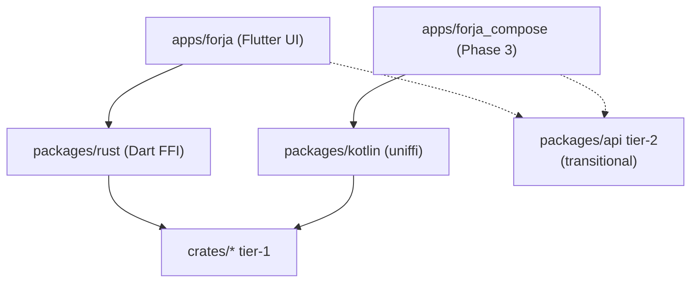

# Forja global migration

**Last updated:** 2026-07-06  
**Current phase:** [Phase 2 — Rust engine complete](./02-rust-engine-complete.md)  
**Boundary rules:** [ENGINE_BOUNDARY.md](../ENGINE_BOUNDARY.md)

---

## Phases

| # | Doc | Summary |
|---|-----|---------|
| 1 | [01-rust-engine.md](./01-rust-engine.md) | ✅ Rust crates + FFI primitives |
| 2 | [02-rust-engine-complete.md](./02-rust-engine-complete.md) | 🔄 **Tier-1 playback path → Rust; delete playback packages** |
| 3 | [03-kotlin-compose.md](./03-kotlin-compose.md) | ⬜ Compose UI — **same Rust tier-1 engine** |
| 4 | [04-delete-flutter.md](./04-delete-flutter.md) | ⬜ Delete Flutter app + `packages/rust` + remaining `packages/api` |
| 5 | [05-web-client.md](./05-web-client.md) | ⬜ WASM parallel |

---

## Engine tiers

| Tier | Definition | When |
|------|------------|------|
| **Tier-1** | Playback path — title → playable URL | Must be Rust before Phase 3 |
| **Tier-2** | Catalog/metadata APIs (TMDB, verticals) | May stay in host packages until ported incrementally |
| **Host-only** | WebView, player, OAuth, theme, Nuvio, WASM | Never Rust — see [ENGINE_BOUNDARY.md](../ENGINE_BOUNDARY.md) R3 |

---

## Migration rules

**Tier-1 move** = port to `crates/*`, expose FFI, delete Dart equivalent, test.

**Tier-2** = no new Dart engine logic; port when touching a vertical (P2-89b in Phase 3).

**Host slice** = move to `apps/forja` (theme, WebView adapters), not Rust.

There is no “Dart wrapper calling Rust” for tier-1 — delete the Dart file when Rust ships.

### What survives in `packages/`

| Package | Role | When deleted |
|---------|------|--------------|
| **`packages/rust`** | Dart FFI loader + parity tests | Phase 4 |
| **`packages/kotlin`** | Kotlin/uniffi bindings for Compose | **Never** |
| **`packages/api`** | Tier-2 catalog (transitional) | Phase 3/4 when screens ported |
| **`packages/{storage,core,streaming}`** | Tier-1 remnants | Phase 2 |

### Package deletion schedule

| Package | Phase 2 | Phase 3 / 4 |
|---------|---------|-------------|
| `streaming` | Delete after P2-83, 91, 92 | — |
| `storage` | Delete after P2-88 (+ theme → app, P2-96) | — |
| `core` | Delete after P2-90 | — |
| `api` | Shrink — tier-1 slices out; **freeze tier-2** | Delete when Compose screens ported |
| `webstreamr` | ✅ deleted — logic in `crates/webstreamr` (**no rollback**) | — |
| `scrapers` | ✅ deleted | — |

Legacy `packages/forja_*` — already deleted (P2-60).

### Per tier-1 package workflow

1. **Port** — implement in matching `crates/<name>/`.
2. **FFI** — expose via `crates/ffi` / uniffi (`*_json` or typed API); fetch+parse in Rust (Pattern B).
3. **Wire UI** — `apps/forja` calls `ForjaEngine.*` for tier-1 paths.
4. **Delete** — remove Dart package slice, pubspec deps, imports.
5. **Test** — Rust unit/golden + `packages/rust/test/parity/` for new FFI.

---

## Architecture

**Tier-1 engine works in Rust. Host shows pixels and platform capabilities.**

| Rust tier-1 (`crates/*`) | Host |
|--------------------------|------|
| Stream resolve, torrent, proxy, scrapers | Widgets, navigation |
| Storage, prefs, watch history (tier-1) | Player (media_kit) |
| Parse, crypto, extract (playback path) | WebView, Nuvio, WASM hosts |
| | OAuth, secure storage |
| | Tier-2 catalog (`packages/api` transitional) |

No Kotlin orchestration layer. Phase 3 swaps UI; Phase 4 deletes Flutter + `packages/rust` + `packages/api`.

---

## Principles

1. **Rust = tier-1 engine** — playback path, not every REST client.
2. **Host = pixels + platform** — R3 classes + tier-2 catalog during transition.
3. **Tier-1 move = port + delete** — not rewire, not wrap.
4. **Phase 2 finishes tier-1** — not full `api` port.
5. **Phase 3 starts** when [tier-1 exit checklist](./02-rust-engine-complete.md#tier-1-exit-checklist) is ✅ (includes P2-14 mobile magnet).
6. **Phase 4** — delete Flutter, `packages/rust`, remaining `packages/api`.

**Do not start Phase 3** until the [tier-1 exit checklist](./02-rust-engine-complete.md#tier-1-exit-checklist) is fully ✅.

Agent workflow: [`.cursor/rules/rust-migration.mdc`](../../.cursor/rules/rust-migration.mdc)
