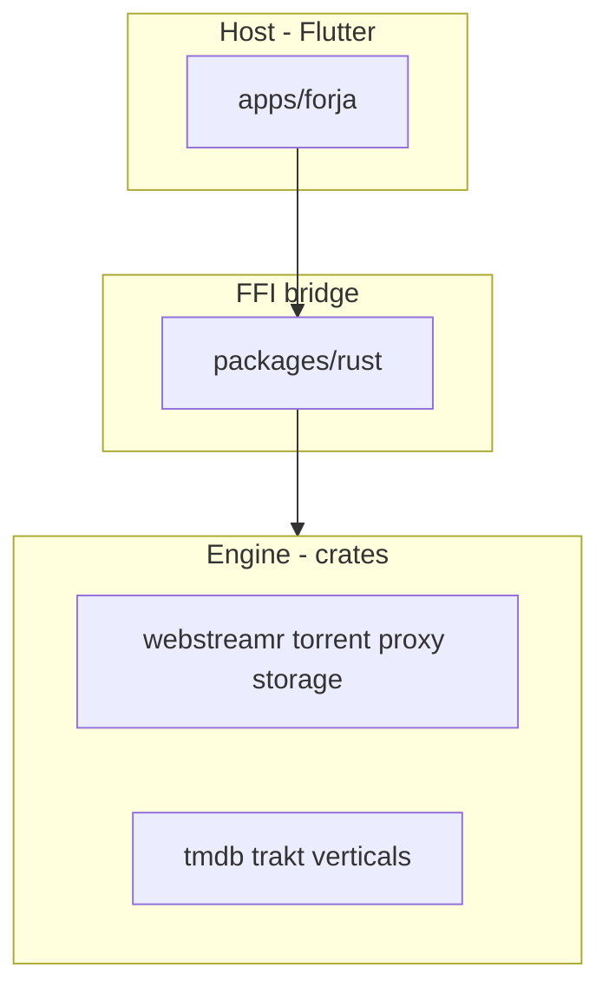

# Forja global migration

**Last updated:** 2026-07-06  
**Current phase:** [Phase 3 — Catalog engine (wave 2)](./03-engine-catalog.md) — Phase 2 playback engine ✅  
**Boundary rules:** [ENGINE_BOUNDARY.md](../ENGINE_BOUNDARY.md)

---

## Phases

| # | Doc | Summary |
|---|-----|---------|
| 1 | [01-rust-engine.md](./01-rust-engine.md) | ✅ Rust crates + FFI primitives |
| 2 | [02-rust-engine-complete.md](./02-rust-engine-complete.md) | ✅ Playback engine → `crates/*` |
| 3 | [03-engine-catalog.md](./03-engine-catalog.md) | 🔄 **Wave 2: catalog engine → `crates/*`; delete `packages/api`** (kotlin ✅ P3-00) |
| 4 | [04-web-client.md](./04-web-client.md) | ⬜ WASM parallel |

---

## Two layers (normalized)

| Layer | Location | What belongs |
|-------|----------|--------------|
| **Engine** | `crates/*` | All non-platform logic (C1, C2, C7, C8, C9, Rust C11 pipelines) |
| **Host** | `apps/forja` | UI + platform (C3–C6, C10, C12, host C11 UX) |
| **FFI bridge** | `packages/rust` | Loader + parity tests only |

Legacy engine in `packages/api` must port to `crates/*` — not a permanent tier. (`streaming`/`storage`/`core` deleted wave 1.)

---

## Migration rules

**Engine move** = port to `crates/*`, expose FFI, delete Dart equivalent, test.

**No new engine logic in Dart** — port to `crates/*` when touching.

**Host slice** = move to `apps/forja` (theme, WebView adapters), not Rust.

There is no “Dart wrapper calling Rust” for engine code — delete the Dart file when Rust ships.

### What survives in `packages/` (normalized end state)

| Package | Role | Fate |
|---------|------|------|
| **`packages/rust`** | Dart FFI loader + parity tests | **Permanent** |
| **`packages/api`** | Legacy catalog engine | Delete wave 2 (Phase 3) |
| **`packages/{storage,core,streaming}`** | Legacy playback engine | ✅ deleted (wave 1) |

### Legacy package deletion

| Package | Wave |
|---------|------|
| `streaming` | 1 — ✅ deleted → `api/playback` + `forja/nuvio` |
| `storage` | 1 — ✅ deleted → `packages/rust` |
| `core` | 1 — ✅ deleted → `api/models` + app utils |
| `api` (playback slices) | 1 — P2-89 |
| `api` (catalog verticals) | 2 — Phase 3 |
| `webstreamr`, `scrapers` | ✅ deleted — logic in `crates/*` |
| `kotlin` | 2 — ✅ deleted (P3-00) |

### Per engine port workflow

1. **Port** — implement in matching `crates/<name>/`.
2. **FFI** — expose via `crates/ffi` (`*_json` or typed API); fetch+parse in Rust (Pattern B).
3. **Wire UI** — `apps/forja` calls `ForjaEngine.*`.
4. **Delete** — remove Dart package slice, pubspec deps, imports.
5. **Test** — Rust unit/golden + `packages/rust/test/parity/`.

---

## Architecture

**Engine in `crates/*`. Flutter host shows pixels and platform capabilities.**

Wave 1 normalizes playback engine. Wave 2 normalizes catalog engine. **Normalized end state:** only `packages/rust` under `packages/`.

---

## Principles

1. **Engine = `crates/*` only** — capability-based, not migration-history-based.
2. **Host = Flutter** — pixels + platform permanently.
3. **Engine move = port + delete** — not rewire, not wrap.
4. **Wave 1 complete** = playback engine normalized — app shippable.
5. **Wave 2** = catalog engine normalized — [architecture complete](./03-engine-catalog.md#exit-checklist).
6. **Web client** = parallel Phase 4.

**Start wave 2** — Phase 2 playback exit checklist complete ([T6 mobile magnet E2E](./02-rust-engine-complete.md#playback-engine-exit-checklist) ✅).

Agent workflow: [`.cursor/rules/rust-migration.mdc`](../../.cursor/rules/rust-migration.mdc)
