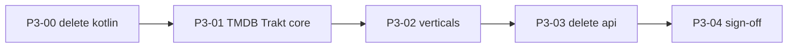

# Phase 3 — Catalog engine (wave 2)

**Status:** fixed  
**Depends on:** [Playback engine exit checklist](./02-[fixed]-rust-engine-complete.md#playback-engine-exit-checklist) ✅  
**Migration index:** [README.md](../README.md)  
**Boundary:** [ENGINE_BOUNDARY.md](../../ENGINE_BOUNDARY.md)  
**Spec:** [RFC-009](../../rfc/fixed/009-[fixed]-rust-ffi.md)

---

## Goal

Catalog engine lives in `crates/*`. Delete `packages/api` and any remaining legacy engine under `packages/`.

TMDB, Trakt, Jellyfin, and vertical APIs are **C1 engine** — same destination as playback (`crates/*`), different wave. ~~`packages/api`~~ **deleted** (P3-03 ✅); residual Dart engine debt lives in `apps/forja` until ported.

---

## Status at a glance

| | |
|--|--|
| **Progress** | **5 / 5 tasks** — P3-04 ✅ |
| **Blocked by** | — |
| **Deferred from wave 1** | P2-89 (Stremio catalog service) |

**Legend:** ✅ done · 🔄 in progress · ⬜ not started

---

## Tasks

| # | ID | Description | Status |
|--:|----|-------------|--------|
| 1 | P3-00 | Delete `packages/kotlin/` + `scripts/generate_kotlin_ffi.sh` references (Compose cancelled) | ✅ |
| 2 | P3-01 | Port TMDB/Trakt core to `crates/*` | ✅ |
| 3 | P3-02 | Port verticals incrementally (anime, manga, jellyfin, music, Arabic, …) | ✅ |
| 4 | P3-03 | Delete `packages/api` | ✅ |
| 5 | P3-04 | Architecture normalized sign-off | ✅ |

### P3-03 — done

`packages/api` deleted. Final relocation: playback/debrid/torrent services → `apps/forja/lib/shared/playback/`; `music_service` → `apps/forja/lib/shared/audio/`; `jellyfin_service` → `apps/forja/lib/features/jellyfin/catalog/`; `subtitle_api` → `packages/rust/lib/src/catalog/`. See [023-[fixed]-packages-api-delete-blocked-host-relocation.md](../issues/fixed/023-[fixed]-packages-api-delete-blocked-host-relocation.md).

| Step | Status |
|------|--------|
| Move `anime_http.dart` → `packages/rust/lib/src/catalog_http.dart` | ✅ |
| Move shared DTOs (`Movie`, `StreamSource`, `TorrentResult`) → `packages/rust/lib/src/models/` | ✅ |
| Move host services (`pip`, `external_player`, `player_pool`, `android_player_launcher`, `app_updater`) → `apps/forja/lib/shared/services/` | ✅ |
| Move `episode_watched_service` → `packages/rust` (Trakt/Simkl sync via host callback) | ✅ |
| Move `my_list_service` + `book_progress_service` → `packages/rust`; `BookResult` → `packages/rust/lib/src/models/` | ✅ |
| Consolidate tracker sync in `apps/forja/lib/shared/services/tracker_sync.dart` | ✅ |
| Move playback glue (11 files) + `webstreamr_settings` → `packages/rust/lib/src/playback/` | ✅ |
| Move catalog metadata services → `packages/rust/lib/src/catalog/` | ✅ |
| Move host utils + music/audio cluster → `apps/forja` | ✅ |
| Move catalog verticals + extractors → `apps/forja` | ✅ |
| Relocate final 14 files (playback resolvers, debrid, music, jellyfin, subtitle) | ✅ |
| Remove `packages/api` from workspace | ✅ |

### P3-04 — done

Consolidate residual Dart engine into `packages/rust`; port direct-`http` slices to `crates/*` for A2/A4.

| Step | Status |
|------|--------|
| Move playback Dart from `apps/forja/lib/shared/playback/` → `packages/rust/lib/src/playback/` | ✅ |
| Move `music_service` + `youtube_audio_extractor` → `packages/rust/lib/src/catalog/` | ✅ |
| Port jackett / prowlarr / link_resolver → `crates/indexer` + FFI | ✅ |
| Port debrid (5 providers) → `crates/debrid` + FFI | ✅ |
| Port site111477 index scrape → `crates/proxy/index111477` + FFI | ✅ |
| Port mega_proxy → `crates/proxy/mega` + FFI | ✅ |
| Port music_service → `crates/music` + FFI | ✅ |
| Port lyrics + introdb → `anime/metadata` + FFI | ✅ |
| Port mdblist → `anime/mdblist` + FFI | ✅ |
| Port paper2audio → `anime/paper2audio` + FFI | ✅ |
| Port subtitle stack (wyzie, levrx, subtitlecat, mysubs) → `anime/subtitle` + FFI | ✅ |
| Port kisskh subtitle fetch+decrypt → `anime/subtitle/kisskh` + FFI | ✅ |
| Document host exceptions (WebView/C3 extractors) | ✅ |
| A2 + A4 exit checklist green | ✅ |

---

## Catalog engine exit checklist {#exit-checklist}

**Architecture fully normalized when all rows are ✅.**

| # | Criterion | Task | Status |
|---|-----------|------|--------|
| A1 | `packages/api` deleted | P3-03 | ✅ |
| A2 | C1 catalog APIs in `crates/*` (TMDB, Trakt, Jellyfin, P3-04 ports) | P3-01, P3-04 | ✅ |
| A3 | Only `packages/rust` under `packages/` | P3-03, P3-04 | ✅ |
| A4 | No engine logic in Dart outside FFI (`packages/rust` + host exceptions) | P3-04 | ✅ |
| A5 | `packages/kotlin` deleted | P3-00 | ✅ |

---

## Migration rule

| Step | Action |
|------|--------|
| 1 | Port vertical to `crates/<vertical>/` or shared catalog crate |
| 2 | Add FFI in `crates/ffi` (fetch+parse, Pattern B) |
| 3 | Wire `apps/forja` to `ForjaEngine.*` |
| 4 | **Delete the Dart slice** — directory, pubspec deps, imports |
| 5 | Rust tests + Dart parity in `packages/rust/test/parity/` where applicable |

**No new engine logic in Dart** during wave 2.

### Port order (suggested)



| Vertical | Location | Engine status |
|----------|----------|---------------|
| TMDB | `packages/rust` → `crates/tmdb` | ✅ C1 in Rust; `runTmdbGetJson` worker pool |
| Trakt | `apps/forja` OAuth + `crates/trakt` | ✅ C1 in Rust; `runTraktRequestJson` worker pool |
| Jellyfin | `apps/forja/features/jellyfin/` + `crates/jellyfin` | ✅ C1 in Rust; `runJellyfinRequestJson` worker pool |
| Anime AniList | `apps/forja/features/anime/` + `crates/anilist` | ✅ GraphQL in Rust; WebView extractors host (C3) |
| Manga | `apps/forja/features/manga/` + `crates/manga` | Fetch in Rust; parse/orchestration Dart (C2 host) |
| KissKh | `apps/forja/features/asian_drama/` | Metadata Rust; WebView embed host (C3) |
| Arabic / Books / Comics / Audiobook | `apps/forja/features/*` | C2 scrape in Dart — **host, not ported** |
| Subtitles/metadata | `packages/rust/catalog` → `anime` | ✅ P3-04 |
| Debrid / indexers / music / proxy | `packages/rust/playback` + `crates/*` | ✅ P3-04 |
| Stremio catalog service | `packages/rust/stremio_service.dart` | P2-89 deferred — parse in Rust, orchestration Dart |

### `packages/` after wave 2

| Package | Purpose |
|---------|---------|
| `packages/rust` | Dart FFI bridge + parity tests (**permanent**) |
| `packages/rust/lib/src/catalog_http.dart` | Shared catalog HTTP (`animeHttp` / `animeHttpBytes`) — moved from `packages/api` in P3-03 |
| `packages/rust/lib/src/models/` | Shared DTOs (`Movie`, `StreamSource`, `TorrentResult`) — moved from ~~`packages/api`~~ in P3-03 |
| `packages/rust/lib/src/playback/` | Thin FFI wrappers (debrid, indexers, site111477, mega) |
| `crates/proxy` | Local proxy + site111477 index/seek + mega decrypt proxy |
| `crates/indexer` | Jackett + Prowlarr + link resolve (P3-04) |
| `crates/debrid` | Debrid resolve — 5 providers (P3-04) |
| `packages/rust/lib/src/catalog/` | Catalog metadata + thin `music_service`, `subtitle_api` |
| `crates/music` | Deezer catalog + YouTube InnerTube audio (P3-04) |

---

## Host exceptions (C3–C5) — documented, not ported

Per [ENGINE_BOUNDARY.md](../ENGINE_BOUNDARY.md) §3, these **stay in `apps/forja`** (WebView / JS / WASM hosts). HTTP fetch uses `animeHttp` → `anime`; parse/orchestration in Dart is host-side until ported.

| Area | Files | Class | Notes |
|------|-------|-------|-------|
| KissKh WebView | `shared/extractors/providers/kisskh/kisskh_extractor.dart` | C3 | WebView embed sniff |
| Allanime / Miruro / Hentaini | `anime/catalog/*_extractor.dart` | C2+C3 | HTML parse in Dart; HTTP via FFI |
| Arabic verticals | `shared/extractors/providers/arabic/arabic_service.dart` | C2 | Multi-site scrape in Dart |
| Anime Arabic | `anime_arabic/catalog/anime_arabic_extractor.dart` | C2+C3 | Mega Rust; iframe scrape Dart |
| Nuvio | `shared/nuvio/nuvio_runtime.dart` | C4 | `flutter_js` |
| Videasy | `packages/rust/.../videasy_extractor.dart` | C5 | WASM host |
| Subtitle browse (SubtitleCat, MySubs, Wyzie, Levrx) | `anime/subtitle` + thin Dart FFI | ✅ |
| KissKh subtitle fetch+decrypt | `anime/subtitle/kisskh` + thin Dart FFI (file I/O host) | ✅ |
| MDBlist | `anime/mdblist` + thin Dart FFI | ✅ |

**Host (not A4 blockers):** C3 WebView extractors + C2 scrape hosts in `apps/forja` per table below. `subtitle_api.dart` orchestration + Stremio addon calls are thin Dart (C11).

---

## Architecture

```
UI (apps/forja — Flutter permanent host)
  → widgets, navigation, OAuth, secure storage
  → calls ForjaEngine / RustLib for catalog paths

Engine (crates/* + libffi)
  → catalog: tmdb, trakt, jellyfin, vertical APIs
  → playback: stream resolve, torrent, proxy, storage (wave 1 ✅)

packages/rust/lib/src/playback/
  → thin FFI wrappers (P3-04 playback ✅)
packages/rust/lib/src/catalog/
  → thin music_service FFI; catalog vertical extractors remain in apps/forja (P3-04)
```

| **Engine (`crates/*`)** | **Host (`apps/forja`)** |
|-------------------------|-------------------------|
| TMDB/Trakt/Jellyfin fetch+parse | Browse UI, details screens |
| Vertical APIs (anime, manga, …) | OAuth flows, theme |
| Stremio catalog (P2-89 → P3) | My list UX, navigation |

**Allowed:** `Isolate.run` for long FFI · no **new** Dart engine logic in host

**Anti-patterns:** sync FFI on UI thread · Pattern A FFI · new engine logic in Dart

---

## Quick health check

```bash
./scripts/build_rust.sh
cd crates && cargo test --workspace
cd packages/rust && flutter test test/parity/tmdb_test.dart test/parity/trakt_test.dart test/parity/jellyfin_test.dart test/parity/anilist_manga_test.dart test/parity/anime_test.dart

# After each vertical port — grep for deleted Dart slice:
rg "packages/api/lib/api/<vertical>" apps/forja packages/rust
```

---

## Related

- [Phase 2 playback](./02-[fixed]-rust-engine-complete.md) · [ENGINE_BOUNDARY](../ENGINE_BOUNDARY.md) · [RFC-009](../rfc/fixed/009-[fixed]-rust-ffi.md)
