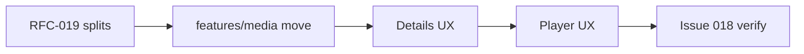

# RFC-026: Media details & player UX redesign

**Status:** partial  
**Depends on:** [RFC-019](019-[draft]-god-file-decomposition.md) (details + player splits), [RFC-025](fixed/025-[fixed]-flat-cinematic-shell.md) (flat shell tokens)  
**Area:** `features/media/`, `features/home/details_screen.dart` → move, `shared/player/`

## Status at a glance

| | |
|--|--|
| **Progress** | **10 / 18** components · **6 / 14** acceptance (1.0.1 UX slice) · **2 / 18** components in progress (details screen thin-wrap) |
| **Current slice** | Shared hero + details scroll shell + sources panel extraction (torrent + streaming) |

**Legend:** ✅ done · 🔄 in progress · ⬜ not started · ⏭️ deferred (later slice)

---

## Components

| # | ID | Description | Status |
|--:|----|-------------|--------|
| 1 | R26-C01 | God-file split — details (`features/media/details/` per RFC-019) | ⬜ |
| 2 | R26-C02 | God-file split — player `controls/` extract (RFC-019 R19-A05) | ⬜ |
| 3 | R26-C03 | `features/media/` module — move screens; `AppRouter` imports only (absorbs RFC-020) | ⬜ |
| 4 | R26-C04 | Torrent details UX — full-viewport hero, unified scroll, Sources panel | 🔄 |
| 5 | R26-C05 | Streaming details UX — same hero + section order as torrent | 🔄 |
| 6 | R26-C06 | Player chrome — flat `ForjaShellColors` / `ShellTokens`, no glass | ⬜ |
| 7 | R26-C07 | Player controls hierarchy — seek, tracks, speed, next ep, PiP | ⬜ |
| 8 | R26-C08 | Details → player handoff — sources, resume, season/episode | ⬜ |
| 9 | R26-C09 | `MediaDetailsHero` — full-viewport Ken Burns, 3s preloaded trailer crossfade, bottom-left overlay | ✅ |
| 10 | R26-C10 | TMDB rich metadata — cast, crew, keywords, production, recommendations | ✅ |
| 11 | R26-C11 | `StreamSourcePanel` — desktop side panel + mobile sheet from `_currentSources` | ✅ |
| 12 | R26-C12 | `SeekBarWithPreview` — debounced `media_kit` screenshot + timestamp fallback | ✅ |
| 13 | R26-C13 | `TvSeasonEpisodePicker` — season poster cards + expandable episode rail | ✅ |
| 14 | R26-C14 | Hero primitives — `HeroTitle`, `HeroMetaLine`, `HeroFactsPanel`, `pickDirectorFromCrew` (Home + details) | ✅ |
| 15 | R26-C15 | `HeroOverviewText` — bounded-height slot fix (Home desktop hero) | ✅ |
| 16 | R26-C16 | `MediaDetailsScrollPage` + `MediaDetailsRecommendationsSection` | ✅ |
| 17 | R26-C17 | `TorrentSourcesPanel` + `TorrentSourceFilters` + `TorrentSourceTile` / `StremioSourceTile` | ✅ |
| 18 | R26-C18 | `MediaDetailsTorrentActionRow` + `MediaDetailsStreamingActionRow` | ✅ |

---

## Acceptance (details + player UX)

| # | ID | Description | Status |
|--:|----|-------------|--------|
| 1 | R26-A01 | Details opens from Home, Discover, Search, My List, Similar — same behavior | ⬜ |
| 2 | R26-A02 | Torrent + Stremio + Nuvio + Jackett/Prowlarr paths unchanged functionally | ⬜ |
| 3 | R26-A03 | Direct streaming mode path unchanged functionally | ⬜ |
| 4 | R26-A04 | No `BackdropFilter` / glass chrome on details or player (RFC-025 parity) | ⬜ |
| 5 | R26-A05 | Desktop + mobile unified scroll layout; no split poster column | 🔄 |
| 6 | R26-A06 | `flutter analyze` clean; manual smoke on both details variants + player | ⬜ |
| 7 | R26-A07 | [Issue 018](../issues/018-[draft]-migration-playback-parity-unverified.md) playback parity rows verified or explicitly scoped out with notes | ⬜ |

---

## Acceptance (1.0.1 UX slice)

| # | ID | Description | Status |
|--:|----|-------------|--------|
| 1 | R26-A08 | Details hero: Ken Burns backdrop immediately; preloaded YouTube trailer after 3s when TMDB key exists | ✅ |
| 2 | R26-A09 | Hero watch progress bar for movies + selected TV episode (hide &lt;2% or ≥90%) | ✅ |
| 3 | R26-A10 | Primary scroll: Main Characters + More Like This (+ seasons for TV); crew/keywords in body deferred | 🔄 |
| 4 | R26-A11 | Player flat chrome: Back + title/meta overlay; play, ±10s, volume, sources, PiP, fullscreen | ✅ |
| 5 | R26-A12 | `StreamSourcePanel` switches among `_currentSources` without engine change | ✅ |
| 6 | R26-A13 | Seek hover preview shows frame when `screenshot()` succeeds; timestamp-only fallback otherwise | ✅ |
| 7 | R26-A14 | TV season poster cards + expandable episode rail with thumbnails, progress, synopsis, watched | ✅ |

---

## Summary

Full UX redesign of media details (torrent + streaming) and the unified player. Structural cleanup ([RFC-019](019-[draft]-god-file-decomposition.md) splits, [RFC-020](020-[draft]-media-details-routing.md) module move) is a **prerequisite**, not optional. Visual language extends the shipped [RFC-025](fixed/025-[fixed]-flat-cinematic-shell.md) flat cinematic shell into details and player — no frosted glass, no ambient glows.

## Problem

| File | Lines (approx.) | Issue |
|------|-----------------|-------|
| [`details_screen.dart`](../../apps/forja/lib/features/home/details_screen.dart) | ~2570 | God file shrinking; sources UI extracted to `shared/widgets/media_details/` |
| [`streaming_details_screen.dart`](../../apps/forja/lib/features/home/streaming_details_screen.dart) | ~765 | Uses shared scroll shell + action row; logic still in screen |
| [`mobile_player_screen.dart`](../../apps/forja/lib/shared/player/player/mobile_player_screen.dart) | ~4292 | `_Glass` chrome; not aligned with flat shell |
| [`desktop_player_screen.dart`](../../apps/forja/lib/shared/player/player/desktop_player_screen.dart) | ~4145 | Same |

Details screens live under `features/home/` but are app-wide routes. Player still uses glass overlays removed elsewhere in 1.0.0.

## Goals

- **Module clarity:** `features/media/` owns detail + streaming detail screens
- **Visual parity:** [`ShellTokens`](../../apps/forja/lib/shared/design/src/shell_tokens.dart) + [`ForjaShellColors`](../../apps/forja/lib/shared/design/src/forja_shell_colors.dart) — flat ghost buttons, underline tabs, no `BackdropFilter`
- **Functional parity:** All torrent, Stremio, Nuvio, debrid, and WebStreamr paths behave as today
- **Play flow:** Details → player handoff preserves sources, resume position, season/episode context

## UX direction (default — no external mocks)

Aligned with RFC-025 Home hero:

| Area | Direction |
|------|-----------|
| Details hero | Cinematic backdrop + metadata column (mirror `heroImageWidthFraction` / `heroTextWidthFraction`) |
| Source picker | Shell-consistent tab/segment control — replace ad-hoc `_sourceTab` chips |
| Metadata | Cast, overview, ratings, My List, Trakt — same actions, cleaner hierarchy |
| Episodes | Season/episode picker integrated into layout; watched state visible |
| Player chrome | Replace `_Glass` / `_GlassSeekbar` with flat controls using shell tokens |
| Player controls | Seek, play/pause, subtitles, audio, speed, sources menu, next episode, PiP — same behavior |

Add reference mockups to this RFC before implementation if target layout diverges from RFC-025 patterns.

## Non-goals (this RFC)

Deferred to overlay/providers/casting work ([RFC-003](003-[partial]-player-overlay.md), [RFC-004](004-[partial]-provider-registry.md), [RFC-005](005-[partial]-casting.md)):

- Player overlay panel + server grid ([RFC-003](003-[partial]-player-overlay.md))
- In-player provider switch ([RFC-004](004-[partial]-provider-registry.md))
- AirPlay + Chromecast ([RFC-005](005-[partial]-casting.md))
- v1.1 casting/providers bundle ([RFC-012](012-[draft]-v1.1-casting-providers.md))

## Target layout

```
features/media/
  details/
    details_screen.dart        # shell, tabs, app bar
    details_torrents.dart      # torrent/debrid UI + logic
    details_stremio.dart       # addon streams
    details_episodes.dart      # season/episode picker
  streaming_details_screen.dart

shared/player/
  player_screen.dart
  player/
    mobile_player_screen.dart  # slimmed
    desktop_player_screen.dart
  controls/
    overlay_host.dart          # flat control chrome (not RFC-003 server grid)
    subtitle_sheet.dart
    quality_menu.dart
```

## Slices



| Slice | Ships | IDs |
|-------|-------|-----|
| 1 — Split | Details + player god-file decomposition | R26-C01, R26-C02 |
| 2 — Move | `features/media/` + AppRouter | R26-C03 |
| 3 — Details UX | Torrent then streaming screens | R26-C04, R26-C05 |
| 4 — Player UX | Flat chrome + controls | R26-C06, R26-C07 |
| 5 — Handoff + verify | Play flow + issue 018 gate | R26-C08, R26-A01–A07 |

## Contracts (must not break)

| Contract | Location |
|----------|----------|
| `AppRouter.openDetails` / `openStreamingDetails` / `openMovie` / `openPlayer` | `shell/app_router.dart` |
| Torrent search gen-token discard | `details_screen.dart` |
| WebStreamr source list → player | `streaming_details_screen.dart` |
| `PlayerScreen` constructor args | `shared/player/player_screen.dart` |
| Platform playback profile gates | `PlatformPlayback.capabilities` |

## Related

[RFC-019](019-[draft]-god-file-decomposition.md), [RFC-020](020-[draft]-media-details-routing.md), [RFC-025](fixed/025-[fixed]-flat-cinematic-shell.md), [Issue 018](../issues/018-[draft]-migration-playback-parity-unverified.md)
